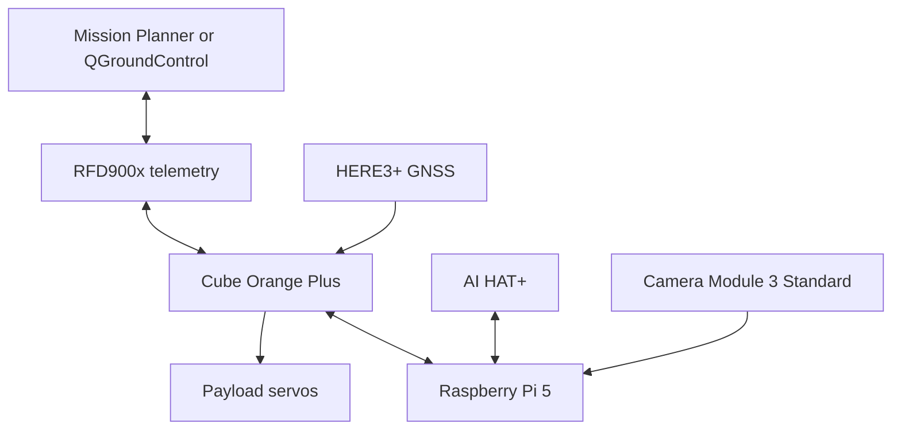

# System Architecture

## Responsibility boundary

### Cube Orange Plus

- Flight stabilization
- EKF and navigation
- AUTO waypoint execution
- GUIDED position or velocity setpoints
- Flight-mode and radio failsafes
- Payload PWM output

### Raspberry Pi 5

- Mission state machine
- Target detection and tracking
- Target-centering calculations
- Correct payload selection
- Annotated video generation
- Mission event logging

The Raspberry Pi must never send raw motor commands.
