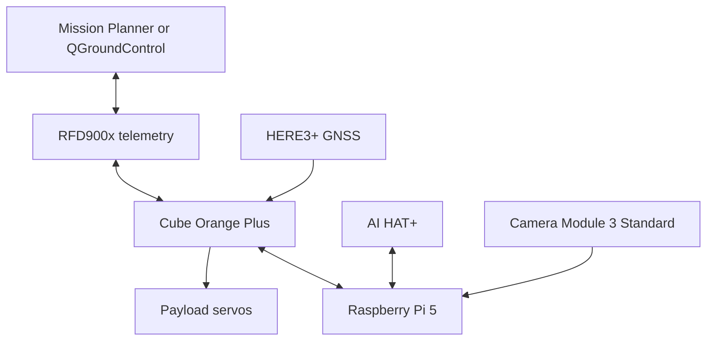

# Technical Handoff For External Review: Teknofest 2026 Rotary-Wing UAV

Generated: 2026-06-26T11:39:14 local time

Repository: `git@github.com:ABDULRAHMAN-ALSAADI/wd-drone-autonomous-mission.git`
Branch: `main`
Commit at generation time: `f587429` plus current working-tree changes
Workspace: `/home/kambe/FOR_COMP/wd-drone-autonomous-mission`

Audience: another AI/code reviewer. This document is intentionally exhaustive and includes all tracked source/config/docs content in the appendix, except this generated handoff file itself to avoid recursive self-embedding.

## Current Worktree Status

```text
M docs/REAL_MISSION_FLOW.md
 M docs/SAFETY_AND_FAILSAFES.md
 M docs/TARGET_MISSION_OPERATIONS.md
 M real_mission/README.md
 M real_mission/parameter_config/README.md
 M real_mission/parameter_config/mission1_no_search.json
 M real_mission/parameter_config/mission2_target_payload.json
 M real_mission/parameter_config/real_drone.json
 M target_mission_v2/configs/real_pi_camera_module_3.json
 M target_mission_v2/configs/sim_gazebo.json
 M target_mission_v2/mission_config.json
 M target_mission_v2/mission_controller.py
 M target_mission_v2/operator_config.json
 M target_mission_v2/parameter_config.json
 M target_mission_v2/test_mission_controller.py
 M test_components/preflight/full_check.sh
```

## Executive Summary

This repository implements a companion-computer mission stack for a Teknofest 2026 rotary-wing UAV. ArduPilot/Cube Orange owns normal AUTO waypoint flight, altitude, speed, arming, RTL, and failsafes. The Raspberry Pi 5 companion owns camera acquisition, target detection, target confirmation, requesting GUIDED for low-speed target centering, optional payload servo command, AUTO resume after the first target, and RTL after both targets are complete.

Important current behavior:

- Mission 1 is a no-search profile (`search_enabled=false`), so the Pi does not trigger Mission 2 target logic during the figure-8 mission.
- Mission 2 search starts only when armed, in AUTO, at or after `mission.search_start_wp`, with `search_enabled=true`, and optionally when an RC gate is high.
- AUTO search speed is QGC/Mission Planner/ArduPilot-owned by default through `navigation.search_speed_source = qgc_mission`.
- The controller filters MAVLink HEARTBEAT messages so GCS/onboard-controller heartbeats do not corrupt the active vehicle mode/armed state.
- During active target work, `GUIDED -> AUTO -> GUIDED` bounces are treated as mission-owned AUTO bounce; the target lock is kept and GUIDED is requested again.
- If the vehicle enters a non-mission mode such as LOITER/STABILIZE/RTL/LAND during target work, the Pi sends zero velocity, drops the target lock, and waits for AUTO instead of fighting pilot/failsafe authority.
- If camera frames stop during active target work longer than `safety.camera_frame_timeout_s`, the Pi holds in GUIDED and reports the timeout.
- Payload output is simulated by default in real configs. Physical servo output requires `payload.simulate_only=false` after bench tests.

## User-Provided Hardware Context

- Flight controller: Cube Orange running ArduPilot.
- Companion link: TELEM2 UART at 57600 baud to Raspberry Pi 5 GPIO 14/15, although the currently tested repo config uses `/dev/serial0` at 921600 baud.
- Companion computer: Raspberry Pi 5.
- AI accelerator: Hailo AI HAT+ on PCIe.
- Camera: AR0234 Global Shutter camera on MIPI CSI; earlier live-view tests also used Raspberry Pi Camera Module 3 style rpicam paths.
- ESC: Tekko 32 4-in-1 ESC.
- Motors: F90 motors.
- GPS/Compass: NEO 3 Pro GPS on CAN2.
- Receiver: RadioLink R9DS on RCIN via SBUS.
- Transmitter: AT9S Pro.
- Battery: 5S 5000mAh LiPo.
- Telemetry radio: 915MHz SiK/RFD style telemetry on TELEM1 depending on setup notes.

Critical baud review item: the hardware brief says TELEM2 at 57600, while the Pi/Cube bench tests showed stable `/dev/serial0` at 921600. Confirm the actual SERIAL port baud in Mission Planner before real flight and update `real_mission/parameter_config/mission2_target_payload.json` if needed.

## Full Project Structure

```text
.github/workflows/tests.yml
.gitignore
README.md
START_HERE.md
config/README.md
config/settings.json
docs/ARCHITECTURE.md
docs/CAMERA_CALIBRATION.md
docs/COMPETITION_REQUIREMENTS.md
docs/MONITORING.md
docs/PIXHAWK_PI_TEST_DAY.md
docs/PROJECT_STRUCTURE.md
docs/RASPBERRY_PI_PIXHAWK_MAVLINK.md
docs/REAL_DRONE_CHECKLIST.md
docs/REAL_MISSION_FLOW.md
docs/ROADMAP.md
docs/SAFETY_AND_FAILSAFES.md
docs/SITL_TEST_PLAN.md
docs/TARGET_MISSION_OPERATIONS.md
docs/TEAM_PI_WORKFLOW.md
docs/VISION_MODEL_PLAN.md
real_mission/README.md
real_mission/open_laptop_camera_window.sh
real_mission/parameter_config/README.md
real_mission/parameter_config/mission1_no_search.json
real_mission/parameter_config/mission2_target_payload.json
real_mission/parameter_config/real_drone.json
real_mission/run_mission1_no_search.sh
real_mission/run_mission2_target_payload.sh
real_mission/run_real_mission.sh
requirements.txt
scripts/README.md
scripts/check_project.sh
scripts/clean_workspace.sh
scripts/mavlink_bench.sh
scripts/pi_cache_wheels.sh
scripts/pi_camera_check.sh
scripts/pi_camera_live.sh
scripts/pi_mavlink_bench_sequence.sh
scripts/pi_test_day_readiness.sh
scripts/pi_uart_preflight.sh
scripts/pi_validate.sh
scripts/run_sitl_monitor.sh
scripts/run_sitl_observer.sh
scripts/run_uart_monitor.sh
scripts/setup.sh
scripts/sync_to_pi.sh
simulation/README.md
simulation/enable_gazebo_camera.sh
simulation/example_square_mission.waypoints
simulation/legacy_shortcuts.md
simulation/run_target_mission.sh
simulation/start_gazebo.sh
simulation/start_sitl.sh
src/README.md
src/wd_drone/__init__.py
src/wd_drone/config.py
src/wd_drone/event_logger.py
src/wd_drone/main.py
src/wd_drone/mavlink_client.py
src/wd_drone/mission_state.py
src/wd_drone/vehicle_status.py
target_mission_v2/README.md
target_mission_v2/camera_sources.py
target_mission_v2/configs/README.md
target_mission_v2/configs/real_pi_camera_module_3.json
target_mission_v2/configs/sim_gazebo.json
target_mission_v2/control.py
target_mission_v2/mission_config.json
target_mission_v2/mission_controller.py
target_mission_v2/operator_config.json
target_mission_v2/parameter_config.json
target_mission_v2/run.sh
target_mission_v2/setup.sh
target_mission_v2/test_mission_controller.py
target_mission_v2/vision.py
test_components/COMMANDS.md
test_components/README.md
test_components/camera/check_on_pi.sh
test_components/camera/live_from_laptop.sh
test_components/mavlink/MOTOR_MAPPING.md
test_components/mavlink/bench_sequence.sh
test_components/mavlink/health.sh
test_components/mavlink/motor_test.sh
test_components/mavlink/rc_channels.sh
test_components/mavlink/servo_payload_test.sh
test_components/mavlink/status.sh
test_components/preflight/full_check.sh
test_components/software/run_all_checks.sh
tests/README.md
tests/test_config.py
tests/test_mavlink_bench.py
tests/test_mission_state.py
tools/README.md
tools/mavlink_bench.py
tools/pi_camera_check.py
tools/pi_camera_live_view.py
```

## File-by-File Purpose Index

### `.github/workflows/tests.yml`
- Purpose: GitHub Actions workflow for dependency install and automated unit checks.
- Type/libraries: YAML configuration.
- Lines: 40

### `.gitignore`
- Purpose: Ignores local virtualenvs, caches, logs, snapshots, and generated runtime artifacts.
- Type/libraries: Project file/data artifact.
- Lines: 27

### `README.md`
- Purpose: Top-level project overview and entry points for real mission, simulation, and tests.
- Type/libraries: Markdown documentation.
- Lines: 136

### `START_HERE.md`
- Purpose: Human-first quick start for team members using the repo on Ubuntu or Pi.
- Type/libraries: Markdown documentation.
- Lines: 125

### `config/README.md`
- Purpose: Explains global non-mission configuration files.
- Type/libraries: Markdown documentation.
- Lines: 12

### `config/settings.json`
- Purpose: Small shared project settings used by helper tests/docs.
- Type/libraries: JSON configuration/profile data.
- Lines: 29

### `docs/ARCHITECTURE.md`
- Purpose: Architecture overview and component ownership boundaries.
- Type/libraries: Markdown documentation.
- Lines: 43

### `docs/CAMERA_CALIBRATION.md`
- Purpose: Camera setup and calibration notes for Pi camera/live vision.
- Type/libraries: Markdown documentation.
- Lines: 62

### `docs/COMPETITION_REQUIREMENTS.md`
- Purpose: Notes extracted from Teknofest mission/safety requirements.
- Type/libraries: Markdown documentation.
- Lines: 94

### `docs/MONITORING.md`
- Purpose: Telemetry and status monitoring notes.
- Type/libraries: Markdown documentation.
- Lines: 80

### `docs/PIXHAWK_PI_TEST_DAY.md`
- Purpose: Step-by-step Pi/Cube test-day procedure.
- Type/libraries: Markdown documentation.
- Lines: 171

### `docs/PROJECT_STRUCTURE.md`
- Purpose: Folder/file organization guide.
- Type/libraries: Markdown documentation.
- Lines: 116

### `docs/RASPBERRY_PI_PIXHAWK_MAVLINK.md`
- Purpose: UART/MAVLink setup notes between Pi 5 and Cube Orange.
- Type/libraries: Markdown documentation.
- Lines: 191

### `docs/REAL_DRONE_CHECKLIST.md`
- Purpose: Real-drone readiness checklist before flight.
- Type/libraries: Markdown documentation.
- Lines: 41

### `docs/REAL_MISSION_FLOW.md`
- Purpose: Operator flow for Mission 1 vs Mission 2 and RC/GCS usage.
- Type/libraries: Markdown documentation.
- Lines: 222

### `docs/ROADMAP.md`
- Purpose: Planned improvements and future work.
- Type/libraries: Markdown documentation.
- Lines: 72

### `docs/SAFETY_AND_FAILSAFES.md`
- Purpose: Safety ownership, ArduPilot failsafes, companion boundaries.
- Type/libraries: Markdown documentation.
- Lines: 137

### `docs/SITL_TEST_PLAN.md`
- Purpose: Simulation/SITL testing procedure.
- Type/libraries: Markdown documentation.
- Lines: 48

### `docs/TARGET_MISSION_OPERATIONS.md`
- Purpose: Detailed target mission behavior/tuning guide.
- Type/libraries: Markdown documentation.
- Lines: 174

### `docs/TEAM_PI_WORKFLOW.md`
- Purpose: How team members sync/run code on the Pi.
- Type/libraries: Markdown documentation.
- Lines: 139

### `docs/VISION_MODEL_PLAN.md`
- Purpose: Plan for adding trained YOLO/Hailo vision later.
- Type/libraries: Markdown documentation.
- Lines: 78

### `real_mission/README.md`
- Purpose: Real drone mission commands and operating notes.
- Type/libraries: Markdown documentation.
- Lines: 211

### `real_mission/open_laptop_camera_window.sh`
- Purpose: Laptop helper to open live Pi camera/vision viewer over SSH/network.
- Type/libraries: Bash shell wrapper/helper.
- Lines: 8

### `real_mission/parameter_config/README.md`
- Purpose: Explains real mission parameter files and tunable fields.
- Type/libraries: Markdown documentation.
- Lines: 101

### `real_mission/parameter_config/mission1_no_search.json`
- Purpose: Real Mission 1 profile; search disabled, monitor only.
- Type/libraries: JSON configuration/profile data.
- Lines: 117

### `real_mission/parameter_config/mission2_target_payload.json`
- Purpose: Real Mission 2 profile; Pi vision/search/payload enabled with conservative defaults.
- Type/libraries: JSON configuration/profile data.
- Lines: 117

### `real_mission/parameter_config/real_drone.json`
- Purpose: Compatibility real-drone profile.
- Type/libraries: JSON configuration/profile data.
- Lines: 117

### `real_mission/run_mission1_no_search.sh`
- Purpose: Runs Mission 1 monitor profile.
- Type/libraries: Bash shell wrapper/helper.
- Lines: 6

### `real_mission/run_mission2_target_payload.sh`
- Purpose: Runs Mission 2 target/payload profile.
- Type/libraries: Bash shell wrapper/helper.
- Lines: 6

### `real_mission/run_real_mission.sh`
- Purpose: Generic real mission launcher with selected config.
- Type/libraries: Bash shell wrapper/helper.
- Lines: 28

### `requirements.txt`
- Purpose: Python package dependencies.
- Type/libraries: Plain text/data file.
- Lines: 2

### `scripts/README.md`
- Purpose: Helper script guide.
- Type/libraries: Markdown documentation.
- Lines: 79

### `scripts/check_project.sh`
- Purpose: Basic local project sanity checks.
- Type/libraries: Bash shell wrapper/helper.
- Lines: 35

### `scripts/clean_workspace.sh`
- Purpose: Removes local runtime clutter/caches.
- Type/libraries: Bash shell wrapper/helper.
- Lines: 28

### `scripts/mavlink_bench.sh`
- Purpose: Wrapper for MAVLink bench CLI.
- Type/libraries: Bash shell wrapper/helper.
- Lines: 15

### `scripts/pi_cache_wheels.sh`
- Purpose: Pi dependency wheel cache helper.
- Type/libraries: Bash shell wrapper/helper.
- Lines: 22

### `scripts/pi_camera_check.sh`
- Purpose: Pi camera still/readiness wrapper.
- Type/libraries: Bash shell wrapper/helper.
- Lines: 26

### `scripts/pi_camera_live.sh`
- Purpose: Pi live OpenCV camera/vision window wrapper.
- Type/libraries: Bash shell wrapper/helper.
- Lines: 59

### `scripts/pi_mavlink_bench_sequence.sh`
- Purpose: Pi MAVLink bench sequence wrapper.
- Type/libraries: Bash shell wrapper/helper.
- Lines: 9

### `scripts/pi_test_day_readiness.sh`
- Purpose: Pi test-day readiness wrapper.
- Type/libraries: Bash shell wrapper/helper.
- Lines: 82

### `scripts/pi_uart_preflight.sh`
- Purpose: UART preflight helper for Pi serial.
- Type/libraries: Bash shell wrapper/helper.
- Lines: 54

### `scripts/pi_validate.sh`
- Purpose: Pi-side validation helper.
- Type/libraries: Bash shell wrapper/helper.
- Lines: 20

### `scripts/run_sitl_monitor.sh`
- Purpose: Legacy SITL monitor launcher.
- Type/libraries: Bash shell wrapper/helper.
- Lines: 13

### `scripts/run_sitl_observer.sh`
- Purpose: Legacy SITL observer launcher.
- Type/libraries: Bash shell wrapper/helper.
- Lines: 13

### `scripts/run_uart_monitor.sh`
- Purpose: UART monitor launcher.
- Type/libraries: Bash shell wrapper/helper.
- Lines: 13

### `scripts/setup.sh`
- Purpose: Project setup/install helper.
- Type/libraries: Bash shell wrapper/helper.
- Lines: 13

### `scripts/sync_to_pi.sh`
- Purpose: Rsync helper from laptop to Pi.
- Type/libraries: Bash shell wrapper/helper.
- Lines: 48

### `simulation/README.md`
- Purpose: Simulation folder guide.
- Type/libraries: Markdown documentation.
- Lines: 94

### `simulation/enable_gazebo_camera.sh`
- Purpose: Enables the Gazebo camera stream/source.
- Type/libraries: Bash shell wrapper/helper.
- Lines: 11

### `simulation/example_square_mission.waypoints`
- Purpose: Example ArduPilot mission file for SITL.
- Type/libraries: ArduPilot mission waypoint file.
- Lines: 9

### `simulation/legacy_shortcuts.md`
- Purpose: Documents older desktop terminal shortcuts.
- Type/libraries: Markdown documentation.
- Lines: 29

### `simulation/run_target_mission.sh`
- Purpose: SITL target mission launcher.
- Type/libraries: Bash shell wrapper/helper.
- Lines: 10

### `simulation/start_gazebo.sh`
- Purpose: Gazebo startup helper.
- Type/libraries: Bash shell wrapper/helper.
- Lines: 29

### `simulation/start_sitl.sh`
- Purpose: ArduPilot SITL startup helper.
- Type/libraries: Bash shell wrapper/helper.
- Lines: 27

### `src/README.md`
- Purpose: Legacy/experimental package notes.
- Type/libraries: Markdown documentation.
- Lines: 13

### `src/wd_drone/__init__.py`
- Purpose: Python package marker.
- Type/libraries: Python; see imports in code. Main external libraries are pymavlink, OpenCV cv2, NumPy.
- Lines: 3

### `src/wd_drone/config.py`
- Purpose: Small config loader for the legacy monitor package.
- Type/libraries: Python; see imports in code. Main external libraries are pymavlink, OpenCV cv2, NumPy.
- Lines: 114

### `src/wd_drone/event_logger.py`
- Purpose: CSV/event logger utility for legacy monitor package.
- Type/libraries: Python; see imports in code. Main external libraries are pymavlink, OpenCV cv2, NumPy.
- Lines: 36

### `src/wd_drone/main.py`
- Purpose: Legacy mission monitor entry point.
- Type/libraries: Python; see imports in code. Main external libraries are pymavlink, OpenCV cv2, NumPy.
- Lines: 187

### `src/wd_drone/mavlink_client.py`
- Purpose: Threaded legacy MAVLink receive client.
- Type/libraries: Python; see imports in code. Main external libraries are pymavlink, OpenCV cv2, NumPy.
- Lines: 116

### `src/wd_drone/mission_state.py`
- Purpose: Legacy mission-state observer.
- Type/libraries: Python; see imports in code. Main external libraries are pymavlink, OpenCV cv2, NumPy.
- Lines: 104

### `src/wd_drone/vehicle_status.py`
- Purpose: Vehicle telemetry dataclass for legacy monitor package.
- Type/libraries: Python; see imports in code. Main external libraries are pymavlink, OpenCV cv2, NumPy.
- Lines: 113

### `target_mission_v2/README.md`
- Purpose: Active mission engine guide.
- Type/libraries: Markdown documentation.
- Lines: 298

### `target_mission_v2/camera_sources.py`
- Purpose: Camera source factory for UDP, OpenCV device, and rpicam MJPEG.
- Type/libraries: Python; see imports in code. Main external libraries are pymavlink, OpenCV cv2, NumPy.
- Lines: 197

### `target_mission_v2/configs/README.md`
- Purpose: Compatibility/SITL config guide.
- Type/libraries: Markdown documentation.
- Lines: 31

### `target_mission_v2/configs/real_pi_camera_module_3.json`
- Purpose: Older Pi Camera Module 3 real profile kept for compatibility.
- Type/libraries: JSON configuration/profile data.
- Lines: 99

### `target_mission_v2/configs/sim_gazebo.json`
- Purpose: SITL/Gazebo profile for Ubuntu simulation.
- Type/libraries: JSON configuration/profile data.
- Lines: 91

### `target_mission_v2/control.py`
- Purpose: Small control math helpers.
- Type/libraries: Python; see imports in code. Main external libraries are pymavlink, OpenCV cv2, NumPy.
- Lines: 28

### `target_mission_v2/mission_config.json`
- Purpose: Compatibility mission config.
- Type/libraries: JSON configuration/profile data.
- Lines: 91

### `target_mission_v2/mission_controller.py`
- Purpose: Active Mission 2 controller, MAVLink vehicle adapter, state machine, overlay, payload logic.
- Type/libraries: Python; see imports in code. Main external libraries are pymavlink, OpenCV cv2, NumPy.
- Lines: 1067

### `target_mission_v2/operator_config.json`
- Purpose: Operator-facing compatibility config.
- Type/libraries: JSON configuration/profile data.
- Lines: 91

### `target_mission_v2/parameter_config.json`
- Purpose: SITL/tuning config with inline help.
- Type/libraries: JSON configuration/profile data.
- Lines: 109

### `target_mission_v2/run.sh`
- Purpose: Target mission launcher.
- Type/libraries: Bash shell wrapper/helper.
- Lines: 26

### `target_mission_v2/setup.sh`
- Purpose: Target mission local setup helper.
- Type/libraries: Bash shell wrapper/helper.
- Lines: 12

### `target_mission_v2/test_mission_controller.py`
- Purpose: Mission, vision, config, and safety unit tests.
- Type/libraries: Python; see imports in code. Main external libraries are pymavlink, OpenCV cv2, NumPy.
- Lines: 883

### `target_mission_v2/vision.py`
- Purpose: Strict OpenCV color/shape detector and tracker.
- Type/libraries: Python; see imports in code. Main external libraries are pymavlink, OpenCV cv2, NumPy.
- Lines: 405

### `test_components/COMMANDS.md`
- Purpose: Copy/paste test command reference.
- Type/libraries: Markdown documentation.
- Lines: 216

### `test_components/README.md`
- Purpose: Component test folder guide.
- Type/libraries: Markdown documentation.
- Lines: 22

### `test_components/camera/check_on_pi.sh`
- Purpose: Camera check wrapper for Pi.
- Type/libraries: Bash shell wrapper/helper.
- Lines: 7

### `test_components/camera/live_from_laptop.sh`
- Purpose: Laptop camera live-view helper.
- Type/libraries: Bash shell wrapper/helper.
- Lines: 7

### `test_components/mavlink/MOTOR_MAPPING.md`
- Purpose: Motor command vs physical motor mapping notes.
- Type/libraries: Markdown documentation.
- Lines: 69

### `test_components/mavlink/bench_sequence.sh`
- Purpose: MAVLink mode/arm sequence bench test.
- Type/libraries: Bash shell wrapper/helper.
- Lines: 7

### `test_components/mavlink/health.sh`
- Purpose: Read-only MAVLink health telemetry test.
- Type/libraries: Bash shell wrapper/helper.
- Lines: 7

### `test_components/mavlink/motor_test.sh`
- Purpose: Props-off MAVLink motor test wrapper.
- Type/libraries: Bash shell wrapper/helper.
- Lines: 12

### `test_components/mavlink/rc_channels.sh`
- Purpose: RC channel observer wrapper.
- Type/libraries: Bash shell wrapper/helper.
- Lines: 7

### `test_components/mavlink/servo_payload_test.sh`
- Purpose: Payload servo bench test wrapper.
- Type/libraries: Bash shell wrapper/helper.
- Lines: 25

### `test_components/mavlink/status.sh`
- Purpose: Read-only heartbeat/mode status wrapper.
- Type/libraries: Bash shell wrapper/helper.
- Lines: 7

### `test_components/preflight/full_check.sh`
- Purpose: Read-only-ish combined preflight check with optional camera/MAVLink sections.
- Type/libraries: Bash shell wrapper/helper.
- Lines: 78

### `test_components/software/run_all_checks.sh`
- Purpose: Runs software/unit checks.
- Type/libraries: Bash shell wrapper/helper.
- Lines: 7

### `tests/README.md`
- Purpose: Unit test folder guide.
- Type/libraries: Markdown documentation.
- Lines: 16

### `tests/test_config.py`
- Purpose: Config loading tests.
- Type/libraries: Python; see imports in code. Main external libraries are pymavlink, OpenCV cv2, NumPy.
- Lines: 52

### `tests/test_mavlink_bench.py`
- Purpose: MAVLink bench helper tests.
- Type/libraries: Python; see imports in code. Main external libraries are pymavlink, OpenCV cv2, NumPy.
- Lines: 14

### `tests/test_mission_state.py`
- Purpose: Legacy mission-state tests.
- Type/libraries: Python; see imports in code. Main external libraries are pymavlink, OpenCV cv2, NumPy.
- Lines: 87

### `tools/README.md`
- Purpose: Tools folder guide.
- Type/libraries: Markdown documentation.
- Lines: 9

### `tools/mavlink_bench.py`
- Purpose: MAVLink bench CLI for status, health, mode, servo, motor, RC tests.
- Type/libraries: Python; see imports in code. Main external libraries are pymavlink, OpenCV cv2, NumPy.
- Lines: 646

### `tools/pi_camera_check.py`
- Purpose: Pi camera check utility.
- Type/libraries: Python; see imports in code. Main external libraries are pymavlink, OpenCV cv2, NumPy.
- Lines: 137

### `tools/pi_camera_live_view.py`
- Purpose: Live OpenCV camera window and strict-shape detector test utility.
- Type/libraries: Python; see imports in code. Main external libraries are pymavlink, OpenCV cv2, NumPy.
- Lines: 271

## Architecture Decisions

### Mission Separation
Mission selection is profile-based. Mission 1 uses a no-search profile and ArduPilot AUTO mission behavior. Mission 2 uses the target/payload profile. The Pi does not upload or select waypoint missions in flight; the operator uploads the proper mission in Mission Planner/QGC and starts AUTO.

### Control Ownership
ArduPilot owns takeoff, mission waypoints, AUTO speed/altitude, arming, RTL, geofence, RC failsafe, battery failsafe, EKF/GPS acceptance, and vehicle stabilization. The Pi owns only the companion task: target search, confirmation, low-speed GUIDED centering, payload command, and mission resume/RTL requests after payload tasks.

### State Machine
The active mission controller is an explicit state machine: `WAITING_FOR_AUTO -> SEARCH -> WAITING_FOR_GUIDED -> CENTER -> PAYLOAD -> WAITING_FOR_AUTO_RESUME / WAITING_FOR_RTL -> COMPLETE`. This keeps behavior observable, testable, and simple enough for competition debugging.

### Configuration First
Normal tuning belongs in JSON profiles, especially `real_mission/parameter_config/mission2_target_payload.json` and `target_mission_v2/parameter_config.json`, not in Python. Code validates key ranges and tests load all profiles.

### What Was Not Chosen
The project intentionally does not currently use a complex behavior tree, ROS graph, companion mission uploader, or Hailo/YOLO runtime in the active mission. Those are useful later but would add integration risk before the baseline mission is proven in real flight.

## MAVLink / pymavlink Implementation

Active mission MAVLink is implemented in `target_mission_v2/mission_controller.py` through the `Vehicle` class:

- Connection: `mavutil.mavlink_connection(connection, baud=...)` using JSON config.
- Heartbeat acquisition: waits for a vehicle/autopilot heartbeat only; ignores GCS/onboard-controller heartbeats.
- Telemetry parsing: consumes HEARTBEAT, GLOBAL_POSITION_INT, VFR_HUD, MISSION_CURRENT, ATTITUDE, HIGHRES_IMU, SYS_STATUS, BATTERY_STATUS, GPS_RAW_INT, RC_CHANNELS, and PARAM_VALUE where relevant.
- Mode switching: sends `set_mode_send` with the ArduCopter mode mapping from pymavlink.
- Guided centering: sends `SET_POSITION_TARGET_LOCAL_NED` in body-offset NED with velocity fields enabled and position/acceleration/yaw ignored.
- Search speed: if `navigation.search_speed_source` is `companion_do_change_speed`, sends `MAV_CMD_DO_CHANGE_SPEED`; default is `qgc_mission`, so no companion speed command is sent.
- Payload: sends `MAV_CMD_DO_SET_SERVO` only when `payload.simulate_only=false`; otherwise logs simulated payload drops.
- Parameter enforcement: optional; real profiles currently disable enforcement so Mission Planner/QGC/ArduPilot parameters remain the source of truth.
- Arming/takeoff: active mission does not arm or take off. Bench tools can test arm/mode/motor/servo behavior explicitly, with props-off warnings.

`tools/mavlink_bench.py` is the bench CLI for read-only status/health/RC tests plus explicit mode/servo/motor test commands. It also filters/labels heartbeats to reduce confusion from GCS component heartbeats.

## Threading and Concurrency Model

The active target mission is single-threaded by design: poll MAVLink, read one camera frame, run detector, update the state machine, send at most the needed command/velocity, draw/log, repeat. This minimizes race conditions on the Pi 5. The legacy `src/wd_drone/mavlink_client.py` has a threaded receiver for older monitoring experiments, but it is not the active payload mission controller.

## Vision Integration

Current active vision is OpenCV/NumPy strict color/shape detection in `target_mission_v2/vision.py`. It detects red triangles and blue/purple-blue hexagons, rejects squares/rectangles/runway strips, uses multi-hit confirmation, and tracks the confirmed target during centering. The mission controller calls detector methods directly in-process; there is no IPC layer yet.

Hailo AI HAT+ is not integrated yet. The intended future design is to add a detector backend behind the existing interface (`create_detector`, `search(frame)`, `track_colour(...)` or equivalent target-return format). The output format should mirror the current `Detection` dataclass: target label, center x/y, area, confidence, vertex metrics, shape metrics, and bbox. Refresh rate should be measured on the Pi after the fan/AI HAT/camera are installed; no safe real refresh rate is claimed yet.

## Safety and Error Handling

Covered in current code/tests:

- Heartbeat timeout exits active mission.
- HEARTBEAT filtering prevents GCS/onboard heartbeats from changing vehicle mode state.
- Mission 1 no-search profile prevents accidental target logic during the figure-8 mission.
- Search gates require AUTO, armed, configured waypoint, `search_enabled`, and optional RC gate.
- Multi-hit target confirmation reduces one-frame false locks.
- Active target AUTO bounce keeps target lock and retries GUIDED.
- External non-mission mode during target work stands down instead of fighting pilot/failsafe.
- Camera frame timeout during active target holds GUIDED/zero velocity.
- Payload waits for mission-owned mode and is simulated by default.
- Real config keeps AUTO speed/altitude owned by QGC/ArduPilot.
- Preflight script checks key real-mission safety defaults.
- Unit tests cover vision rejection cases, target flow, configs, mode bounce behavior, and safety stand-down paths.

Not covered or still ArduPilot-owned:

- GPS loss, EKF failsafe, RC failsafe, low battery, geofence, and RTL altitude are expected to be configured/tested in ArduPilot/Mission Planner.
- No companion-side arming gate or autonomous takeoff logic exists in the active mission.
- No systemd watchdog/service restart is installed yet.
- No real Hailo inference path exists yet.
- No formal camera intrinsic/extrinsic calibration is applied to centering yet; centering is image-error proportional control.

## Search Speed Answer

The current real and simulation profiles use `navigation.search_speed_source = qgc_mission`. That means search speed comes from the Mission Planner/QGC mission items and ArduPilot navigation parameters, not from companion code. If you see about 1.5-1.6 m/s while QGC says 3 m/s, check the uploaded mission ChangeSpeed items, waypoint speed acceptance, WPNAV speed parameters, and vehicle limits. The code can own search speed only if you intentionally switch to `companion_do_change_speed`, but the safer default is to keep speed in QGC/Mission Planner so one authority owns AUTO navigation.

## What Is Not Done Yet

- Real flight validation with props on and safety pilot.
- Final TELEM2 baud decision between 57600 and the bench-tested 921600.
- Hailo YOLO backend integration and latency/FPS testing.
- AR0234-specific rpicam/libcamera tuning under sunlight and vibration.
- Camera calibration and altitude-to-pixel centering model.
- Systemd service for mission startup/log capture on Pi.
- Formal RC switch mapping for optional Mission 2 search enable.
- Physical payload release disabled until bench and mechanism tests pass.

## Known Issues / Assumptions

- Current real profiles use `/dev/serial0` at 921600 because that worked in bench tests; hardware notes mention TELEM2 57600, so this must be reconciled.
- Strict color/shape vision can fail under real lighting, shadows, motion blur, target wear, and camera exposure changes.
- Centering accuracy depends on the camera being mounted downward and signs in `image_y_to_forward_sign` / `image_x_to_right_sign` being correct.
- Servo channel 5 assumes payload servo signal is actually on ArduPilot output 5 with correct SERVO mapping/power.
- Motor order must be verified with the real frame and ArduPilot motor test; command order and physical label order may differ.

## Verification Snapshot

Latest local checks before this handoff was regenerated:

```text
python3 -m unittest -v test_mission_controller.py  # 72 tests passed
./test_components/software/run_all_checks.sh      # 7 general tests + 72 mission tests passed
SKIP_CAMERA=1 SKIP_MAVLINK=1 ./test_components/preflight/full_check.sh  # passed on laptop; camera/MAVLink skipped
```

## Full Code / Config / Documentation Appendix

Every tracked file except this generated handoff file is included below verbatim. Runtime logs, `.git`, `.venv`, and `__pycache__` files are not tracked and are excluded.

### `.github/workflows/tests.yml`

`````yml
name: tests

on:
  push:
  pull_request:

jobs:
  python:
    runs-on: ubuntu-24.04
    steps:
      - name: Check out repository
        uses: actions/checkout@v4

      - name: Install system dependencies
        run: |
          sudo apt-get update
          sudo apt-get install -y python3-venv python3-opencv python3-numpy

      - name: Create Python environment
        run: |
          python3 -m venv --system-site-packages .ci-venv
          . .ci-venv/bin/activate
          python -m pip install --upgrade pip
          python -m pip install -r requirements.txt

      - name: Run package tests
        run: |
          . .ci-venv/bin/activate
          PYTHONPATH=src python -m unittest discover -s tests -v

      - name: Run target mission tests
        run: |
          . .ci-venv/bin/activate
          cd target_mission_v2
          python -m unittest -v test_mission_controller.py

      - name: Compile mission scripts
        run: |
          . .ci-venv/bin/activate
          python -m py_compile target_mission_v2/*.py src/wd_drone/*.py tools/*.py
`````

### `.gitignore`

`````text
__pycache__/
*.py[cod]
*.so
.Python
.venv/
venv/
env/
.wheelhouse/
build/
dist/
*.egg-info/
.pytest_cache/
.mypy_cache/
.coverage
htmlcov/
.vscode/
.idea/
.DS_Store
*.log
logs/
data/raw/
data/processed/
models/*.hef
models/*.onnx
models/*.pt
secrets/
.env
`````

### `README.md`

`````md
# WD Drone Autonomous Mission

Autonomous rotary-wing UAV mission software for the 2026 UAV competition.

Start here:

```text
START_HERE.md
```

## Simple Folder Map

| Folder | Purpose |
| --- | --- |
| `real_mission/` | Real Pi 5 + Cube Orange mission and real-drone parameter config. |
| `test_components/` | Bench commands for camera, MAVLink, servo, motor, and software checks. |
| `simulation/` | Gazebo + ArduPilot SITL scripts for testing the mission on Ubuntu. |
| `target_mission_v2/` | Internal tested mission engine used by `real_mission/`. |
| `scripts/` and `tools/` | Internal helpers used by the test wrappers. |
| `docs/` | Safety notes, wiring notes, and longer explanations. |

## Run The Real Mission

On the Raspberry Pi:

```bash
cd ~/FOR_COMP/wd-drone-autonomous-mission
./real_mission/run_mission2_target_payload.sh
```

Edit the real-drone tuning file:

```text
real_mission/parameter_config/mission2_target_payload.json
```

## Test Before Flight

Read:

```text
test_components/COMMANDS.md
```

Run all local software checks:

```bash
./test_components/software/run_all_checks.sh
```

Run the full read-only preflight check on the Pi:

```bash
./test_components/preflight/full_check.sh
```

Run the live laptop camera window:

```bash
./real_mission/open_laptop_camera_window.sh
```

Run MAVLink health on the Pi:

```bash
./test_components/mavlink/status.sh
./test_components/mavlink/health.sh
```

Run the guarded avionics sequence dry-run:

```bash
./test_components/mavlink/bench_sequence.sh --dry-run
```

Real armed bench sequence, propellers removed only:

```bash
./test_components/mavlink/bench_sequence.sh --i-understand-props-off --i-accept-arming
```

## Mission Behavior

The Pi waits for ArduPilot to be armed, in `AUTO`, at or after the configured
search waypoint, and running a search-enabled Mission 2 profile. Then it:

1. searches for the blue hexagon and red triangle;
2. requests `GUIDED`;
3. centers over the confirmed target;
4. drops the correct payload when physical payload is enabled;
5. resumes `AUTO` for the next target;
6. requests `RTL` after both targets are complete.

By default, QGC/Mission Planner and ArduPilot own AUTO altitude and AUTO speed.
The Pi only controls low-speed horizontal centering in GUIDED after a confirmed
target.

Read the operator flow for Mission 1 and Mission 2:

```text
docs/REAL_MISSION_FLOW.md
```

## Simulation

Read:

```text
simulation/README.md
```

The normal startup order is Gazebo, SITL, camera stream, then mission
controller.

## Camera Monitoring

The laptop camera window needs Wi-Fi or hotspot access to the Pi:

```bash
./real_mission/open_laptop_camera_window.sh
```

RFD900x is MAVLink telemetry, not video. The mission can continue without the
laptop window.

## Safety

Keep this default until bench tests pass:

```json
"payload": {
  "simulate_only": true
}
```

Do not run arm, servo, or motor tests with propellers installed.
`````

### `START_HERE.md`

`````md
# Start Here

This repo has three folders you should care about first:

| Folder | Use it for |
| --- | --- |
| `real_mission/` | The real Raspberry Pi 5 + Cube Orange mission. Run this on the aircraft. |
| `test_components/` | Camera, MAVLink, servo, motor, Pi, and software checks before flight. |
| `simulation/` | Gazebo + ArduPilot SITL startup scripts for mission testing. |

Everything else is support code, tests, or documentation behind those three
folders.

## Real Mission

Run on the Raspberry Pi:

```bash
cd ~/FOR_COMP/wd-drone-autonomous-mission
./real_mission/run_mission2_target_payload.sh
```

Tune the real drone here:

```text
real_mission/parameter_config/mission2_target_payload.json
```

Read the tuning notes here:

```text
real_mission/parameter_config/README.md
```

The Pi mission waits until ArduPilot is armed, in `AUTO`, and at or after
`mission.search_start_wp`, and the mission profile has search enabled. Then it
starts target search, switches to `GUIDED` for centering, triggers payload when
enabled, resumes `AUTO`, and requests `RTL` after both targets are complete.

## Test Components

Start here:

```text
test_components/COMMANDS.md
```

Useful examples:

```bash
./test_components/software/run_all_checks.sh
./test_components/preflight/full_check.sh
./test_components/camera/check_on_pi.sh --seconds 10
./test_components/mavlink/status.sh
./test_components/mavlink/health.sh
./test_components/mavlink/bench_sequence.sh --dry-run
```

The avionics bench sequence requested for testing is:

```text
STABILIZE -> GUIDED -> ARM -> AUTO -> RTL -> STABILIZE -> DISARM
```

Run it only with propellers removed:

```bash
./test_components/mavlink/bench_sequence.sh --i-understand-props-off --i-accept-arming
```

## Laptop Camera Window

The live camera window opens on the Ubuntu laptop, not on the Pi:

```bash
cd ~/FOR_COMP/wd-drone-autonomous-mission
./real_mission/open_laptop_camera_window.sh
```

The laptop and Pi must be on the same Wi-Fi/hotspot network. RFD900x carries
MAVLink telemetry, not video.

The mission does not depend on this window. It is only for you to watch what the
camera sees.

## Simulation

Start here:

```text
simulation/README.md
```

Typical startup order:

```bash
./simulation/start_gazebo.sh
./simulation/start_sitl.sh
./simulation/enable_gazebo_camera.sh
./simulation/run_target_mission.sh
```

## What The Other Folders Are

| Folder | Why it exists |
| --- | --- |
| `target_mission_v2/` | Tested mission engine used by `real_mission/run_real_mission.sh`. |
| `scripts/` | Low-level shell helpers used by the clean test wrappers. |
| `tools/` | Python bench tools behind the shell commands. |
| `src/wd_drone/` | Read-only telemetry observer package. It sends no flight commands. |
| `tests/` | Unit tests for monitor/config code. |
| `docs/` | Longer explanations and checklists. |
| `config/` | Config for the read-only observer, not the active mission. |

Do not edit `.venv/`, `.git/`, `__pycache__/`, or logs.

## Best Reading Order

1. `real_mission/README.md`
2. `docs/REAL_MISSION_FLOW.md`
3. `real_mission/parameter_config/README.md`
4. `test_components/COMMANDS.md`
5. `simulation/README.md`
6. `docs/SAFETY_AND_FAILSAFES.md`
7. `docs/PIXHAWK_PI_TEST_DAY.md`
`````

### `config/README.md`

`````md
# Config

This folder configures the read-only observer package in `src/wd_drone/`.

It does not configure the active target mission.

Active mission configs are in:

```text
target_mission_v2/
target_mission_v2/configs/
```
`````

### `config/settings.json`

`````json
{
  "active_profile": "sitl",
  "profiles": {
    "sitl": {
      "connection": "udpin:0.0.0.0:14551",
      "baud": null,
      "heartbeat_timeout_s": 15.0
    },
    "cube_pi_uart": {
      "connection": "/dev/serial0",
      "baud": 921600,
      "heartbeat_timeout_s": 15.0
    }
  },
  "telemetry": {
    "status_rate_hz": 2.0,
    "print_rate_hz": 1.0,
    "stale_after_s": 3.0
  },
  "mission": {
    "search_altitude_m": 7.0,
    "search_speed_m_s": 2.5,
    "lane_spacing_m": 5.5,
    "centering_max_speed_m_s": 1.0,
    "drop_altitude_m": 3.5,
    "search_start_waypoint": 2,
    "mission_complete_waypoint": 999
  }
}
`````

### `docs/ARCHITECTURE.md`

`````md
# System Architecture



## Responsibility boundary

### Cube Orange Plus

- Flight stabilization
- EKF and navigation
- AUTO waypoint execution
- GUIDED position or velocity setpoints
- Flight-mode and radio failsafes
- Payload PWM output

### Raspberry Pi 5

- Mission state machine
- Target detection and tracking
- Target-centering calculations
- Correct payload selection
- Annotated video generation
- Mission event logging

The Raspberry Pi must never send raw motor commands.
`````

### `docs/CAMERA_CALIBRATION.md`

`````md
# Camera Calibration

Gazebo camera images are not the same as Raspberry Pi Camera Module 3 images.
The simulator is good for mission logic, shape rules, and centering behavior,
but the real camera will differ in lens distortion, field of view, exposure,
white balance, motion blur, vibration, compression, and sunlight.

## Altitude Flexibility

The controller can run at 5 m, 7 m, or 10 m because it does not command AUTO
altitude by default. QGC and ArduPilot decide the mission altitude.

Vision still needs validation at each altitude because the target pixel area
changes with height. The current detector uses configurable minimum contour
areas:

```json
"vision": {
  "search_min_area_px": 220.0,
  "tracking_min_area_px": 120.0
}
```

If a real target is missed at 10 m, lower these values carefully and rerun the
rectangle rejection tests. Do not lower them blindly during flight.

## Real Camera First Steps

1. Mount the Pi Camera Module 3 rigidly and point it straight down.
2. Lock exposure and white balance if possible after field testing.
3. Confirm the live mission view sees the target clearly before flying.
4. Confirm the blue runway rectangles and other blue objects are rejected in SITL.
5. Keep payload `simulate_only` enabled until repeated SITL and tethered tests
   are clean.

## Centring Check

If the drone moves the wrong way while centering:

```json
"image_y_to_forward_sign": 1.0
```

or:

```json
"image_x_to_right_sign": -1.0
```

Change only one axis at a time and test at low speed.

## Centering Precision

The target is considered centered when the pixel error is inside:

```json
"center_tolerance_px": 12.0
```

Smaller values are more precise in Gazebo but can oscillate with GPS noise,
wind, camera vibration, and real lens distortion. For real flights, start
conservative and reduce the value only after stable low-speed tests.
`````

### `docs/COMPETITION_REQUIREMENTS.md`

`````md
# Competition Requirements For This Software

Source files reviewed:

- `2026_İHA_Yarışmaları_Şartnamesi_EN_v1_qO7Lq.pdf`
- `Teknofest Wiring .pdf`

This is a working summary for the software team, not a replacement for the
official rules.

## Category And Mission

The active software targets the International UAV Competition Rotary Wing
Category second mission.

The mission requires the UAV to:

- fly autonomously with flight-control software;
- detect two unknown target locations using image processing;
- release one payload per target;
- release the correct payload color for the detected target;
- complete the mission inside the 10 minute second-mission flight limit.

## Target And Payload Mapping

For the International Rotary Wing second mission:

- Blue regular hexagon, side length 2 m: release the red payload.
- Red equilateral triangle, side length 1 m: release the blue payload.
- Target order is not fixed; release the correct payload on whichever target is
  detected first.

The code mapping is:

```text
blue_hexagon -> red payload
red_triangle -> blue payload
```

## Vision Rules That Matter

The mission requires image processing proof. A hit without image processing does
not receive target-hit points.

Rotary-wing UAVs must not detect fixed-wing targets in the same field:

- fixed-wing blue square/rectangle targets;
- fixed-wing red square/rectangle targets.

This is why `vision.py` strongly rejects blue rectangles and red rectangles.

## Scoring-Relevant Behavior

The target distance is measured from the final resting position of the payload to
the target center. For rotary wing, measurement is only made up to 10 m from the
target center.

Software implication:

- center over the target before payload;
- avoid dropping while still correcting aggressively;
- keep payload simulation enabled until bench and flight tests prove the release
  channel and centering direction.

## Flight Timing

The second mission maximum flight time is 10 minutes.

The mission config keeps:

```json
"max_flight_time_s": 600.0
```

## Camera Rule

For image processing, the rules allow a single camera integrated into the
auxiliary computer. A second camera used to view the area is prohibited.

Software implication:

- use one mission camera stream for target detection;
- do not add a separate scouting camera feed to the competition mission.

## Safety And Hardware Notes From The Wiring PDF

The wiring notes mention:

- Cube Orange documentation and ArduPilot firmware setup;
- recording firmware/data state before reprogramming;
- Pi 5 power current configuration for a 5 A supply;
- strain relief/hot glue where wires enter screw terminals.

These are tracked in `docs/SAFETY_AND_FAILSAFES.md`.
`````

### `docs/MONITORING.md`

`````md
# Monitoring

Monitoring has two levels:

1. Bench health checks before running the mission.
2. Mission overlay/logging while the target mission is running.

## Bench Health

From the Pi:

```bash
cd ~/FOR_COMP/wd-drone-autonomous-mission
./scripts/mavlink_bench.sh health --connection /dev/serial0 --baud 921600 --seconds 10
```

This is read-only. It summarizes:

- real Cube heartbeat;
- flight mode;
- armed/disarmed state;
- battery voltage/percentage if available;
- GPS fix type and satellites if GPS is connected;
- altitude/speed/heading if reported;
- EKF flags if reported;
- vibration if reported;
- power status if reported.

Use this before any mode, servo, motor, or mission test.

## Read-Only Mission Observer

The observer in `src/wd_drone/` sends no flight commands.

Cube/Pi UART:

```bash
cd ~/FOR_COMP/wd-drone-autonomous-mission
./scripts/run_uart_monitor.sh
```

It prints:

- link state;
- armed state;
- mode;
- waypoint;
- GPS fix/satellites;
- altitude;
- speed;
- heading;
- battery.

## Active Mission Overlay

The active mission controller displays:

- mission state;
- mode;
- waypoint;
- target lock and centering status;
- target hit counts;
- done targets;
- mission completion count;
- speed and acceleration.

The active mission controller can command GUIDED centering and payload actions.
Use the read-only observer when you only want status.

## What To Watch Tomorrow

Before motor tests:

- Pi temp below 80 C;
- `throttled=0x0`;
- Cube heartbeat from `src=1:1`;
- `armed=False`;
- GPS status understood, even if GPS is not connected yet;
- battery/power readings are sane;
- Mission Planner agrees with the Pi mode output.
`````

### `docs/PIXHAWK_PI_TEST_DAY.md`

`````md
# Pixhawk + Raspberry Pi 5 Test Day

Use this when the Cube Orange and Raspberry Pi 5 are connected for bench tests
before the full aircraft is assembled.

## Today: Finish Before Leaving

Run from the Ubuntu laptop:

```bash
cd ~/FOR_COMP/wd-drone-autonomous-mission
./scripts/pi_validate.sh
./scripts/pi_test_day_readiness.sh
./scripts/pi_cache_wheels.sh
./scripts/sync_to_pi.sh
```

`.wheelhouse/` is only a Pi-side offline package cache. It is ignored by Git.

Run from the Pi when the Cube is connected:

```bash
cd ~/FOR_COMP/wd-drone-autonomous-mission
./test_components/mavlink/status.sh
./test_components/mavlink/health.sh
./scripts/mavlink_bench.sh set-mode GUIDED --connection /dev/serial0 --baud 921600 --observe 5
./scripts/mavlink_bench.sh set-mode AUTO --connection /dev/serial0 --baud 921600 --observe 5
./scripts/mavlink_bench.sh set-mode STABILIZE --connection /dev/serial0 --baud 921600 --observe 5
./test_components/mavlink/bench_sequence.sh --dry-run
```

Good result:

```text
[HEARTBEAT] src=1:1 ...
[CONFIRMED] requested mode=... actual=...
```

Ignored heartbeats from `255:190` or `1:0` are normal when another MAVLink
endpoint is present. The real Cube vehicle heartbeat is `src=1:1`.

## Tomorrow Hardware Order

1. Remove propellers.
2. Mount Cube, power module, Pi, and wiring securely.
3. Connect Cube TELEM TX to Pi GPIO15 RXD.
4. Connect Cube TELEM RX to Pi GPIO14 TXD.
5. Connect Cube ground to Pi ground.
6. Power the Pi from its own stable supply.
7. Power the Cube.
8. Confirm Pi temperature and throttling:

```bash
vcgencmd measure_temp
vcgencmd get_throttled
```

9. Confirm MAVLink:

```bash
cd ~/FOR_COMP/wd-drone-autonomous-mission
./scripts/mavlink_bench.sh status --connection /dev/serial0 --baud 921600 --seconds 10
./scripts/mavlink_bench.sh health --connection /dev/serial0 --baud 921600 --seconds 10
```

10. Confirm modes:

```bash
./scripts/mavlink_bench.sh set-mode STABILIZE --connection /dev/serial0 --baud 921600 --observe 5
./scripts/mavlink_bench.sh set-mode GUIDED --connection /dev/serial0 --baud 921600 --observe 5
./scripts/mavlink_bench.sh set-mode AUTO --connection /dev/serial0 --baud 921600 --observe 5
./scripts/mavlink_bench.sh set-mode STABILIZE --connection /dev/serial0 --baud 921600 --observe 5
```

11. Confirm the guarded full command sequence in dry-run mode:

```bash
./test_components/mavlink/bench_sequence.sh --dry-run
```

12. Only with propellers removed and the aircraft secured, run the guarded
mode/arm sequence:

```bash
./test_components/mavlink/bench_sequence.sh --i-understand-props-off --i-accept-arming
```

The sequence requests:

```text
STABILIZE -> GUIDED -> ARM -> AUTO -> RTL -> STABILIZE -> DISARM
```

It does not force arming. If pre-arm checks, GPS, EKF, RC mode switch, or AUTO
mission requirements are not satisfied, ArduPilot should reject the step. Treat
that as useful bench information, not as a reason to bypass safety.

## Camera Live Vision

Run this from the Ubuntu laptop, not from the Pi Lite terminal:

```bash
cd ~/FOR_COMP/wd-drone-autonomous-mission
./real_mission/open_laptop_camera_window.sh
```

The Pi streams Camera Module 3 frames over SSH. The laptop opens the OpenCV
window, draws the mission detector results, and shows FPS, resolution, red/blue
mask pixel counts, and target errors. Press `q` or Esc to quit, `s` to save a
snapshot, and `m` to toggle mask windows.

## Servo Or Payload Output Test

Do this before any motor test. Keep the payload mechanism disconnected first if
the channel is uncertain.

```bash
./scripts/mavlink_bench.sh servo \
  --connection /dev/serial0 \
  --baud 921600 \
  --channel 9 \
  --pwm 1900 \
  --reset-pwm 1100 \
  --hold 1.0 \
  --i-understand-props-off
```

If the wrong output moves, stop and fix the channel mapping before continuing.

## Motor Test

Only run this when all of these are true:

- Propellers are removed.
- Battery and ESC wiring have been inspected.
- The aircraft is physically restrained on the bench.
- Everyone near the aircraft knows a motor test is about to run.
- MAVLink heartbeat and mode tests already passed.

Start with one motor, low throttle, short duration:

```bash
./scripts/mavlink_bench.sh motor-test \
  --connection /dev/serial0 \
  --baud 921600 \
  --motor 1 \
  --throttle-percent 5 \
  --duration 1 \
  --i-understand-props-off \
  --i-accept-motor-spin
```

Then test motors `2`, `3`, and `4` one at a time. Do not exceed 5 percent for
the first round. The script refuses values above 15 percent.

## Mission Software Boundary

For the first full-system test, keep:

```text
real_mission/parameter_config/mission2_target_payload.json
payload.simulate_only = true
control.altitude_control = "off"
navigation.search_speed_source = "qgc_mission"
```

That means QGC/ArduPilot owns AUTO altitude and AUTO speed, and the companion
only tests mission supervision, vision, and guided centering logic.

Enable physical payload only after mode, servo, camera, and simulated mission
tests are clean.
`````

### `docs/PROJECT_STRUCTURE.md`

`````md
# Project Structure

This file explains the repository in plain language.

## The Three Folders To Use First

### `real_mission/`

This is the real-drone operator folder.

- `run_mission2_target_payload.sh`: run this on the Raspberry Pi for Mission 2.
- `run_mission1_no_search.sh`: optional Pi process for Mission 1 with search
  disabled.
- `run_real_mission.sh`: lower-level wrapper used by the mission-specific
  scripts.
- `open_laptop_camera_window.sh`: run this on the Ubuntu laptop to watch the Pi
  Camera Module 3 feed.
- `parameter_config/mission2_target_payload.json`: edit this for Mission 2
  real-drone tuning.
- `parameter_config/mission1_no_search.json`: no-search Mission 1 profile.
- `parameter_config/README.md`: explains the important tuning fields.

### `test_components/`

This is the bench-test folder.

- `COMMANDS.md`: step-by-step component test commands.
- `camera/`: Pi camera and laptop live-view tests.
- `mavlink/`: Cube/Pi heartbeat, health, mode, arm, servo, and motor tests.
- `software/`: local code and config checks.
- `preflight/`: read-only Pi preflight check that combines software, camera,
  MAVLink status, and first-flight-safe config checks.

Use this folder before trusting the real mission.

### `simulation/`

This is the Ubuntu SITL/Gazebo entry point.

- `start_gazebo.sh`: launches the `iris_runway.sdf` Gazebo world.
- `start_sitl.sh`: launches ArduPilot SITL with MAVLink on `14550` and `14551`.
- `enable_gazebo_camera.sh`: enables the simulated camera stream.
- `run_target_mission.sh`: runs the target mission controller with the Gazebo
  config.
- `example_square_mission.waypoints`: legacy example MAVProxy mission file.
- `legacy_shortcuts.md`: records the old personal laptop shortcuts.

Use this folder when a teammate wants to reproduce the simulation.

## Mission Engine

`target_mission_v2/` is the tested mission engine used by `real_mission/`.

- `mission_controller.py`: mission state machine and MAVLink control loop.
- `vision.py`: red triangle and blue hexagon detector.
- `camera_sources.py`: SITL camera and Pi Camera Module 3 input.
- `control.py`: small centering and altitude math helpers.
- `test_mission_controller.py`: mission and vision unit tests.
- `parameter_config.json`: SITL/operator tuning file.
- `configs/sim_gazebo.json`: SITL/Gazebo profile.
- `configs/real_pi_camera_module_3.json`: older real profile kept for
  compatibility. Prefer the named profiles in `real_mission/parameter_config/`.

Open this folder when you need to change code behavior, not just tune values.

## Low-Level Commands

`scripts/` contains the lower-level shell toolbox used by the clean wrappers.

Examples:

- `sync_to_pi.sh`: copy laptop source to the Pi.
- `pi_validate.sh`: check Pi Python dependencies and tests.
- `pi_uart_preflight.sh`: check Pi UART mapping.
- `mavlink_bench.sh`: safe Cube/Pixhawk bench command wrapper.
- `check_project.sh`: run local tests.

Normal operators should start from `test_components/COMMANDS.md` instead.

## Tool Internals

`tools/` contains Python helper programs behind the scripts.

- `mavlink_bench.py`: heartbeat, health, modes, guarded arm, servo, speed, and
  motor-test commands.
- `pi_camera_check.py`: Pi-side camera FPS and preview check.
- `pi_camera_live_view.py`: laptop live camera window and detector overlay.

## Read-Only Observer

`src/wd_drone/` is a separate read-only monitor package.

It observes telemetry and mission state. It does not arm, change mode, move the
drone, move servos, or upload missions.

## Tests

- `tests/`: read-only observer tests.
- `target_mission_v2/test_mission_controller.py`: active mission, config, and
  vision tests.

## Documents

`docs/` holds longer operating knowledge: safety, wiring, test day, monitoring,
camera calibration, and model plans.

## Generated Or Local-Only Folders

These are not source code:

- `.venv/`: local Python environment.
- `.wheelhouse/`: Pi-side offline Python package cache.
- `__pycache__/`: Python bytecode cache.
- `logs/`: runtime logs.

Do not edit those by hand.
`````

### `docs/RASPBERRY_PI_PIXHAWK_MAVLINK.md`

`````md
# Raspberry Pi 5 to Pixhawk MAVLink Bench Tests

Use this to verify communication before running the autonomous mission.

For the full bench order, including servo and motor-test sequence, see
`test_components/COMMANDS.md`.

## Wiring

- Pi GPIO 14 TXD connects to Pixhawk TELEM RX.
- Pi GPIO 15 RXD connects to Pixhawk TELEM TX.
- Ground connects to ground.
- Do not power servos or payload from the Pi UART pins.
- Remove propellers for every command test.

On the Pixhawk/Cube TELEM port, set the serial protocol and baud to match the
Pi connection. This repo defaults to:

```text
/dev/serial0
921600 baud
```

## Pi UART Preflight

Before connecting Pixhawk, the Pi UART must be dedicated to MAVLink. The ready
state is:

```text
/dev/serial0 -> ttyAMA0
GPIO14 = TXD0
GPIO15 = RXD0
no console=ttyAMA... in /proc/cmdline
no active serial-getty on the MAVLink UART
```

From the Ubuntu laptop:

```bash
cd ~/FOR_COMP/wd-drone-autonomous-mission
./scripts/pi_uart_preflight.sh
```

If it reports a serial console/getty problem, fix that before wiring Pixhawk.
The companion computer must not share the MAVLink UART with a Linux login
console.

The current Pi 5 setup uses this boot config block:

```text
# WD Drone: MAVLink UART for Pixhawk TELEM on GPIO14/15.
dtparam=uart0_console=off
dtoverlay=uart0-pi5
```

## Install

```bash
cd ~/FOR_COMP/wd-drone-autonomous-mission
./scripts/setup.sh
```

## Heartbeat And Telemetry

First test only the link:

```bash
./scripts/mavlink_bench.sh status --connection /dev/serial0 --baud 921600 --seconds 10
```

Expected result:

```text
[HEARTBEAT] src=1:1 mode=... armed=...
```

The important part is that the Cube vehicle heartbeat arrives and the mode/armed
state are readable. Ignored heartbeats from a GCS or bridge are normal when
Mission Planner/QGC is also connected.

If heartbeat times out, do not try mode, servo, or motor commands yet. Check:

- Pixhawk is powered.
- Pi TX goes to Pixhawk TELEM RX.
- Pi RX goes to Pixhawk TELEM TX.
- Pi ground goes to Pixhawk ground.
- The Pixhawk TELEM port is configured for MAVLink 2 at the same baud.

## Modes

Read-only health summary:

```bash
./scripts/mavlink_bench.sh health --connection /dev/serial0 --baud 921600 --seconds 10
```

List modes:

```bash
./scripts/mavlink_bench.sh modes --connection /dev/serial0 --baud 921600
```

Request GUIDED:

```bash
./scripts/mavlink_bench.sh set-mode GUIDED --connection /dev/serial0 --baud 921600
```

Return to STABILIZE:

```bash
./scripts/mavlink_bench.sh set-mode STABILIZE --connection /dev/serial0 --baud 921600
```

The script watches heartbeat after the request. If it says the requested mode
was `STABILIZE` but the actual mode became `ALT_HOLD`, the Pi link is working
but another mode authority is winning. Check the RC/transmitter flight-mode
switch first, then Mission Planner/QGC mode controls and Pixhawk failsafe or
mode conditions. AUTO also requires a valid uploaded mission.

## Guarded Mode/Arm Sequence

Use this when you want one command that tests command authority in the same
order we care about for the mission:

```bash
./test_components/mavlink/bench_sequence.sh --dry-run
```

Real run, propellers removed only:

```bash
./test_components/mavlink/bench_sequence.sh --i-understand-props-off --i-accept-arming
```

Sequence:

```text
STABILIZE -> GUIDED -> ARM -> AUTO -> RTL -> STABILIZE -> DISARM
```

The tool refuses to arm unless both safety flags are present. It does not force
arming or bypass ArduPilot pre-arm checks.

## Payload Servo Bench Test

Props off. Payload disconnected first if you are unsure about the channel.

```bash
./scripts/mavlink_bench.sh servo \
  --connection /dev/serial0 \
  --baud 921600 \
  --channel 9 \
  --pwm 1900 \
  --reset-pwm 1100 \
  --hold 1.0 \
  --i-understand-props-off
```

## AUTO Speed Command Test

This sends `MAV_CMD_DO_CHANGE_SPEED`:

```bash
./scripts/mavlink_bench.sh speed \
  --connection /dev/serial0 \
  --baud 921600 \
  --speed 3.0
```

For the mission itself, prefer setting AUTO speed in QGC unless you intentionally
want companion-owned speed commands.

## Motor Test

Avoid this until heartbeat, modes, and servo tests are already correct.

Props off is mandatory. The script refuses more than 15 percent throttle.

```bash
./scripts/mavlink_bench.sh motor-test \
  --connection /dev/serial0 \
  --baud 921600 \
  --motor 1 \
  --throttle-percent 5 \
  --duration 1 \
  --i-understand-props-off \
  --i-accept-motor-spin
```

Do not run motor tests on a fully assembled aircraft with propellers mounted.
`````

### `docs/REAL_DRONE_CHECKLIST.md`

`````md
# Real Drone Checklist

Use this before moving from SITL to Cube Orange Plus and Raspberry Pi 5.

## Bench

- QGC mission altitude and speed are set correctly.
- Real profile MAVLink is `/dev/serial0` with `921600` baud.
- `parameter_config.json` uses `navigation.search_speed_source: "qgc_mission"`
  unless companion-owned AUTO speed is intentionally required.
- ArduPilot failsafes, RTL altitude, geofence, and battery failsafe are verified.
- Companion parameter enforcement remains disabled unless intentionally enabled.
- Payload config remains `simulate_only: true`.
- Camera stream opens without old viewers holding the port.
- Telemetry link through RFD900x is stable.

## Tether Or Props-Off

- Verify mode transitions: AUTO, GUIDED, AUTO, RTL.
- Verify servo channel and PWM values with payload disconnected first.
- Verify the camera overlay shows waypoint, speed, acceleration, target state,
  and mission count.
- Verify closing and reopening the program resets the in-memory mission count.

## First Flight

- Use conservative QGC speed.
- Keep payload simulation enabled.
- Use only one target first.
- Abort if the centering direction is wrong.
- Abort if the detector locks on anything except the actual target shape.

## Payload Enable

Enable physical payload only after:

- SITL completes both targets repeatedly;
- automated vision tests reject non-target rectangles;
- real-camera recordings pass offline;
- low-speed flight centering is correct;
- servo release and reset are verified on the bench.
`````

### `docs/REAL_MISSION_FLOW.md`

`````md
# Real Mission Flow

This is the recommended operator flow for the two competition tasks.

## Important Principle

Do not make the Raspberry Pi upload or choose between Mission 1 and Mission 2
in the air yet.

For the first real flights, keep mission selection simple:

1. Load the correct mission in Mission Planner or QGroundControl on the ground.
2. Start the matching Pi profile, or no target controller for Mission 1.
3. Use the RC flight-mode switch to start AUTO.

This avoids a risky situation where the companion computer uploads, swaps, or
starts the wrong mission in the air.

## Mission 1: Figure 8

Mission 1 should be a normal ArduPilot AUTO mission.

Recommended flow:

1. Upload the Figure 8 mission from Mission Planner/QGroundControl.
2. Verify altitude, speed, geofence, RTL, and failsafes.
3. Arm from the normal pilot procedure.
4. Use the RC mode switch to enter AUTO.
5. ArduPilot flies the two Figure 8 laps.
6. Pilot can switch to LOITER/STABILIZE/RTL at any time for safety.

The Raspberry Pi is not required to control Mission 1. It may run read-only
monitoring, but it should not send GUIDED or payload commands.

Normal Mission 1 command:

```text
do not run the target payload controller
```

Optional no-search Pi profile:

```bash
cd ~/FOR_COMP/wd-drone-autonomous-mission
./real_mission/run_mission1_no_search.sh
```

This profile keeps `mission.search_enabled` false, so the Pi cannot enter
SEARCH even if the waypoint number matches.

## Mission 2: Pole, Search Area, Target Payload

Mission 2 is an ArduPilot AUTO mission plus the Pi vision controller.

Recommended flow:

1. Upload the Mission 2 waypoint file from Mission Planner/QGroundControl.
2. The AUTO mission should handle takeoff, pole 2 outside pass, and travel to
   the search area.
3. Start the Mission 2 Pi profile before arming:

   ```bash
   cd ~/FOR_COMP/wd-drone-autonomous-mission
   ./real_mission/run_mission2_target_payload.sh
   ```

4. Start the laptop camera window if Wi-Fi/hotspot is available:

   ```bash
   ./real_mission/open_laptop_camera_window.sh
   ```

5. Use the RC mode switch to enter AUTO.
6. The Pi waits until:

   ```text
   armed == true
   mode == AUTO
   current waypoint >= mission.search_start_wp
   mission.search_enabled == true
   ```

7. After a target is confirmed, the Pi requests GUIDED, centers over the target,
   triggers the correct payload when enabled, then resumes AUTO or requests RTL
   after both targets are complete.

Tune the search start waypoint here:

```text
real_mission/parameter_config/mission2_target_payload.json
```

```json
"mission": {
  "search_start_wp": 2
}
```

## RC Switch Recommendation

For the first real tests, use one flight-mode switch with clear safety modes:

```text
Position 1: STABILIZE or ALT_HOLD
Position 2: LOITER
Position 3: AUTO
```

Use a separate RC option or switch for RTL only after the pilot and avionics
lead agree on the transmitter layout.

For an extra Mission 2 safety lock, you may assign one RC channel as search
enable. Example:

```json
"mission": {
  "search_enable_rc_channel": 7,
  "search_enable_pwm_min": 1700
}
```

That switch does not choose Mission 1 or Mission 2. It only allows Mission 2
search after the correct mission profile is already running.

To find the correct AT9S Pro channel, run this on the Raspberry Pi:

```bash
cd ~/FOR_COMP/wd-drone-autonomous-mission
./test_components/mavlink/rc_channels.sh --seconds 30 --channels 5 6 7 8
```

Flip one switch at a time. The changed channel is printed with `*`.

## Active Target Mode Safety

During Mission 2, once a target is confirmed, the Pi should own the target job
until the payload step finishes or the target is aborted.

The real config therefore has:

```json
"safety": {
  "max_guided_auto_bounces_per_target": null,
  "camera_frame_timeout_s": 2.0,
  "active_target_abort_mode": "AUTO"
}
```

This means:

- if ArduPilot briefly reports AUTO during centering, the Pi immediately
  requests GUIDED again;
- if this keeps happening during the same target, the Pi keeps the target lock
  and keeps requesting GUIDED;
- normal AUTO resume still happens after a successful payload action when there
  is another target left.

If a pilot switch or failsafe puts the vehicle into LOITER, STABILIZE, RTL, LAND,
or another non-mission mode during target work, the Pi does not force the mission
back. It sends a zero-velocity command, clears the current target, and waits for
AUTO again.

## Why Not Two RC Buttons Yet?

A two-button system where one button starts Mission 1 and another starts Mission
2 sounds convenient, but it adds risk:

- ArduPilot normally has one active uploaded mission at a time.
- The companion would need to choose, upload, or jump between missions.
- A wrong RC read or mode conflict could start the wrong route.
- It makes safety review harder before the first real flights.

After repeated successful flights, a companion-controlled mission selector can
be designed as a separate feature. It should not be the first flight design.

## Simulation Versus Real World

The simulation proving the mission is necessary, but it is not enough.

Real flight adds:

- wind;
- GPS drift;
- compass/EKF errors;
- camera vibration;
- sunlight and shadows;
- motion blur;
- payload release timing;
- RC/GCS failsafe behavior;
- real motor/ESC response.

That is why the real-drone config keeps these defaults:

```json
"payload": {
  "simulate_only": true
},
"control": {
  "altitude_control": "off"
},
"navigation": {
  "search_speed_source": "qgc_mission"
}
```

The Pi should not control altitude or AUTO speed during the first real tests.

## Vision Confidence

The strict shape detector is useful and tested, but it is not perfect.

Before trusting it for payload release:

1. Test with printed or painted targets, not only phone/tablet images.
2. Test at the real camera mount angle.
3. Test at 5 m, 7 m, and 10 m.
4. Test in sunlight and shade.
5. Verify that blue rectangles and red rectangles are rejected.
6. Keep payload simulation enabled until detection and centering are proven.

YOLO/AI HAT+ can be added later as an optional backend, but the simple detector
should remain as a fallback until the trained model passes real-world tests.
`````

### `docs/ROADMAP.md`

`````md
# Development Roadmap

## Phase 1 — MAVLink link

- [x] Repository structure
- [x] SITL and Cube UART connection profiles
- [x] Read-only heartbeat and telemetry monitor
- [x] Confirm stable SITL connection on port 14551
- [x] Run unit tests

## Phase 2 — Mission observation

- [x] Read current AUTO mission index
- [x] Detect entry into the search area
- [x] Create mission event logger
- [x] Add deterministic mission-state transitions
- [x] Add unit tests for mission-state transitions
- [ ] Validate waypoint changes during a real SITL AUTO mission
- [ ] Set the final search-start waypoint from the competition mission

## Phase 3 — Safe AUTO/GUIDED control

- [x] Implement guarded GUIDED/AUTO/RTL mode requests
- [x] Implement GUIDED velocity command with timeout
- [x] Stop horizontal velocity when leaving GUIDED
- [x] Resume AUTO after the first target
- [x] Keep QGC/ArduPilot owner of AUTO speed and altitude by default
- [ ] Test mode transitions on Cube without propellers

## Phase 4 — Simulated target detection

- [x] Add OpenCV colour and polygon detector
- [x] Display annotated detection output
- [x] Reject fixed-wing rectangular targets
- [x] Add multi-frame target confirmation
- [ ] Validate against real Pi Camera Module 3 frames

## Phase 5 — Visual centering

- [x] Convert image error to body-frame velocity
- [x] Add proportional speed reduction near target
- [x] Add target-loss recovery
- [x] Require stable centering before payload action
- [ ] Tune centering gain on real camera/video

## Phase 6 — Payload logic

- [x] Map red payload to blue hexagon
- [x] Map blue payload to red triangle
- [x] Add release interlocks
- [x] Simulate servo output
- [ ] Test real Cube AUX output without propellers

## Phase 7 — Raspberry Pi and AI HAT+

- [ ] Configure Raspberry Pi UART
- [ ] Verify Cube heartbeat over `/dev/serial0`
- [ ] Configure Camera Module 3
- [ ] Train and validate target model
- [ ] Convert model to Hailo HEF
- [ ] Add `yolo_shape_gate` backend after model validation
- [ ] Run inference on AI HAT+
- [ ] Add systemd service and watchdog after manual launch is stable

## Phase 8 — Flight validation

- [ ] Bench tests without propellers
- [ ] Tethered or protected low-altitude tests
- [ ] Search-only test
- [ ] Centering-only test
- [ ] Dummy payload drop test
- [ ] Complete autonomous mission test
`````

### `docs/SAFETY_AND_FAILSAFES.md`

`````md
# Safety And Failsafes

Safety is part of the mission design, not a final checkbox.

## Competition Safety Requirements To Track

The rules require pre-flight safety control. The important software/hardware
items are:

- all components securely mounted;
- wires and connectors sized correctly and strain-relieved;
- propeller, motor, and rotation direction checked;
- radio range sufficient for control and motor on/off;
- radio system protected against interference;
- fail-safe mode activates within 5 seconds after RC signal loss;
- emergency power cut-off switch cuts UAV power within 2 seconds;
- encrypted telemetry for fixed-wing and rotary-wing categories;
- telemetry and image transmission pre-tested before the competition area.

## Mission Planner / ArduPilot Items

Back up parameters before changing anything.

In Mission Planner, verify and document:

- frame class/type;
- motor order and direction;
- accelerometer calibration;
- compass calibration;
- RC calibration;
- flight modes on the transmitter switch;
- battery monitor;
- EKF health;
- GPS health;
- geofence if used;
- RTL behavior;
- RC failsafe behavior;
- battery failsafe behavior;
- GCS failsafe behavior if used;
- serial port protocol and baud for the Pi TELEM port.

## RC Failsafe

The official rotary-wing safety check expects controlled descent or throttle cut
behavior, not an uncontrolled mode fight.

Ground test with propellers removed:

1. Confirm the Cube is disarmed.
2. Confirm Mission Planner shows RC input.
3. Turn off the transmitter.
4. Confirm ArduPilot enters the configured failsafe behavior within 5 seconds.
5. Turn the transmitter back on.
6. Confirm control recovers.

Record the Mission Planner parameter backup after the test.

## Emergency Power Cut-Off

The UAV must have an accessible power cut-off mechanism that cuts power within
2 seconds.

Bench test:

1. Props off.
2. Power the system.
3. Start a stopwatch.
4. Use the emergency cut-off.
5. Confirm power is removed within 2 seconds.

## Companion Computer Boundary

The Raspberry Pi mission software should not own these by default:

- AUTO altitude;
- AUTO speed;
- ArduPilot failsafe decisions;
- arming;
- motor tests;
- parameter changes.

The default real mission profile keeps:

```json
"altitude_control": "off"
"search_speed_source": "qgc_mission"
"payload": {
  "simulate_only": true
}
```

During Mission 2 the companion only treats AUTO and GUIDED as mission-owned
modes. If ArduPilot briefly reports AUTO while the Pi is centering a confirmed
target, the Pi keeps the target lock and requests GUIDED again. If the pilot or
failsafe changes to LOITER, STABILIZE, RTL, LAND, or another non-mission mode,
the Pi sends zero velocity, drops the active target lock, and waits for AUTO
instead of fighting the aircraft.

`safety.camera_frame_timeout_s` protects active target work if the camera feed
stalls. After the timeout, the Pi holds position in GUIDED and reports a camera
timeout in the overlay/log instead of continuing the route blindly.

## Before Real Payload Release

Keep `payload.simulate_only` set to `true` until:

- SITL mission passes repeatedly;
- bench servo channel/PWM is verified;
- payload mechanism is mechanically safe;
- real camera target detection is proven;
- guided centering direction is verified at low speed;
- abort plan is agreed by the team.

## Wiring Notes

For Pi/Cube MAVLink:

- Cube TELEM TX -> Pi GPIO15 RXD.
- Cube TELEM RX -> Pi GPIO14 TXD.
- Cube GND -> Pi GND.
- Do not power the Pi from UART pins.

Use strain relief on screw-terminal or fragile wire entry points. The wiring PDF
mentions using hot glue for wire support; keep glue away from connectors that
must be serviced or inspected.

## Pi 5 Power And Cooling

Check before heavy work:

```bash
vcgencmd measure_temp
vcgencmd get_throttled
```

Stop heavy work near 80 C. Do not run long OpenCV/YOLO workloads without
cooling.
`````

### `docs/SITL_TEST_PLAN.md`

`````md
# SITL Test Plan

Run this matrix after detector or controller changes.

## Required Tests

1. Default run at 5 m:
   - detects blue hexagon;
   - centers;
   - simulates red payload;
   - resumes AUTO;
   - detects red triangle;
   - simulates blue payload;
   - enters RTL.

2. QGC altitude changed to 7 m:
   - overlay altitude follows vehicle altitude;
   - no `target=5 m` control claim appears;
   - centering still works.

3. QGC altitude changed to 10 m:
   - targets are still detected;
   - if detections are weak, record frames and tune offline.

4. Blue runway rectangle pass:
   - detector must not confirm a runway stripe as `blue_hexagon`;
   - hit count must remain below confirmation.

5. Repeat-run reset:
   - finish mission once;
   - start AUTO again without closing the process;
   - `MISSIONS DONE` increments and targets are searched again.

6. Failure handling:
   - cover target during centering;
   - controller holds GUIDED, stops horizontal motion, and searches for the same
     target instead of returning to AUTO;
   - if centering is slow, controller keeps GUIDED locked and keeps trying until
     payload is completed or the operator takes over.

## Automated Tests

```bash
cd ~/FOR_COMP/wd-drone-autonomous-mission
PYTHONPATH=src python3 -m unittest discover -s tests -v
cd target_mission_v2
python3 -m unittest -v test_mission_controller.py
```
`````

### `docs/TARGET_MISSION_OPERATIONS.md`

`````md
# Target Mission Operations

This is the active operating guide for the real mission wrapper in
`real_mission/` and the tested engine in `target_mission_v2/`.

## Control Ownership

QGC and ArduPilot own AUTO mission altitude, waypoint speed, acceleration limits,
RTL behavior, arming, failsafes, and mission item order.

The companion controller owns only:

- target detection;
- target confirmation;
- switching to GUIDED after a confirmed target;
- low-speed horizontal centering in GUIDED;
- payload decision or simulated payload event;
- returning to AUTO only after a successful first target payload;
- requesting RTL after both targets are complete.

The default config keeps vertical velocity disabled:

```json
"control": {
  "altitude_control": "off"
}
```

## Run Profiles

Real Raspberry Pi Camera Module 3 profile:

```bash
cd ~/FOR_COMP/wd-drone-autonomous-mission
./real_mission/run_mission2_target_payload.sh
```

SITL profile:

```bash
cd ~/FOR_COMP/wd-drone-autonomous-mission/target_mission_v2
./run.sh
```

Explicit Gazebo profile:

```bash
./run.sh configs/sim_gazebo.json
```

Real profile through the engine directly:

```bash
./run.sh ../real_mission/parameter_config/mission2_target_payload.json
```

The real profile uses `/dev/serial0` at `921600` baud for the Cube UART link.
Use `parameter_config.json`, `operator_config.json`, or `configs/sim_gazebo.json`
for Ubuntu SITL.

The real profile is a starting point, not a final calibration. Validate it with
recorded frames at the exact camera mount angle, lens, exposure, target size, and
flight altitude.

The active vision backend is:

```json
"vision": {
  "backend": "strict_shape"
}
```

Keep this backend for SITL, MAVLink bench tests, and first real-camera checks.
Add YOLO or AI HAT inference only as a separate backend after the trained model
passes the safety gates in `docs/VISION_MODEL_PLAN.md`.

## Operator Config

Mission 2 uses:

```text
real_mission/parameter_config/mission2_target_payload.json
```

Mission 1 no-search monitoring uses:

```text
real_mission/parameter_config/mission1_no_search.json
```

`target_mission_v2/parameter_config.json` remains the normal SITL tuning file.

AUTO search speed is controlled by:

```json
"navigation": {
  "search_speed_source": "qgc_mission",
  "search_speed_m_s": 3.0
}
```

With `qgc_mission`, QGC/ArduPilot owns AUTO speed. With
`companion_do_change_speed`, the companion sends `MAV_CMD_DO_CHANGE_SPEED` when
SEARCH starts or resumes.

If you see search speed around 1.5-1.6 m/s while `qgc_mission` is selected, it
is coming from the QGC mission or ArduPilot waypoint navigation settings, not
from this controller.

GUIDED bounce protection is controlled by:

```json
"guided_auto_bounce_grace_s": null,
"max_guided_auto_bounces_per_target": null,
"camera_frame_timeout_s": 2.0,
"active_target_abort_mode": "AUTO",
"mode_retry_interval_s": 0.2
```

If ArduPilot briefly reports AUTO after GUIDED was requested, the controller
keeps the target lock and immediately forces GUIDED again. With
`guided_auto_bounce_grace_s` and `max_guided_auto_bounces_per_target` set to
`null`, repeated AUTO bounces do not abort the target; the controller keeps
requesting GUIDED until centering and payload are finished.

The overlay shows `Guided bounces`. This counter increases only when the
controller is already centering a target and ArduPilot reports AUTO. It does not
count the normal AUTO resume after one target is complete.

If the vehicle enters a non-mission mode such as LOITER, STABILIZE, RTL, or LAND
during active target work, the Pi sends one zero-velocity command, clears the
target lock, and waits for AUTO. That prevents the companion from fighting a
pilot command or ArduPilot failsafe.

If the camera stops delivering frames during active target work for longer than
`camera_frame_timeout_s`, the Pi holds position in GUIDED and keeps requesting
GUIDED. This is meant to avoid continuing AUTO blindly when the confirmed target
camera stream freezes.

Temporary target loss during centering is controlled by:

```json
"target_lost_timeout_s": 4.0,
"reacquire_after_lost_s": 0.25
```

During this window the controller stays in GUIDED, sends zero horizontal
velocity, and searches for the same target again.

## Repeat Tests

After both targets are complete and RTL is confirmed, the process stays open.
If you start AUTO again from the search waypoint or later, the controller clears
the target-completion set and starts a new run.

The overlay keeps `MISSIONS DONE` in memory while the process remains open. If
you close the camera window and restart the program, the count starts from zero.

## Camera Window

The main window intentionally shows mission state, mode, current waypoint, target
lock, hit counts, completed targets, speed owner, speed, vertical speed, and
acceleration in a compact panel.

Mask windows are disabled by default:

```json
"display": {
  "show_main_window": true,
  "show_masks": false
}
```

Turn masks on only when debugging HSV thresholds.
`````

### `docs/TEAM_PI_WORKFLOW.md`

`````md
# Team Raspberry Pi Workflow

This guide is for team members who need to inspect, edit, sync, and test the
Raspberry Pi 5 mission computer.

## Rules

- Use the SSH alias `pi5`; do not hard-code the Pi IP address in scripts.
- Keep the Ubuntu laptop repo as the source of truth.
- Do not copy a laptop `.venv` to the Pi. The Pi builds its own ARM64 `.venv`.
- Do not use `sudo`, reboot, arm, move servos, spin motors, upload missions, or
  run the autonomous mission on hardware unless the test lead approves it.
- Remove propellers before any Pixhawk command test.
- Without fan/heatsink, keep Pi work light: sync, edit, import checks, and
  heartbeat tests only.

## Team Access

Each team member should have their own SSH public key on the Pi. From their
laptop, they generate a key if needed:

```bash
ssh-keygen -t ed25519 -C "team-member-name"
```

Then the Pi owner adds the public key to:

```text
/home/pi5/.ssh/authorized_keys
```

Each laptop should define the same SSH alias:

```text
Host pi5
    HostName raspberrypi5.local
    User pi5
    IdentityFile ~/.ssh/id_ed25519
```

After that:

```bash
ssh pi5
```

## Sync Code To The Pi

From the Ubuntu laptop repo:

```bash
cd ~/FOR_COMP/wd-drone-autonomous-mission
DRY_RUN=1 ./scripts/sync_to_pi.sh
./scripts/sync_to_pi.sh
```

The script excludes virtualenvs, caches, logs, raw data, model files, secrets,
and `.env`. It does not delete files on the Pi.

## Prepare And Validate The Pi Copy

From the Ubuntu laptop repo:

```bash
./scripts/pi_validate.sh
```

This creates/updates the Pi `.venv`, installs `requirements.txt`, compiles the
Python files, runs the lightweight package tests, and prints Pi temperature and
throttle status. It does not touch the Pixhawk.

## Editing Code

Recommended flow:

```bash
git pull
# edit on the Ubuntu laptop
python -m unittest discover -s tests -v
cd target_mission_v2
python -m unittest -v test_mission_controller.py
cd ..
./scripts/sync_to_pi.sh
./scripts/pi_validate.sh
```

Full laptop check before a serious sync:

```bash
./scripts/check_project.sh
```

Clean ignored local caches when the workspace gets noisy:

```bash
./scripts/clean_workspace.sh
```

Only commit and push after tests pass:

```bash
git status
git add .
git commit -m "Describe the change"
git push
```

## Safe MAVLink Bench Order

Before the Pixhawk is connected:

```bash
cd ~/FOR_COMP/wd-drone-autonomous-mission
./scripts/pi_uart_preflight.sh
```

When the Pixhawk is connected and propellers are removed:

```bash
ssh pi5
cd ~/FOR_COMP/wd-drone-autonomous-mission
./scripts/mavlink_bench.sh status --connection /dev/serial0 --baud 921600 --seconds 10
```

Only after heartbeat works should the team test mode requests or servo output.
Motor tests are last and require explicit approval.

## GitHub Collaboration

Give teammates repository access from GitHub:

1. Open the repository on GitHub.
2. Go to `Settings` -> `Collaborators and teams`.
3. Add each teammate by GitHub username.
4. Use `Write` access for normal contributors.
5. Protect `main` later if the team starts working in branches.

For Pi access, GitHub permission is not enough. The Pi still needs each
teammate's SSH public key in `/home/pi5/.ssh/authorized_keys`.
`````

### `docs/VISION_MODEL_PLAN.md`

`````md
# Vision Model Plan

The mission should stay simple on the Raspberry Pi. Classical shape detection
is the default flight backend today. YOLO or AI HAT inference should be added
only after the model is trained, validated, and cooled hardware is installed.

## Current Backend

`target_mission_v2` uses:

```json
"vision": {
  "backend": "strict_shape"
}
```

`strict_shape` uses HSV colour masks plus polygon, extent, circularity,
solidity, aspect-ratio, and multi-frame confirmation rules. It is lightweight
and does not require model files.

## Future Backend

The recommended next backend is `yolo_shape_gate`:

```text
camera frame
-> YOLO candidate boxes
-> colour and geometry safety gate
-> multi-frame confirmation
-> GUIDED centering
```

Do not use raw YOLO boxes directly for payload decisions. The safety gate should
still reject blue runway rectangles, red squares, shadows, and partial objects.

## Dataset Labels

Use exactly these class names:

```text
red_triangle
blue_hexagon
```

Negative examples are just as important as positives. Include:

- blue runway rectangles and strips;
- red squares and red rectangles;
- grass without targets;
- target edges partly outside the image;
- motion blur;
- different altitudes such as 5 m, 7 m, and 10 m;
- different sun angles and exposure levels.

## Model Files

Keep large training outputs out of Git. The repository ignores:

```text
models/*.pt
models/*.onnx
models/*.hef
data/raw/
data/processed/
```

Store only small instructions, configs, and test summaries in Git.

## Acceptance Gate

A trained detector is not ready for flight until it passes:

- SITL mission tests;
- rectangle rejection tests;
- real-camera still-frame tests;
- real-camera video tests;
- props-off Pixhawk mode and payload tests;
- low-speed centering with payload simulation enabled.
`````

### `real_mission/README.md`

`````md
# Real Mission

This folder is the operator-facing place for the real drone mission.

The tested Python engine still lives in `target_mission_v2/` so the old SITL
tests and imports stay stable. Use this folder when preparing the Raspberry Pi
for the aircraft.

## What Runs On The Drone

For Mission 2, run this on the Raspberry Pi 5:

```bash
cd ~/FOR_COMP/wd-drone-autonomous-mission
./real_mission/run_mission2_target_payload.sh
```

The Pi connects to the Cube on `/dev/serial0`, reads the Pi Camera Module 3,
waits for the AUTO mission to reach the configured search waypoint, searches for
the blue hexagon and red triangle, centers in GUIDED, triggers the payload servo
when enabled, resumes AUTO after the first target, and requests RTL after both
targets are complete.

## Mission 1 vs Mission 2

This is the important safety rule:

```text
Mission 1 = ArduPilot AUTO only, no Pi search/payload logic.
Mission 2 = ArduPilot AUTO + Pi vision/search/payload logic.
```

For Mission 1, normally do not run the target payload controller at all. Upload
the Figure 8 mission from Mission Planner/QGC and start AUTO from the RC.

If you want the Pi process open during Mission 1 for bench monitoring practice,
use the no-search profile:

```bash
cd ~/FOR_COMP/wd-drone-autonomous-mission
./real_mission/run_mission1_no_search.sh
```

That profile has:

```json
"mission": {
  "name": "mission1_figure8_no_search",
  "search_enabled": false
}
```

Even if the AUTO mission reaches waypoint `5`, `7`, or any search-like number,
the Pi will not enter SEARCH.

For Mission 2, use:

```bash
cd ~/FOR_COMP/wd-drone-autonomous-mission
./real_mission/run_mission2_target_payload.sh
```

That profile has:

```json
"mission": {
  "name": "mission2_target_payload",
  "search_enabled": true
}
```

The RC should control ArduPilot modes or mission start. The companion computer
does not upload or choose between the two missions in the air.

Real sequence:

1. Upload the correct AUTO mission from Mission Planner/QGC.
2. Start the matching Pi profile, or no Pi target controller for Mission 1.
3. Use RC/Mission Planner to arm and start AUTO.
4. The Pi waits quietly until:
   - the vehicle is armed;
   - mode is `AUTO`;
   - mission item is at or after `mission.search_start_wp`.
   - search is enabled by the selected mission profile.
5. Then, only for Mission 2, the Pi starts vision/search/centering/payload.

The Cube normally has one uploaded AUTO mission at a time. If you want one RC
button for mission one and another RC button for mission two, that is an
ArduPilot/Mission Planner/Lua mission-management design. The clean first
version is: upload the mission you want on the ground, start the matching Pi
profile, then use RC to start AUTO.

## Optional Mission 2 RC Enable Switch

You can add one extra safety lock for Mission 2: an RC channel that must be high
before search can start.

Example for RC channel 7:

```json
"mission": {
  "search_enable_rc_channel": 7,
  "search_enable_pwm_min": 1700
}
```

Then the Pi will require all of this before search:

```text
armed == true
mode == AUTO
waypoint >= search_start_wp
RC7 >= 1700
```

If the switch is low, the overlay/logs say search is blocked. This is a safety
enable, not a mission selector.

Find the real AT9S Pro channel before enabling this:

```bash
cd ~/FOR_COMP/wd-drone-autonomous-mission
./test_components/mavlink/rc_channels.sh --seconds 30 --channels 5 6 7 8
```

Flip one switch at a time. The changed channel is marked with `*`.

## Active Target Abort Safety

If Mission 2 has already confirmed a target and the vehicle repeatedly leaves
GUIDED before the payload step is finished, the Pi should not quietly let AUTO
continue the route.

The real config now uses:

```json
"safety": {
  "max_guided_auto_bounces_per_target": null,
  "camera_frame_timeout_s": 2.0,
  "active_target_abort_mode": "AUTO"
}
```

So `GUIDED -> AUTO -> GUIDED` bounces are retried without dropping the target
lock. The Pi keeps requesting GUIDED until the target is centered and payload is
finished.

If the pilot or failsafe changes the vehicle to LOITER, STABILIZE, RTL, LAND, or
another non-mission mode, the Pi stands down, sends zero velocity, clears the
target lock, and waits for AUTO. That keeps the companion from overriding a real
safety decision.

## Laptop Camera Window

The camera window is not opened by the RC and it is not sent through RFD900x.
RFD900x is for MAVLink telemetry, not video.

To see what the drone camera sees, the laptop and Pi must be on the same Wi-Fi
or hotspot network. Start this from the Ubuntu laptop before takeoff:

```bash
cd ~/FOR_COMP/wd-drone-autonomous-mission
./real_mission/open_laptop_camera_window.sh
```

This opens a laptop OpenCV window. The Pi only streams frames. The mission does
not depend on the laptop window, so if the Wi-Fi video drops, the Pi can still
continue the mission.

## Tunable Parameters

Edit:

```text
real_mission/parameter_config/mission2_target_payload.json
```

Important values:

- `mission.name`: tells the operator which mission profile is running.
- `mission.search_enabled`: false means the Pi will never enter target search.
- `mission.search_start_wp`: first AUTO waypoint where search starts.
- `mission.search_enable_rc_channel`: optional extra RC switch gate for Mission
  2 search.
- `payload.simulate_only`: keep `true` until servo tests pass; set `false` only
  when the payload mechanism is physically ready.
- `payload.servo_channel`, `payload.release_pwm`, `payload.reset_pwm`: payload
  output settings.
- `control.center_max_speed_m_s`: max horizontal speed during GUIDED centering.
- `control.center_tolerance_px`: pixel error accepted as centered.
- `vision.search_min_area_px`: target size threshold for the real camera.
- `camera.width`, `camera.height`, `camera.framerate`: Camera Module 3 stream
  settings.

Read `parameter_config/README.md` before changing values.

## Safety Defaults

The default real-drone config keeps:

```json
"payload": {
  "simulate_only": true
},
"display": {
  "show_main_window": false
}
```

That means the Pi can run headless and will not physically drop payload until
you intentionally enable it after bench tests.
`````

### `real_mission/open_laptop_camera_window.sh`

`````sh
#!/usr/bin/env bash
set -euo pipefail

ROOT="$(cd "$(dirname "${BASH_SOURCE[0]}")/.." && pwd)"
CONFIG_PATH="${REAL_MISSION_CONFIG:-$ROOT/real_mission/parameter_config/mission2_target_payload.json}"

cd "$ROOT"
exec ./scripts/pi_camera_live.sh --config "$CONFIG_PATH" "$@"
`````

### `real_mission/parameter_config/README.md`

`````md
# Real Mission Parameter Config

Edit the named mission profile for the real Raspberry Pi 5 + Cube Orange mission:

```text
mission1_no_search.json
mission2_target_payload.json
```

Do not edit Python code for normal tuning. Start here first.

## Most Common Values

| Field | What it controls | Safe starting idea |
| --- | --- | --- |
| `mission.name` | Human-readable mission profile name. | Use `mission1_figure8_no_search` or `mission2_target_payload`. |
| `mission.search_enabled` | Whether the Pi may enter target search. | `false` for Mission 1, `true` for Mission 2. |
| `mission.search_start_wp` | AUTO mission item where vision search starts. | Set to the waypoint after your survey enters the target area. |
| `mission.search_enable_rc_channel` | Optional RC switch that must be high before search. | Use `null` first, or channel `7`/`8` after RC testing. |
| `mission.search_enable_pwm_min` | PWM threshold for the optional search-enable RC channel. | Usually `1700`. |
| `navigation.search_speed_source` | Who controls AUTO search speed. | Keep `qgc_mission` so QGC/Mission Planner owns AUTO speed. |
| `control.center_max_speed_m_s` | Max GUIDED centering speed. | Start low, around `0.25` to `0.35`. |
| `control.center_tolerance_px` | How close the target must be to camera center. | Larger is safer, smaller is more precise. |
| `control.center_hold_s` | How long the target must stay centered before payload. | `1.0` to `1.5` seconds. |
| `safety.guided_auto_bounce_grace_s` | Time label for AUTO bounce diagnostics. | Keep `null` so active target GUIDED lock has no time limit. |
| `safety.max_guided_auto_bounces_per_target` | Diagnostic counter for repeated `GUIDED -> AUTO` bounces. | Keep `null`; active target bounces should not abort centering. |
| `safety.active_target_abort_mode` | Fallback mode for explicit abort paths, not normal target tracking. | Use `AUTO` only when you intentionally want the mission to continue after abort. |
| `safety.camera_frame_timeout_s` | Active-target camera freeze timeout. | Start at `2.0`; set `null` only for debugging. |
| `vision.required_hits` | Number of stable detections before target lock. | Higher is safer but slower. |
| `vision.search_min_area_px` | Smallest target area accepted during search. | Lower for higher altitude, higher to reject noise. |
| `payload.simulate_only` | If `true`, no servo command is sent. | Keep `true` until servo bench passes. |
| `payload.servo_channel` | Pixhawk output channel for payload. | `5` when the servo signal is on MAIN OUT / signal 5. |
| `payload.release_pwm` | PWM sent to release payload. | Test on bench before flight. |
| `payload.reset_pwm` | PWM sent after release hold time. | Test on bench before flight. |
| `display.show_main_window` | Opens local OpenCV window on the Pi. | Keep `false` on Pi OS Lite. |

## Camera Window

The laptop viewer also reads this config for Camera Module 3 and vision tuning:

```bash
./real_mission/open_laptop_camera_window.sh
```

The laptop viewer needs Wi-Fi/SSH to the Pi. It is not carried by RFD900x.

## Payload Servo

The mission already knows the competition payload mapping:

```text
blue hexagon  -> red payload
red triangle  -> blue payload
```

Physical servo output only happens when:

```json
"payload": {
  "simulate_only": false
}
```

Leave it `true` until the payload mechanism and channel mapping are tested with
propellers removed.

## Pixhawk Output Number Warning

The payload command sends `MAV_CMD_DO_SET_SERVO` to the configured ArduPilot
servo output number.

For the wiring you showed:

```json
"servo_channel": 5
```

is correct only if the payload servo signal wire is on MAIN OUT / signal 5.
If your wire is on AUX OUT 5 instead, stop and remap the channel before testing.

## Optional RC Mission 2 Enable

Before setting `mission.search_enable_rc_channel`, identify the switch channel:

```bash
cd ~/FOR_COMP/wd-drone-autonomous-mission
./test_components/mavlink/rc_channels.sh --seconds 30 --channels 5 6 7 8
```

Flip one AT9S Pro switch at a time. The channel marked with `*` is the one that
changed. After you choose the Mission 2 enable switch, put that channel number
in `mission2_target_payload.json`:

```json
"mission": {
  "search_enable_rc_channel": 7,
  "search_enable_pwm_min": 1700
}
```

Keep Mission 1 on `mission1_no_search.json`, where `search_enabled` is `false`.
`````

### `real_mission/parameter_config/mission1_no_search.json`

`````json
{
  "_help": {
    "mission.search_start_wp": "First AUTO mission item where the Pi is allowed to search for targets.",
    "mission.search_enabled": "Set false for Mission 1/no-search profiles. Mission 2 must be true.",
    "mission.search_enable_rc_channel": "Optional extra RC switch gate. Null disables the RC gate. Example: 7 means RC channel 7 must be high before search can start.",
    "navigation.search_speed_source": "qgc_mission means Mission Planner/QGC/ArduPilot owns AUTO speed. companion_do_change_speed makes the Pi send MAV_CMD_DO_CHANGE_SPEED.",
    "control.center_max_speed_m_s": "Maximum horizontal speed during GUIDED centering.",
    "control.center_tolerance_px": "Default pixel error accepted as centered. Bigger is safer; smaller is more precise.",
    "control.center_tolerance_px_by_target": "Optional target-specific tolerance. Red triangle can need a slightly larger tolerance because its visual center jitters more.",
    "control.target_lost_timeout_s": "How long to stay still in GUIDED while trying to reacquire a confirmed target before it keeps searching in place.",
    "safety.max_guided_auto_bounces_per_target": "Diagnostic only; keep null so GUIDED lock has no time limit during active centering.",
    "safety.active_target_abort_mode": "Fallback mode for explicit abort paths only. Normal target loss and slow centering now hold GUIDED and keep trying.",
    "vision.search_min_area_px": "Lower this carefully if real targets are too small at higher altitude.",
    "payload.simulate_only": "Keep true until servo and payload bench tests pass. Set false only for physical payload output.",
    "payload.servo_channel": "Pixhawk output channel for payload. Use 5 when the payload servo signal wire is on MAIN OUT / signal 5.",
    "display.show_main_window": "Keep false on Raspberry Pi OS Lite. Use real_mission/open_laptop_camera_window.sh on the Ubuntu laptop for live viewing.",
    "safety.camera_frame_timeout_s": "If camera frames stop during active target work, hold position after this many seconds. Set null to disable.",
    "safety.manual_override_behavior": "If the pilot/failsafe changes to a non-AUTO/non-GUIDED mode, the Pi stops commanding and waits for AUTO instead of fighting the pilot."
  },
  "mavlink": {
    "connection": "/dev/serial0",
    "baud": 921600,
    "heartbeat_timeout_s": 8.0
  },
  "camera": {
    "source": "rpicam_mjpeg",
    "camera_index": 0,
    "width": 1280,
    "height": 720,
    "framerate": 15,
    "quality": 85,
    "read_timeout_s": 2.0,
    "autofocus_mode": "manual",
    "lens_position": 0.0,
    "denoise": "cdn_fast"
  },
  "mission": {
    "name": "mission1_figure8_no_search",
    "search_enabled": false,
    "search_start_wp": 2,
    "search_enable_rc_channel": null,
    "search_enable_pwm_min": 1700,
    "mode_change_timeout_s": 5.0,
    "max_flight_time_s": 600.0
  },
  "navigation": {
    "search_speed_source": "qgc_mission",
    "search_speed_m_s": 3.0
  },
  "parameters": {
    "enforce": false,
    "rtl_alt_cm": 500.0,
    "rtl_climb_min_cm": 0.0,
    "mis_restart": 0,
    "read_timeout_s": 2.0,
    "missing_action": "warn"
  },
  "vision": {
    "backend": "strict_shape",
    "process_width": 960,
    "search_min_area_px": 180.0,
    "tracking_min_area_px": 100.0,
    "required_hits": 4,
    "confirmation_window_s": 1.8,
    "max_lock_jump_px": 180.0,
    "debug_rejects": false
  },
  "control": {
    "command_rate_hz": 10.0,
    "center_kp": 0.55,
    "center_max_speed_m_s": 0.35,
    "center_tolerance_px": 22.0,
    "center_tolerance_px_by_target": {
      "red_triangle": 30.0,
      "blue_hexagon": 22.0
    },
    "center_hold_s": 1.2,
    "target_lost_timeout_s": 4.0,
    "reacquire_after_lost_s": 0.25,
    "altitude_control": "off",
    "altitude_tolerance_m": 0.2,
    "altitude_kp": 0.45,
    "altitude_max_speed_m_s": 0.3,
    "image_y_to_forward_sign": -1.0,
    "image_x_to_right_sign": 1.0
  },
  "payload": {
    "simulate_only": true,
    "servo_channel": 5,
    "release_pwm": 1900,
    "reset_pwm": 1100,
    "release_hold_s": 1.0,
    "total_action_time_s": 1.5
  },
  "safety": {
    "max_center_time_s": null,
    "max_guided_speed_m_s": 0.35,
    "guided_auto_bounce_grace_s": null,
    "max_guided_auto_bounces_per_target": null,
    "active_target_abort_mode": "AUTO",
    "mode_retry_interval_s": 0.2,
    "camera_frame_timeout_s": 2.0,
    "payload_requires_guided": true,
    "payload_min_altitude_m": null,
    "payload_max_altitude_m": null
  },
  "display": {
    "show_main_window": false,
    "show_masks": false,
    "overlay_font_scale": 0.46,
    "overlay_background_alpha": 0.42
  },
  "logging": {
    "directory": "logs/real_mission",
    "flush_interval_s": 0.5
  }
}
`````

### `real_mission/parameter_config/mission2_target_payload.json`

`````json
{
  "_help": {
    "mission.search_start_wp": "First AUTO mission item where the Pi is allowed to search for targets.",
    "mission.search_enabled": "Set false for Mission 1/no-search profiles. Mission 2 must be true.",
    "mission.search_enable_rc_channel": "Optional extra RC switch gate. Null disables the RC gate. Example: 7 means RC channel 7 must be high before search can start.",
    "navigation.search_speed_source": "qgc_mission means Mission Planner/QGC/ArduPilot owns AUTO speed. companion_do_change_speed makes the Pi send MAV_CMD_DO_CHANGE_SPEED.",
    "control.center_max_speed_m_s": "Maximum horizontal speed during GUIDED centering.",
    "control.center_tolerance_px": "Default pixel error accepted as centered. Bigger is safer; smaller is more precise.",
    "control.center_tolerance_px_by_target": "Optional target-specific tolerance. Red triangle can need a slightly larger tolerance because its visual center jitters more.",
    "control.target_lost_timeout_s": "How long to stay still in GUIDED while trying to reacquire a confirmed target before it keeps searching in place.",
    "safety.max_guided_auto_bounces_per_target": "Diagnostic only; keep null so GUIDED lock has no time limit during active centering.",
    "safety.active_target_abort_mode": "Fallback mode for explicit abort paths only. Normal target loss and slow centering now hold GUIDED and keep trying.",
    "vision.search_min_area_px": "Lower this carefully if real targets are too small at higher altitude.",
    "payload.simulate_only": "Keep true until servo and payload bench tests pass. Set false only for physical payload output.",
    "payload.servo_channel": "Pixhawk output channel for payload. Use 5 when the payload servo signal wire is on MAIN OUT / signal 5.",
    "display.show_main_window": "Keep false on Raspberry Pi OS Lite. Use real_mission/open_laptop_camera_window.sh on the Ubuntu laptop for live viewing.",
    "safety.camera_frame_timeout_s": "If camera frames stop during active target work, hold position after this many seconds. Set null to disable.",
    "safety.manual_override_behavior": "If the pilot/failsafe changes to a non-AUTO/non-GUIDED mode, the Pi stops commanding and waits for AUTO instead of fighting the pilot."
  },
  "mavlink": {
    "connection": "/dev/serial0",
    "baud": 921600,
    "heartbeat_timeout_s": 8.0
  },
  "camera": {
    "source": "rpicam_mjpeg",
    "camera_index": 0,
    "width": 1280,
    "height": 720,
    "framerate": 15,
    "quality": 85,
    "read_timeout_s": 2.0,
    "autofocus_mode": "manual",
    "lens_position": 0.0,
    "denoise": "cdn_fast"
  },
  "mission": {
    "name": "mission2_target_payload",
    "search_enabled": true,
    "search_start_wp": 2,
    "search_enable_rc_channel": null,
    "search_enable_pwm_min": 1700,
    "mode_change_timeout_s": 5.0,
    "max_flight_time_s": 600.0
  },
  "navigation": {
    "search_speed_source": "qgc_mission",
    "search_speed_m_s": 3.0
  },
  "parameters": {
    "enforce": false,
    "rtl_alt_cm": 500.0,
    "rtl_climb_min_cm": 0.0,
    "mis_restart": 0,
    "read_timeout_s": 2.0,
    "missing_action": "warn"
  },
  "vision": {
    "backend": "strict_shape",
    "process_width": 960,
    "search_min_area_px": 180.0,
    "tracking_min_area_px": 100.0,
    "required_hits": 4,
    "confirmation_window_s": 1.8,
    "max_lock_jump_px": 180.0,
    "debug_rejects": false
  },
  "control": {
    "command_rate_hz": 10.0,
    "center_kp": 0.55,
    "center_max_speed_m_s": 0.35,
    "center_tolerance_px": 22.0,
    "center_tolerance_px_by_target": {
      "red_triangle": 30.0,
      "blue_hexagon": 22.0
    },
    "center_hold_s": 1.2,
    "target_lost_timeout_s": 4.0,
    "reacquire_after_lost_s": 0.25,
    "altitude_control": "off",
    "altitude_tolerance_m": 0.2,
    "altitude_kp": 0.45,
    "altitude_max_speed_m_s": 0.3,
    "image_y_to_forward_sign": -1.0,
    "image_x_to_right_sign": 1.0
  },
  "payload": {
    "simulate_only": true,
    "servo_channel": 5,
    "release_pwm": 1900,
    "reset_pwm": 1100,
    "release_hold_s": 1.0,
    "total_action_time_s": 1.5
  },
  "safety": {
    "max_center_time_s": null,
    "max_guided_speed_m_s": 0.35,
    "guided_auto_bounce_grace_s": null,
    "max_guided_auto_bounces_per_target": null,
    "active_target_abort_mode": "AUTO",
    "mode_retry_interval_s": 0.2,
    "camera_frame_timeout_s": 2.0,
    "payload_requires_guided": true,
    "payload_min_altitude_m": null,
    "payload_max_altitude_m": null
  },
  "display": {
    "show_main_window": false,
    "show_masks": false,
    "overlay_font_scale": 0.46,
    "overlay_background_alpha": 0.42
  },
  "logging": {
    "directory": "logs/real_mission",
    "flush_interval_s": 0.5
  }
}
`````

### `real_mission/parameter_config/real_drone.json`

`````json
{
  "_help": {
    "mission.search_start_wp": "First AUTO mission item where the Pi is allowed to search for targets.",
    "mission.search_enabled": "Set false for Mission 1/no-search profiles. Mission 2 must be true.",
    "mission.search_enable_rc_channel": "Optional extra RC switch gate. Null disables the RC gate. Example: 7 means RC channel 7 must be high before search can start.",
    "navigation.search_speed_source": "qgc_mission means Mission Planner/QGC/ArduPilot owns AUTO speed. companion_do_change_speed makes the Pi send MAV_CMD_DO_CHANGE_SPEED.",
    "control.center_max_speed_m_s": "Maximum horizontal speed during GUIDED centering.",
    "control.center_tolerance_px": "Default pixel error accepted as centered. Bigger is safer; smaller is more precise.",
    "control.center_tolerance_px_by_target": "Optional target-specific tolerance. Red triangle can need a slightly larger tolerance because its visual center jitters more.",
    "control.target_lost_timeout_s": "How long to stay still in GUIDED while trying to reacquire a confirmed target before it keeps searching in place.",
    "safety.max_guided_auto_bounces_per_target": "Diagnostic only; keep null so GUIDED lock has no time limit during active centering.",
    "safety.active_target_abort_mode": "Fallback mode for explicit abort paths only. Normal target loss and slow centering now hold GUIDED and keep trying.",
    "vision.search_min_area_px": "Lower this carefully if real targets are too small at higher altitude.",
    "payload.simulate_only": "Keep true until servo and payload bench tests pass. Set false only for physical payload output.",
    "payload.servo_channel": "Pixhawk output channel for payload. Use 5 when the payload servo signal wire is on MAIN OUT / signal 5.",
    "display.show_main_window": "Keep false on Raspberry Pi OS Lite. Use real_mission/open_laptop_camera_window.sh on the Ubuntu laptop for live viewing.",
    "safety.camera_frame_timeout_s": "If camera frames stop during active target work, hold position after this many seconds. Set null to disable.",
    "safety.manual_override_behavior": "If the pilot/failsafe changes to a non-AUTO/non-GUIDED mode, the Pi stops commanding and waits for AUTO instead of fighting the pilot."
  },
  "mavlink": {
    "connection": "/dev/serial0",
    "baud": 921600,
    "heartbeat_timeout_s": 8.0
  },
  "camera": {
    "source": "rpicam_mjpeg",
    "camera_index": 0,
    "width": 1280,
    "height": 720,
    "framerate": 15,
    "quality": 85,
    "read_timeout_s": 2.0,
    "autofocus_mode": "manual",
    "lens_position": 0.0,
    "denoise": "cdn_fast"
  },
  "mission": {
    "name": "mission2_target_payload",
    "search_enabled": true,
    "search_start_wp": 2,
    "search_enable_rc_channel": null,
    "search_enable_pwm_min": 1700,
    "mode_change_timeout_s": 5.0,
    "max_flight_time_s": 600.0
  },
  "navigation": {
    "search_speed_source": "qgc_mission",
    "search_speed_m_s": 3.0
  },
  "parameters": {
    "enforce": false,
    "rtl_alt_cm": 500.0,
    "rtl_climb_min_cm": 0.0,
    "mis_restart": 0,
    "read_timeout_s": 2.0,
    "missing_action": "warn"
  },
  "vision": {
    "backend": "strict_shape",
    "process_width": 960,
    "search_min_area_px": 180.0,
    "tracking_min_area_px": 100.0,
    "required_hits": 4,
    "confirmation_window_s": 1.8,
    "max_lock_jump_px": 180.0,
    "debug_rejects": false
  },
  "control": {
    "command_rate_hz": 10.0,
    "center_kp": 0.55,
    "center_max_speed_m_s": 0.35,
    "center_tolerance_px": 22.0,
    "center_tolerance_px_by_target": {
      "red_triangle": 30.0,
      "blue_hexagon": 22.0
    },
    "center_hold_s": 1.2,
    "target_lost_timeout_s": 4.0,
    "reacquire_after_lost_s": 0.25,
    "altitude_control": "off",
    "altitude_tolerance_m": 0.2,
    "altitude_kp": 0.45,
    "altitude_max_speed_m_s": 0.3,
    "image_y_to_forward_sign": -1.0,
    "image_x_to_right_sign": 1.0
  },
  "payload": {
    "simulate_only": true,
    "servo_channel": 5,
    "release_pwm": 1900,
    "reset_pwm": 1100,
    "release_hold_s": 1.0,
    "total_action_time_s": 1.5
  },
  "safety": {
    "max_center_time_s": null,
    "max_guided_speed_m_s": 0.35,
    "guided_auto_bounce_grace_s": null,
    "max_guided_auto_bounces_per_target": null,
    "active_target_abort_mode": "AUTO",
    "mode_retry_interval_s": 0.2,
    "camera_frame_timeout_s": 2.0,
    "payload_requires_guided": true,
    "payload_min_altitude_m": null,
    "payload_max_altitude_m": null
  },
  "display": {
    "show_main_window": false,
    "show_masks": false,
    "overlay_font_scale": 0.46,
    "overlay_background_alpha": 0.42
  },
  "logging": {
    "directory": "logs/real_mission",
    "flush_interval_s": 0.5
  }
}
`````

### `real_mission/run_mission1_no_search.sh`

`````sh
#!/usr/bin/env bash
set -euo pipefail

ROOT="$(cd "$(dirname "${BASH_SOURCE[0]}")/.." && pwd)"
exec "$ROOT/real_mission/run_real_mission.sh" "$ROOT/real_mission/parameter_config/mission1_no_search.json"
`````

### `real_mission/run_mission2_target_payload.sh`

`````sh
#!/usr/bin/env bash
set -euo pipefail

ROOT="$(cd "$(dirname "${BASH_SOURCE[0]}")/.." && pwd)"
exec "$ROOT/real_mission/run_real_mission.sh" "$ROOT/real_mission/parameter_config/mission2_target_payload.json"
`````

### `real_mission/run_real_mission.sh`

`````sh
#!/usr/bin/env bash
set -euo pipefail

ROOT="$(cd "$(dirname "${BASH_SOURCE[0]}")/.." && pwd)"
CONFIG_PATH="${1:-$ROOT/real_mission/parameter_config/mission2_target_payload.json}"

pick_python() {
    for candidate in "$ROOT/.venv/bin/python" python3; do
        if command -v "$candidate" >/dev/null 2>&1 && "$candidate" - <<'PY' >/dev/null 2>&1
import cv2
import numpy
import pymavlink
PY
        then
            command -v "$candidate"
            return 0
        fi
    done
    return 1
}

PYTHON_BIN="$(pick_python)" || {
    echo "No Python with cv2, numpy, and pymavlink found. Run ./scripts/setup.sh or ./scripts/pi_validate.sh first." >&2
    exit 1
}

cd "$ROOT"
exec "$PYTHON_BIN" target_mission_v2/mission_controller.py --config "$CONFIG_PATH"
`````

### `requirements.txt`

`````txt
pymavlink==2.4.49
pyserial==3.5
`````

### `scripts/README.md`

`````md
# Scripts

These are terminal commands for humans.

For normal drone work, start with the cleaner folders:

```text
real_mission/
test_components/
```

This `scripts/` folder is the lower-level toolbox behind those wrappers.

## Daily Development

- `setup.sh`: create/update local Python environment.
- `check_project.sh`: run local tests.
- `sync_to_pi.sh`: copy laptop source to the Raspberry Pi without deleting Pi
  files.
- `clean_workspace.sh`: remove caches/logs when needed.

## Raspberry Pi Preparation

- `pi_validate.sh`: install/check Pi dependencies and run light tests.
- `pi_uart_preflight.sh`: verify Pi UART is mapped to GPIO14/15 and free for
  MAVLink.
- `pi_camera_check.sh`: open the Pi Camera Module 3 stream, print FPS/health,
  and save a live preview image.
- `pi_camera_live.sh`: run on the Ubuntu laptop; opens a live Pi camera window
  and runs the mission OpenCV detector on that stream.
- `pi_test_day_readiness.sh`: full safe readiness report for hardware test day.
- `pi_cache_wheels.sh`: cache Python wheels on the Pi for poor internet.

## MAVLink Bench

- `mavlink_bench.sh`: heartbeat, health, mode, servo, speed, and guarded motor
  tests.
- `pi_mavlink_bench_sequence.sh`: guarded mode/arm bench sequence for Cube/Pi
  testing. It refuses to arm unless explicit safety flags are passed.

Useful read-only health command:

```bash
./scripts/mavlink_bench.sh health --connection /dev/serial0 --baud 921600 --seconds 10
```

Motor tests require explicit safety flags and propellers removed.

Guarded mode/arm bench sequence:

```bash
./test_components/mavlink/bench_sequence.sh --dry-run
./test_components/mavlink/bench_sequence.sh --i-understand-props-off --i-accept-arming
```

## Pi Camera Dependency

The mission and camera checker expect OpenCV from Raspberry Pi OS packages:

```bash
sudo apt install python3-opencv python3-numpy
python3 -m venv --system-site-packages .venv
```

This keeps the project from building a large OpenCV wheel on the Pi.

Live camera window from the laptop:

```bash
./real_mission/open_laptop_camera_window.sh
```

Keys: `q`/Esc quit, `s` saves a snapshot, `m` toggles red/blue masks.

## Monitors

- `run_sitl_observer.sh`: read-only monitor for SITL.
- `run_uart_monitor.sh`: read-only monitor for the real Cube/Pi UART profile.
- `run_sitl_monitor.sh`: SITL monitor helper.
`````

### `scripts/check_project.sh`

`````sh
#!/usr/bin/env bash
set -euo pipefail

cd "$(dirname "$0")/.."

pick_python() {
    for candidate in .venv/bin/python python3; do
        path="$(command -v "$candidate" 2>/dev/null || true)"
        if [[ -n "$path" ]] && "$path" - <<'PY' >/dev/null 2>&1
import cv2
import numpy
import pymavlink
PY
        then
            case "$path" in
                /*) printf '%s\n' "$path" ;;
                *) printf '%s/%s\n' "$PWD" "$path" ;;
            esac
            return 0
        fi
    done
    return 1
}

PYTHON_BIN="$(pick_python)" || {
    echo "No Python environment has cv2, numpy, and pymavlink. Run ./scripts/setup.sh or target_mission_v2/setup.sh first." >&2
    exit 1
}

PYTHONPATH=src "$PYTHON_BIN" -m unittest discover -s tests -v
(
    cd target_mission_v2
    "$PYTHON_BIN" -m unittest -v test_mission_controller.py
)
"$PYTHON_BIN" -m py_compile target_mission_v2/*.py src/wd_drone/*.py tools/*.py
`````

### `scripts/clean_workspace.sh`

`````sh
#!/usr/bin/env bash
set -euo pipefail

cd "$(dirname "$0")/.."

REMOVE_LOGS=0
if [[ "${1:-}" == "--logs" ]]; then
    REMOVE_LOGS=1
elif [[ "${1:-}" == "-h" || "${1:-}" == "--help" ]]; then
    echo "Usage: $0 [--logs]"
    echo "Removes ignored Python caches. With --logs, also removes local runtime logs."
    exit 0
fi

find . \
    -path './.git' -prune -o \
    -path './.venv' -prune -o \
    -type d \( -name '__pycache__' -o -name '.pytest_cache' -o -name '.mypy_cache' -o -name '.ruff_cache' \) \
    -print -exec rm -rf {} +

if [[ "$REMOVE_LOGS" == "1" ]]; then
    for path in logs target_mission_v2/logs; do
        if [[ -e "$path" ]]; then
            echo "$path"
            rm -rf "$path"
        fi
    done
fi
`````

### `scripts/mavlink_bench.sh`

`````sh
#!/usr/bin/env bash
set -euo pipefail

cd "$(dirname "$0")/.."

export LANG=C.UTF-8
export LC_ALL=C.UTF-8

if [[ ! -d .venv ]]; then
    echo "Missing .venv. Run ./scripts/setup.sh first." >&2
    exit 1
fi

source .venv/bin/activate
python tools/mavlink_bench.py "$@"
`````

### `scripts/pi_cache_wheels.sh`

`````sh
#!/usr/bin/env bash
set -euo pipefail

PI_ALIAS="${PI_ALIAS:-pi5}"
REMOTE_DIR="${REMOTE_DIR:-~/FOR_COMP/wd-drone-autonomous-mission}"

ssh "$PI_ALIAS" "REMOTE_DIR='$REMOTE_DIR' bash -s" <<'REMOTE_SCRIPT'
set -e
REMOTE_DIR="${REMOTE_DIR/#\~/$HOME}"
cd "$REMOTE_DIR"

[ -d .venv ] || {
    echo "[FAIL] missing .venv; run ./scripts/pi_validate.sh first" >&2
    exit 1
}

. .venv/bin/activate
mkdir -p .wheelhouse
python -m pip download -r requirements.txt -d .wheelhouse
echo "[READY] Cached Python wheels in $(pwd)/.wheelhouse"
ls -1 .wheelhouse
REMOTE_SCRIPT
`````

### `scripts/pi_camera_check.sh`

`````sh
#!/usr/bin/env bash
set -euo pipefail

cd "$(dirname "$0")/.."

pick_python() {
    for candidate in "${PYTHON_BIN:-}" .venv/bin/python python3; do
        [[ -n "$candidate" ]] || continue
        if command -v "$candidate" >/dev/null 2>&1 && "$candidate" - <<'PY' >/dev/null 2>&1
import cv2
import numpy
PY
        then
            command -v "$candidate"
            return 0
        fi
    done
    return 1
}

PYTHON_BIN="$(pick_python)" || {
    echo "No Python with cv2/numpy found. Run ./scripts/setup.sh on Ubuntu, or install python3-opencv/python3-numpy on the Pi." >&2
    exit 1
}

exec "$PYTHON_BIN" tools/pi_camera_check.py "$@"
`````

### `scripts/pi_camera_live.sh`

`````sh
#!/usr/bin/env bash
set -euo pipefail

cd "$(dirname "$0")/.."

host="$(hostname 2>/dev/null || true)"
if [[ "${ALLOW_PI_LOCAL_CAMERA_WINDOW:-0}" != "1" ]] && { [[ "$host" == "raspberrypi5" ]] || [[ "${USER:-}" == "pi5" ]]; }; then
    cat >&2 <<'EOF'
This live camera window must be started from the Ubuntu laptop, not from the Raspberry Pi terminal.

Why:
  Raspberry Pi OS Lite has no desktop window.
  The Pi only streams Camera Module 3 frames.
  The Ubuntu laptop opens the OpenCV window and runs the detector overlay.

Do this:
  1. Leave the Pi shell:
       exit

  2. On the Ubuntu laptop terminal:
       cd ~/FOR_COMP/wd-drone-autonomous-mission
       ./real_mission/open_laptop_camera_window.sh

For a no-window Pi-side camera health check only:
       ./scripts/pi_camera_check.sh --seconds 10
EOF
    exit 2
fi

if [[ -z "${DISPLAY:-}" && -z "${WAYLAND_DISPLAY:-}" ]]; then
    cat >&2 <<'EOF'
No desktop display was found.

Run this from the Ubuntu laptop's graphical terminal, not from SSH into the Pi.
EOF
    exit 2
fi

pick_python() {
    for candidate in "${PYTHON_BIN:-}" .venv/bin/python python3; do
        [[ -n "$candidate" ]] || continue
        if command -v "$candidate" >/dev/null 2>&1 && "$candidate" - <<'PY' >/dev/null 2>&1
import cv2
import numpy
PY
        then
            command -v "$candidate"
            return 0
        fi
    done
    return 1
}

PYTHON_BIN="$(pick_python)" || {
    echo "No laptop Python with cv2/numpy found. Run ./scripts/setup.sh first." >&2
    exit 1
}

exec "$PYTHON_BIN" tools/pi_camera_live_view.py "$@"
`````

### `scripts/pi_mavlink_bench_sequence.sh`

`````sh
#!/usr/bin/env bash
set -euo pipefail

cd "$(dirname "$0")/.."

exec ./scripts/mavlink_bench.sh bench-sequence \
    --connection "${MAVLINK_CONNECTION:-/dev/serial0}" \
    --baud "${MAVLINK_BAUD:-921600}" \
    "$@"
`````

### `scripts/pi_test_day_readiness.sh`

`````sh
#!/usr/bin/env bash
set -euo pipefail

PI_ALIAS="${PI_ALIAS:-pi5}"
REMOTE_DIR="${REMOTE_DIR:-~/FOR_COMP/wd-drone-autonomous-mission}"

ssh "$PI_ALIAS" "REMOTE_DIR='$REMOTE_DIR' bash -s" <<'REMOTE_SCRIPT'
set -e
REMOTE_DIR="${REMOTE_DIR/#\~/$HOME}"
cd "$REMOTE_DIR"

fail() {
    echo "[FAIL] $1" >&2
    exit 1
}

ok() {
    echo "[OK] $1"
}

echo "[INFO] host=$(hostname) project=$(pwd)"
echo "[INFO] commit=$(git rev-parse --short HEAD 2>/dev/null || echo unknown)"
echo "[INFO] disk=$(df -h / | tail -1)"
echo "[INFO] temp=$(vcgencmd measure_temp)"
echo "[INFO] throttled=$(vcgencmd get_throttled)"

[ -d .venv ] || fail "missing .venv; run ./scripts/pi_validate.sh from the laptop"
. .venv/bin/activate
python - <<'PY'
import json
from pathlib import Path

import pymavlink  # noqa: F401
import serial  # noqa: F401

cfg = json.loads(Path("real_mission/parameter_config/mission2_target_payload.json").read_text())
assert cfg["mavlink"]["connection"] == "/dev/serial0", cfg["mavlink"]
assert int(cfg["mavlink"]["baud"]) == 921600, cfg["mavlink"]
assert cfg["navigation"]["search_speed_source"] == "qgc_mission", cfg["navigation"]
assert cfg["control"]["altitude_control"] == "off", cfg["control"]
assert cfg["payload"]["simulate_only"] is True, cfg["payload"]
assert cfg["mission"]["name"] == "mission2_target_payload", cfg["mission"]
assert cfg["mission"]["search_enabled"] is True, cfg["mission"]
print("[OK] Python imports and real mission config are bench-safe")
PY

[ -e /dev/serial0 ] || fail "/dev/serial0 does not exist"
SERIAL_TARGET=$(readlink -f /dev/serial0)
echo "[INFO] /dev/serial0 -> $SERIAL_TARGET"
[ -r /dev/serial0 ] && [ -w /dev/serial0 ] || fail "current user cannot read/write /dev/serial0"
ok "serial device exists and is accessible"

if grep -Eq 'console=tty(AMA|S)[0-9]+' /proc/cmdline; then
    fail "serial console is still enabled on a UART"
fi
ok "serial console is not using the MAVLink UART"

SERIAL_UNIT="serial-getty@$(basename "$SERIAL_TARGET").service"
if systemctl is-active --quiet "$SERIAL_UNIT"; then
    fail "$SERIAL_UNIT is active and may steal MAVLink bytes"
fi
ok "serial getty is not active on $(basename "$SERIAL_TARGET")"

PINS=$(pinctrl get 14; pinctrl get 15)
echo "$PINS"
echo "$PINS" | grep -q 'GPIO14 = TXD0' || fail "GPIO14 is not TXD0"
echo "$PINS" | grep -q 'GPIO15 = RXD0' || fail "GPIO15 is not RXD0"
ok "GPIO14/15 are mapped to UART0 TX/RX"

./scripts/mavlink_bench.sh --help >/tmp/wd_drone_mavlink_bench_help.txt
./scripts/mavlink_bench.sh motor-test --help >/tmp/wd_drone_motor_test_help.txt
ok "MAVLink bench and guarded motor-test commands are available"

echo
echo "[READY] Tomorrow bench order:"
echo "1. PROPS OFF. Connect Cube TELEM TX/RX/GND to Pi GPIO15/GPIO14/GND."
echo "2. ./scripts/mavlink_bench.sh status --connection /dev/serial0 --baud 921600 --seconds 10"
echo "3. ./scripts/mavlink_bench.sh health --connection /dev/serial0 --baud 921600 --seconds 10"
echo "4. Test STABILIZE, GUIDED, AUTO, then back to STABILIZE."
echo "5. Servo/output tests only after channel is verified and payload is safe."
echo "6. Motor-test only with props removed and explicit safety flags."
REMOTE_SCRIPT
`````

### `scripts/pi_uart_preflight.sh`

`````sh
#!/usr/bin/env bash
set -euo pipefail

PI_ALIAS="${PI_ALIAS:-pi5}"
REMOTE_DIR="${REMOTE_DIR:-~/FOR_COMP/wd-drone-autonomous-mission}"

ssh "$PI_ALIAS" "
set -e
cd $REMOTE_DIR

fail() {
    echo \"[FAIL] \$1\" >&2
    exit 1
}

ok() {
    echo \"[OK] \$1\"
}

echo \"[INFO] host=\$(hostname) project=\$(pwd)\"
echo \"[INFO] commit=\$(git rev-parse --short HEAD 2>/dev/null || echo unknown)\"
echo \"[INFO] temp=\$(vcgencmd measure_temp)\"
echo \"[INFO] throttled=\$(vcgencmd get_throttled)\"

[ -e /dev/serial0 ] || fail \"/dev/serial0 does not exist\"
SERIAL_TARGET=\$(readlink -f /dev/serial0)
echo \"[INFO] /dev/serial0 -> \$SERIAL_TARGET\"
[ -r /dev/serial0 ] && [ -w /dev/serial0 ] || fail \"current user cannot read/write /dev/serial0\"
ok \"serial device exists and is accessible\"

if grep -Eq 'console=tty(AMA|S)[0-9]+' /proc/cmdline; then
    echo \"[INFO] /proc/cmdline: \$(cat /proc/cmdline)\"
    fail \"serial console is still enabled on a UART\"
fi
ok \"serial console is not using the MAVLink UART\"

SERIAL_UNIT=\"serial-getty@\$(basename \"\$SERIAL_TARGET\").service\"
if systemctl is-active --quiet \"\$SERIAL_UNIT\"; then
    fail \"\$SERIAL_UNIT is active and may steal MAVLink bytes\"
fi
ok \"serial getty is not active on \$(basename \"\$SERIAL_TARGET\")\"

PINS=\$(pinctrl get 14; pinctrl get 15)
echo \"\$PINS\"
echo \"\$PINS\" | grep -q 'GPIO14 = TXD0' || fail \"GPIO14 is not TXD0\"
echo \"\$PINS\" | grep -q 'GPIO15 = RXD0' || fail \"GPIO15 is not RXD0\"
ok \"GPIO14/15 are mapped to UART0 TX/RX\"

[ -d .venv ] || fail \"missing .venv; run ./scripts/pi_validate.sh first\"
. .venv/bin/activate
python -c 'import serial; print(\"[OK] pyserial import works\")'

echo \"[READY] Pi UART is ready for Pixhawk TELEM MAVLink. Do not connect props for bench tests.\"
"
`````

### `scripts/pi_validate.sh`

`````sh
#!/usr/bin/env bash
set -euo pipefail

PI_ALIAS="${PI_ALIAS:-pi5}"
REMOTE_DIR="${REMOTE_DIR:-~/FOR_COMP/wd-drone-autonomous-mission}"

ssh "$PI_ALIAS" "
set -e
cd $REMOTE_DIR
python3 -m venv --system-site-packages .venv
. .venv/bin/activate
python -m pip install --upgrade pip setuptools wheel
python -m pip install -r requirements.txt
python -m py_compile tools/mavlink_bench.py tools/pi_camera_check.py tools/pi_camera_live_view.py src/wd_drone/*.py target_mission_v2/control.py target_mission_v2/mission_controller.py target_mission_v2/vision.py target_mission_v2/camera_sources.py
python tools/mavlink_bench.py --help >/tmp/wd_drone_mavlink_bench_help.txt
PYTHONPATH=src python -m unittest discover -s tests -v
python -c 'import sys; import pymavlink; print(sys.version); print(\"pymavlink ok\")'
vcgencmd measure_temp
vcgencmd get_throttled
"
`````

### `scripts/run_sitl_monitor.sh`

`````sh
#!/usr/bin/env bash
set -euo pipefail

cd "$(dirname "$0")/.."

if [[ ! -d .venv ]]; then
    echo "Missing .venv. Run ./scripts/setup.sh first." >&2
    exit 1
fi

source .venv/bin/activate
export PYTHONPATH="$PWD/src"
python -m wd_drone.main --profile sitl
`````

### `scripts/run_sitl_observer.sh`

`````sh
#!/usr/bin/env bash
set -euo pipefail

cd "$(dirname "$0")/.."

if [[ ! -d .venv ]]; then
    echo "Missing .venv. Run ./scripts/setup.sh first." >&2
    exit 1
fi

source .venv/bin/activate
export PYTHONPATH="$PWD/src"
python -m wd_drone.main --profile sitl
`````

### `scripts/run_uart_monitor.sh`

`````sh
#!/usr/bin/env bash
set -euo pipefail

cd "$(dirname "$0")/.."

if [[ ! -d .venv ]]; then
    echo "Missing .venv. Run ./scripts/setup.sh first." >&2
    exit 1
fi

source .venv/bin/activate
export PYTHONPATH="$PWD/src"
python -m wd_drone.main --profile cube_pi_uart
`````

### `scripts/setup.sh`

`````sh
#!/usr/bin/env bash
set -euo pipefail

cd "$(dirname "$0")/.."

python3 -m venv --system-site-packages .venv
source .venv/bin/activate
python -m pip install --upgrade pip
python -m pip install -r requirements.txt

echo
echo "Environment created."
echo "Activate it with: source .venv/bin/activate"
`````

### `scripts/sync_to_pi.sh`

`````sh
#!/usr/bin/env bash
set -euo pipefail

PI_ALIAS="${PI_ALIAS:-pi5}"
REMOTE_DIR="${REMOTE_DIR:-~/FOR_COMP/wd-drone-autonomous-mission}"
DRY_RUN="${DRY_RUN:-0}"

cd "$(dirname "$0")/.."

RSYNC_FLAGS=(-az --progress)
if [[ "$DRY_RUN" == "1" ]]; then
    RSYNC_FLAGS=(-azn --itemize-changes)
fi

EXCLUDES=(
    --exclude=".git/"
    --exclude=".venv/"
    --exclude=".wheelhouse/"
    --exclude="venv/"
    --exclude="env/"
    --exclude="__pycache__/"
    --exclude="*.pyc"
    --exclude=".pytest_cache/"
    --exclude=".mypy_cache/"
    --exclude=".ruff_cache/"
    --exclude="build/"
    --exclude="dist/"
    --exclude="logs/"
    --exclude="target_mission_v2/logs/"
    --exclude="data/raw/"
    --exclude="data/processed/"
    --exclude="models/*.hef"
    --exclude="models/*.onnx"
    --exclude="models/*.pt"
    --exclude="secrets/"
    --exclude=".env"
)

ssh "$PI_ALIAS" "mkdir -p $REMOTE_DIR"
rsync "${RSYNC_FLAGS[@]}" "${EXCLUDES[@]}" ./ "$PI_ALIAS:$REMOTE_DIR/"

if [[ "$DRY_RUN" == "1" ]]; then
    echo
    echo "Dry run only. Run without DRY_RUN=1 to sync."
else
    echo
    echo "Synced project to $PI_ALIAS:$REMOTE_DIR"
fi
`````

### `simulation/README.md`

`````md
# Simulation

This folder is the clean entry point for running the Gazebo + ArduPilot SITL
version of the mission.

It does not contain ArduPilot or the Gazebo plugin source. Those are external
simulation dependencies already installed on the Ubuntu laptop:

```text
~/ardupilot
~/ardupilot_gazebo
```

## One-Terminal-Per-Job Start Order

Open four terminals on the Ubuntu laptop.

### 1. Gazebo

```bash
cd ~/FOR_COMP/wd-drone-autonomous-mission
./simulation/start_gazebo.sh
```

If you want to force NVIDIA offload:

```bash
./simulation/start_gazebo.sh --nvidia
```

### 2. ArduPilot SITL

```bash
cd ~/FOR_COMP/wd-drone-autonomous-mission
./simulation/start_sitl.sh
```

This broadcasts MAVLink to:

```text
127.0.0.1:14550  for QGC/Mission Planner/MAVProxy
127.0.0.1:14551  for the target mission controller
```

### 3. Gazebo Camera Stream

```bash
cd ~/FOR_COMP/wd-drone-autonomous-mission
./simulation/enable_gazebo_camera.sh
```

### 4. Target Mission Controller

```bash
cd ~/FOR_COMP/wd-drone-autonomous-mission
./simulation/run_target_mission.sh
```

This uses:

```text
target_mission_v2/configs/sim_gazebo.json
```

## Fast Commands From The Old Laptop Setup

The old personal shortcuts were:

```text
drone         -> ~/start_sim.sh
sitl          -> ArduPilot sim_vehicle.py with Gazebo JSON backend
enable_camera -> Gazebo camera streaming topic command
```

Those shortcuts are useful on your laptop, but team members should use the
scripts in this folder because they are version-controlled and easier to read.

## Mission Test Checklist

Before changing real-drone behavior, prove it here first:

1. AUTO mission flies to the configured search area.
2. Blue hexagon is detected and centered.
3. Red triangle is detected and centered.
4. Blue runway rectangles are rejected as non-targets.
5. Temporary target loss does not immediately abort centering.
6. After both targets, the controller requests RTL.

The detailed test matrix is in:

```text
docs/SITL_TEST_PLAN.md
```
`````

### `simulation/enable_gazebo_camera.sh`

`````sh
#!/usr/bin/env bash
set -euo pipefail

TOPIC="${GAZEBO_CAMERA_TOPIC:-/world/iris_runway/model/iris_with_gimbal/model/gimbal/link/pitch_link/sensor/camera/image/enable_streaming}"

echo "[GAZEBO CAMERA] enabling stream on $TOPIC"
exec gz topic \
    -t "$TOPIC" \
    -m gz.msgs.Boolean \
    -p "data: true"
`````

### `simulation/example_square_mission.waypoints`

`````waypoints
QGC WPL 110
0	1	0	16	0	0	0	0	-35.363261	149.165237	584	1
1	0	3	22	0.00000000	0.00000000	0.00000000	0.00000000	0.00000000	0.00000000	10.0000000	1
2	0	3	16	0.00000000	0.00000000	0.00000000	0.00000000	-35.362991	149.165237	20.0000000	1
3	0	3	16	0.00000000	0.00000000	0.00000000	0.00000000	-35.362991	149.165507	20.0000000	1
4	0	3	16	0.00000000	0.00000000	0.00000000	0.00000000	-35.363261	149.165507	20.0000000	1
5	0	3	16	0.00000000	0.00000000	0.00000000	0.00000000	-35.363261	149.165237	20.0000000	1
6	0	3	21	0.00000000	0.00000000	0.00000000	0.00000000	0.00000000	0.00000000	0.0000000	1
`````

### `simulation/legacy_shortcuts.md`

`````md
# Legacy Laptop Shortcuts

This records the old local shortcuts that existed on the Ubuntu laptop before
the version-controlled `simulation/` scripts were added.

## Shell Aliases

From `~/.bashrc`:

```bash
alias drone='~/start_sim.sh'
alias sitl='cd ~/ardupilot/Tools/autotest && python3 sim_vehicle.py -v ArduCopter -f gazebo-iris --model JSON --map --console --out=udp:127.0.0.1:14550 --out=udp:127.0.0.1:14551'
```

## Camera Stream Shortcut

From `~/bin/enable_camera`:

```bash
gz topic -t /world/iris_runway/model/iris_with_gimbal/model/gimbal/link/pitch_link/sensor/camera/image/enable_streaming \
  -m gz.msgs.Boolean \
  -p "data: true"
```

## Why Use The New Scripts Instead

The old shortcuts are personal machine setup. The scripts in `simulation/` are
kept in GitHub, documented, and safer for teammates to run consistently.
`````

### `simulation/run_target_mission.sh`

`````sh
#!/usr/bin/env bash
set -euo pipefail

ROOT="$(cd "$(dirname "${BASH_SOURCE[0]}")/.." && pwd)"
CONFIG_PATH="${1:-$ROOT/target_mission_v2/configs/sim_gazebo.json}"

cd "$ROOT/target_mission_v2"
echo "[SIM MISSION] config=$CONFIG_PATH"
exec ./run.sh "$CONFIG_PATH"
`````

### `simulation/start_gazebo.sh`

`````sh
#!/usr/bin/env bash
set -euo pipefail

WORLD_PATH="${WORLD_PATH:-$HOME/ardupilot_gazebo/worlds/iris_runway.sdf}"
GAZEBO_RESOURCE_PATH="${GAZEBO_RESOURCE_PATH:-$HOME/ardupilot_gazebo/models:$HOME/ardupilot_gazebo/worlds}"
GAZEBO_PLUGIN_PATH="${GAZEBO_PLUGIN_PATH:-$HOME/ardupilot_gazebo/build}"

if [[ "${1:-}" == "--nvidia" ]]; then
    export __NV_PRIME_RENDER_OFFLOAD=1
    export __GLX_VENDOR_LIBRARY_NAME=nvidia
    shift
fi

if [[ ! -f "$WORLD_PATH" ]]; then
    echo "Gazebo world not found: $WORLD_PATH" >&2
    echo "Expected ardupilot_gazebo to be installed at ~/ardupilot_gazebo." >&2
    exit 1
fi

export QT_QPA_PLATFORM="${QT_QPA_PLATFORM:-xcb}"
export GZ_IP="${GZ_IP:-127.0.0.1}"
export GZ_PARTITION="${GZ_PARTITION:-kambe_project}"
export GZ_TRANSPORT_ADDR_IFACE="${GZ_TRANSPORT_ADDR_IFACE:-lo}"
export GZ_SIM_RESOURCE_PATH="$GAZEBO_RESOURCE_PATH${GZ_SIM_RESOURCE_PATH:+:$GZ_SIM_RESOURCE_PATH}"
export GZ_SIM_SYSTEM_PLUGIN_PATH="$GAZEBO_PLUGIN_PATH${GZ_SIM_SYSTEM_PLUGIN_PATH:+:$GZ_SIM_SYSTEM_PLUGIN_PATH}"

echo "[GAZEBO] world=$WORLD_PATH"
exec gz sim -v4 -r "$WORLD_PATH" "$@"
`````

### `simulation/start_sitl.sh`

`````sh
#!/usr/bin/env bash
set -euo pipefail

ARDUPILOT_AUTOTEST="${ARDUPILOT_AUTOTEST:-$HOME/ardupilot/Tools/autotest}"

if [[ ! -d "$ARDUPILOT_AUTOTEST" ]]; then
    echo "ArduPilot autotest folder not found: $ARDUPILOT_AUTOTEST" >&2
    echo "Expected ArduPilot to be installed at ~/ardupilot." >&2
    exit 1
fi

export GZ_IP="${GZ_IP:-127.0.0.1}"
export GZ_PARTITION="${GZ_PARTITION:-kambe_project}"
export GZ_TRANSPORT_ADDR_IFACE="${GZ_TRANSPORT_ADDR_IFACE:-lo}"

cd "$ARDUPILOT_AUTOTEST"
echo "[SITL] ArduCopter gazebo-iris JSON backend"
exec python3 sim_vehicle.py \
    -v ArduCopter \
    -f gazebo-iris \
    --model JSON \
    --map \
    --console \
    --out=udp:127.0.0.1:14550 \
    --out=udp:127.0.0.1:14551 \
    "$@"
`````

### `src/README.md`

`````md
# Source Package

`src/wd_drone/` is a read-only telemetry observer package.

It is not the active target-drop mission.

Use it when you want to monitor the Cube/Pixhawk without sending commands.

The active target mission lives in:

```text
target_mission_v2/
```
`````

### `src/wd_drone/__init__.py`

`````py
"""WD DRONE autonomous mission package."""

__version__ = "0.2.0"
`````

### `src/wd_drone/config.py`

`````py
from __future__ import annotations

from dataclasses import dataclass
import json
import os
from pathlib import Path
from typing import Any


@dataclass(frozen=True)
class ConnectionProfile:
    name: str
    connection: str
    baud: int | None
    heartbeat_timeout_s: float


@dataclass(frozen=True)
class TelemetryConfig:
    status_rate_hz: float
    print_rate_hz: float
    stale_after_s: float


@dataclass(frozen=True)
class MissionConfig:
    search_altitude_m: float
    search_speed_m_s: float
    lane_spacing_m: float
    centering_max_speed_m_s: float
    drop_altitude_m: float
    search_start_waypoint: int
    mission_complete_waypoint: int


@dataclass(frozen=True)
class AppConfig:
    profile: ConnectionProfile
    telemetry: TelemetryConfig
    mission: MissionConfig


def _require(mapping: dict[str, Any], key: str) -> Any:
    if key not in mapping:
        raise ValueError(f"Missing configuration key: {key}")
    return mapping[key]


def load_config(path: str | Path, profile_override: str | None = None) -> AppConfig:
    config_path = Path(path)
    if not config_path.is_file():
        raise FileNotFoundError(f"Configuration file not found: {config_path}")

    with config_path.open("r", encoding="utf-8") as handle:
        raw = json.load(handle)

    profile_name = (
        profile_override
        or os.getenv("WD_DRONE_PROFILE")
        or _require(raw, "active_profile")
    )

    profiles = _require(raw, "profiles")
    if profile_name not in profiles:
        available = ", ".join(sorted(profiles))
        raise ValueError(
            f"Unknown profile '{profile_name}'. Available profiles: {available}"
        )

    selected = profiles[profile_name]
    telemetry = _require(raw, "telemetry")
    mission = _require(raw, "mission")

    baud_value = selected.get("baud")
    baud = int(baud_value) if baud_value is not None else None

    search_start_waypoint = int(_require(mission, "search_start_waypoint"))
    mission_complete_waypoint = int(
        _require(mission, "mission_complete_waypoint")
    )

    if search_start_waypoint < 0:
        raise ValueError("search_start_waypoint must be zero or greater")
    if mission_complete_waypoint <= search_start_waypoint:
        raise ValueError(
            "mission_complete_waypoint must be greater than search_start_waypoint"
        )

    return AppConfig(
        profile=ConnectionProfile(
            name=profile_name,
            connection=str(_require(selected, "connection")),
            baud=baud,
            heartbeat_timeout_s=float(
                _require(selected, "heartbeat_timeout_s")
            ),
        ),
        telemetry=TelemetryConfig(
            status_rate_hz=float(_require(telemetry, "status_rate_hz")),
            print_rate_hz=float(_require(telemetry, "print_rate_hz")),
            stale_after_s=float(_require(telemetry, "stale_after_s")),
        ),
        mission=MissionConfig(
            search_altitude_m=float(_require(mission, "search_altitude_m")),
            search_speed_m_s=float(_require(mission, "search_speed_m_s")),
            lane_spacing_m=float(_require(mission, "lane_spacing_m")),
            centering_max_speed_m_s=float(
                _require(mission, "centering_max_speed_m_s")
            ),
            drop_altitude_m=float(_require(mission, "drop_altitude_m")),
            search_start_waypoint=search_start_waypoint,
            mission_complete_waypoint=mission_complete_waypoint,
        ),
    )
`````

### `src/wd_drone/event_logger.py`

`````py
from __future__ import annotations

from dataclasses import asdict, is_dataclass
from datetime import datetime, timezone
import json
from pathlib import Path
from typing import Any


class EventLogger:
    def __init__(self, path: str | Path) -> None:
        self.path = Path(path)
        self.path.parent.mkdir(parents=True, exist_ok=True)

    def write(self, event_type: str, **payload: Any) -> None:
        record = {
            "timestamp_utc": datetime.now(timezone.utc).isoformat(),
            "event_type": event_type,
            **self._normalize(payload),
        }
        with self.path.open("a", encoding="utf-8") as handle:
            handle.write(json.dumps(record, sort_keys=True) + "\n")

    def _normalize(self, value: Any) -> Any:
        if is_dataclass(value):
            return self._normalize(asdict(value))
        if isinstance(value, dict):
            return {
                str(key): self._normalize(item)
                for key, item in value.items()
            }
        if isinstance(value, (list, tuple)):
            return [self._normalize(item) for item in value]
        if hasattr(value, "name") and hasattr(value, "value"):
            return value.name
        return value
`````

### `src/wd_drone/main.py`

`````py
"""Read-only mission observer entry point.

This package is for monitoring telemetry and mission state. It does not send
flight commands, arm, change mode, move servos, or run computer vision.
"""
from __future__ import annotations

import argparse
import logging
from pathlib import Path
import signal
import sys
import time

from .config import load_config
from .event_logger import EventLogger
from .mavlink_client import MavlinkClient
from .mission_state import MissionObserver


STOP_REQUESTED = False


def _handle_stop_signal(_signum: int, _frame: object) -> None:
    global STOP_REQUESTED
    STOP_REQUESTED = True


def build_parser() -> argparse.ArgumentParser:
    parser = argparse.ArgumentParser(
        description="WD DRONE Phase 2 read-only mission observer"
    )
    parser.add_argument(
        "--config",
        default="config/settings.json",
        help="Path to the JSON configuration file",
    )
    parser.add_argument(
        "--profile",
        default=None,
        help="Connection profile name, for example sitl or cube_pi_uart",
    )
    parser.add_argument(
        "--event-log",
        default="logs/mission_events.jsonl",
        help="Path to the JSON Lines event log",
    )
    parser.add_argument(
        "--log-level",
        default="INFO",
        choices=("DEBUG", "INFO", "WARNING", "ERROR"),
    )
    return parser


def main() -> int:
    args = build_parser().parse_args()
    logging.basicConfig(
        level=getattr(logging, args.log_level),
        format="%(asctime)s %(levelname)s %(name)s: %(message)s",
    )

    try:
        config = load_config(Path(args.config), args.profile)
    except (OSError, ValueError) as exc:
        logging.error("Configuration error: %s", exc)
        return 2

    signal.signal(signal.SIGINT, _handle_stop_signal)
    signal.signal(signal.SIGTERM, _handle_stop_signal)

    event_logger = EventLogger(args.event_log)
    observer = MissionObserver(
        search_start_waypoint=config.mission.search_start_waypoint,
        mission_complete_waypoint=config.mission.mission_complete_waypoint,
        stale_after_s=config.telemetry.stale_after_s,
    )
    client = MavlinkClient(config.profile)

    last_waypoint = None
    last_reached_waypoint = None

    try:
        client.connect()
        client.request_standard_telemetry(
            config.telemetry.status_rate_hz
        )

        print(
            f"Connected with profile '{config.profile.name}'. "
            "Phase 2 observes mission progress and sends no flight commands."
        )
        print(
            f"Search activates at waypoint "
            f"{config.mission.search_start_waypoint}."
        )

        event_logger.write(
            "application_started",
            profile=config.profile.name,
            connection=config.profile.connection,
            search_start_waypoint=(
                config.mission.search_start_waypoint
            ),
            mission_complete_waypoint=(
                config.mission.mission_complete_waypoint
            ),
        )

        print_period_s = 1.0 / max(config.telemetry.print_rate_hz, 0.1)
        next_print = time.monotonic()

        while not STOP_REQUESTED:
            client.receive_available()
            status = client.status

            if status.current_waypoint != last_waypoint:
                event_logger.write(
                    "current_waypoint_changed",
                    previous_waypoint=last_waypoint,
                    current_waypoint=status.current_waypoint,
                    mode=status.mode,
                    armed=status.armed,
                )
                last_waypoint = status.current_waypoint

            if status.last_reached_waypoint != last_reached_waypoint:
                if status.last_reached_waypoint is not None:
                    event_logger.write(
                        "waypoint_reached",
                        waypoint=status.last_reached_waypoint,
                        mode=status.mode,
                        armed=status.armed,
                    )
                last_reached_waypoint = status.last_reached_waypoint

            transition = observer.update(status)
            if transition is not None:
                print(
                    "MISSION_STATE "
                    f"{transition.previous.name} -> "
                    f"{transition.current.name}: "
                    f"{transition.reason}",
                    flush=True,
                )
                event_logger.write(
                    "mission_state_transition",
                    previous=transition.previous.name,
                    current=transition.current.name,
                    reason=transition.reason,
                    waypoint=status.current_waypoint,
                    mode=status.mode,
                    armed=status.armed,
                )

            now = time.monotonic()
            if now >= next_print:
                print(
                    f"mission={observer.state.name} "
                    + status.format_line(
                        config.telemetry.stale_after_s
                    ),
                    flush=True,
                )
                next_print = now + print_period_s

            time.sleep(0.02)

    except TimeoutError as exc:
        logging.error("%s", exc)
        event_logger.write("connection_timeout", error=str(exc))
        return 3
    except KeyboardInterrupt:
        pass
    finally:
        event_logger.write(
            "application_stopped",
            final_state=observer.state.name,
            final_waypoint=client.status.current_waypoint,
        )
        client.close()

    return 0


if __name__ == "__main__":
    sys.exit(main())
`````

### `src/wd_drone/mavlink_client.py`

`````py
from __future__ import annotations

import logging
from typing import Iterable

from pymavlink import mavutil

from .config import ConnectionProfile
from .vehicle_status import VehicleStatus


LOGGER = logging.getLogger(__name__)


class MavlinkClient:
    """Read-only MAVLink client used by Phase 1 and Phase 2.

    It reads vehicle telemetry, mission progress and requests message rates.
    It does not arm, change flight mode, move the aircraft, or actuate payload
    outputs.
    """

    def __init__(self, profile: ConnectionProfile) -> None:
        self.profile = profile
        self.connection = None
        self.status = VehicleStatus()

    def connect(self) -> None:
        kwargs = {
            "autoreconnect": True,
            "source_system": 245,
            "source_component": 190,
        }
        if self.profile.baud is not None:
            kwargs["baud"] = self.profile.baud

        LOGGER.info(
            "Opening MAVLink connection '%s' using profile '%s'",
            self.profile.connection,
            self.profile.name,
        )
        self.connection = mavutil.mavlink_connection(
            self.profile.connection,
            **kwargs,
        )

        heartbeat = self.connection.wait_heartbeat(
            timeout=self.profile.heartbeat_timeout_s
        )
        if heartbeat is None:
            raise TimeoutError(
                "No MAVLink heartbeat received within "
                f"{self.profile.heartbeat_timeout_s:.1f} seconds"
            )

        self.status.update(heartbeat)
        LOGGER.info(
            "Heartbeat received from system %s component %s",
            self.connection.target_system,
            self.connection.target_component,
        )

    def request_standard_telemetry(self, rate_hz: float) -> None:
        if self.connection is None:
            raise RuntimeError("MAVLink connection has not been opened")

        message_ids: Iterable[int] = (
            mavutil.mavlink.MAVLINK_MSG_ID_SYS_STATUS,
            mavutil.mavlink.MAVLINK_MSG_ID_GPS_RAW_INT,
            mavutil.mavlink.MAVLINK_MSG_ID_GLOBAL_POSITION_INT,
            mavutil.mavlink.MAVLINK_MSG_ID_VFR_HUD,
            mavutil.mavlink.MAVLINK_MSG_ID_MISSION_CURRENT,
        )
        interval_us = int(1_000_000 / max(rate_hz, 0.1))

        for message_id in message_ids:
            self.connection.mav.command_long_send(
                self.connection.target_system,
                self.connection.target_component,
                mavutil.mavlink.MAV_CMD_SET_MESSAGE_INTERVAL,
                0,
                message_id,
                interval_us,
                0,
                0,
                0,
                0,
                0,
            )

    def receive_available(self, max_messages: int = 200) -> list[str]:
        if self.connection is None:
            raise RuntimeError("MAVLink connection has not been opened")

        message_types: list[str] = []
        received = 0

        while received < max_messages:
            message = self.connection.recv_match(blocking=False)
            if message is None:
                break

            message_type = message.get_type()
            if message_type != "BAD_DATA":
                self.status.update(message)
                message_types.append(message_type)
            received += 1

        return message_types

    def close(self) -> None:
        if self.connection is not None:
            close_method = getattr(self.connection, "close", None)
            if callable(close_method):
                close_method()
            self.connection = None
`````

### `src/wd_drone/mission_state.py`

`````py
from __future__ import annotations

from dataclasses import dataclass
from enum import Enum, auto
from typing import Protocol


class StatusView(Protocol):
    armed: bool | None
    mode: str
    current_waypoint: int | None

    def is_stale(self, stale_after_s: float) -> bool:
        ...


class MissionState(Enum):
    STARTUP = auto()
    LINK_LOST = auto()
    WAITING_FOR_ARM = auto()
    WAITING_FOR_AUTO = auto()
    AUTO_TRANSIT = auto()
    SEARCH_ACTIVE = auto()
    MISSION_COMPLETE = auto()


@dataclass(frozen=True)
class Transition:
    previous: MissionState
    current: MissionState
    reason: str


class MissionObserver:
    """Read-only mission state estimator.

    The observer converts vehicle telemetry into deterministic mission states.
    It never sends a flight command.
    """

    def __init__(
        self,
        search_start_waypoint: int,
        mission_complete_waypoint: int,
        stale_after_s: float,
    ) -> None:
        self.search_start_waypoint = search_start_waypoint
        self.mission_complete_waypoint = mission_complete_waypoint
        self.stale_after_s = stale_after_s
        self.state = MissionState.STARTUP
        self.has_armed_once = False

    def update(self, status: StatusView) -> Transition | None:
        if status.armed is True:
            self.has_armed_once = True

        target_state, reason = self._calculate(status)

        if target_state == self.state:
            return None

        transition = Transition(
            previous=self.state,
            current=target_state,
            reason=reason,
        )
        self.state = target_state
        return transition

    def _calculate(self, status: StatusView) -> tuple[MissionState, str]:
        if status.is_stale(self.stale_after_s):
            return MissionState.LINK_LOST, "heartbeat is stale"

        if self.has_armed_once and status.armed is False:
            return MissionState.MISSION_COMPLETE, "vehicle disarmed after mission start"

        if status.armed is not True:
            return MissionState.WAITING_FOR_ARM, "vehicle is disarmed"

        if status.mode.upper() != "AUTO":
            return MissionState.WAITING_FOR_AUTO, (
                f"vehicle is armed in {status.mode} mode"
            )

        waypoint = status.current_waypoint
        if waypoint is None:
            return MissionState.WAITING_FOR_AUTO, (
                "AUTO mode active but current waypoint is unknown"
            )

        if waypoint >= self.mission_complete_waypoint:
            return MissionState.MISSION_COMPLETE, (
                f"waypoint {waypoint} reached mission completion threshold"
            )

        if waypoint >= self.search_start_waypoint:
            return MissionState.SEARCH_ACTIVE, (
                f"waypoint {waypoint} reached search activation threshold"
            )

        return MissionState.AUTO_TRANSIT, (
            f"AUTO mission is travelling to search waypoint "
            f"{self.search_start_waypoint}"
        )
`````

### `src/wd_drone/vehicle_status.py`

`````py
from __future__ import annotations

from dataclasses import dataclass
import time
from typing import Any

from pymavlink import mavutil


@dataclass
class VehicleStatus:
    last_heartbeat_monotonic: float | None = None
    system_id: int | None = None
    component_id: int | None = None
    armed: bool | None = None
    mode: str = "UNKNOWN"
    battery_voltage_v: float | None = None
    battery_remaining_pct: int | None = None
    gps_fix_type: int | None = None
    satellites_visible: int | None = None
    latitude_deg: float | None = None
    longitude_deg: float | None = None
    relative_altitude_m: float | None = None
    groundspeed_m_s: float | None = None
    heading_deg: float | None = None
    current_waypoint: int | None = None
    last_reached_waypoint: int | None = None

    def update(self, message: Any) -> None:
        message_type = message.get_type()

        if message_type == "HEARTBEAT":
            self.last_heartbeat_monotonic = time.monotonic()
            self.system_id = message.get_srcSystem()
            self.component_id = message.get_srcComponent()
            self.armed = bool(
                message.base_mode
                & mavutil.mavlink.MAV_MODE_FLAG_SAFETY_ARMED
            )
            self.mode = mavutil.mode_string_v10(message)

        elif message_type == "SYS_STATUS":
            voltage_mv = getattr(message, "voltage_battery", 0)
            self.battery_voltage_v = (
                voltage_mv / 1000.0
                if voltage_mv not in (0, 65535)
                else None
            )
            remaining = getattr(message, "battery_remaining", -1)
            self.battery_remaining_pct = (
                int(remaining) if remaining >= 0 else None
            )

        elif message_type == "GPS_RAW_INT":
            self.gps_fix_type = int(message.fix_type)
            self.satellites_visible = int(message.satellites_visible)

        elif message_type == "GLOBAL_POSITION_INT":
            self.latitude_deg = message.lat / 1e7
            self.longitude_deg = message.lon / 1e7
            self.relative_altitude_m = message.relative_alt / 1000.0
            if message.hdg != 65535:
                self.heading_deg = message.hdg / 100.0

        elif message_type == "VFR_HUD":
            self.groundspeed_m_s = float(message.groundspeed)
            self.heading_deg = float(message.heading)

        elif message_type == "MISSION_CURRENT":
            self.current_waypoint = int(message.seq)

        elif message_type == "MISSION_ITEM_REACHED":
            self.last_reached_waypoint = int(message.seq)

    def heartbeat_age_s(self) -> float | None:
        if self.last_heartbeat_monotonic is None:
            return None
        return time.monotonic() - self.last_heartbeat_monotonic

    def is_stale(self, stale_after_s: float) -> bool:
        age = self.heartbeat_age_s()
        return age is None or age > stale_after_s

    def format_line(self, stale_after_s: float) -> str:
        state = "STALE" if self.is_stale(stale_after_s) else "OK"
        armed_text = (
            "ARMED" if self.armed is True
            else "DISARMED" if self.armed is False
            else "UNKNOWN"
        )

        def fmt(value: float | int | None, digits: int = 1) -> str:
            if value is None:
                return "-"
            if isinstance(value, int):
                return str(value)
            return f"{value:.{digits}f}"

        return (
            f"link={state} "
            f"sys={self.system_id or '-'} "
            f"mode={self.mode} "
            f"state={armed_text} "
            f"wp={self.current_waypoint if self.current_waypoint is not None else '-'} "
            f"reached={self.last_reached_waypoint if self.last_reached_waypoint is not None else '-'} "
            f"gps_fix={self.gps_fix_type if self.gps_fix_type is not None else '-'} "
            f"sats={self.satellites_visible if self.satellites_visible is not None else '-'} "
            f"alt={fmt(self.relative_altitude_m)}m "
            f"speed={fmt(self.groundspeed_m_s)}m/s "
            f"heading={fmt(self.heading_deg, 0)}deg "
            f"battery={fmt(self.battery_voltage_v)}V/"
            f"{self.battery_remaining_pct if self.battery_remaining_pct is not None else '-'}%"
        )
`````

### `target_mission_v2/README.md`

`````md
# WD DRONE Target Mission V2

This is the tested mission engine. For normal real-drone operation, start in:

```text
real_mission/
```

If you are changing mission logic, this folder is where the implementation
lives. If you only remember one thing:

```text
mission_controller.py = mission state machine and MAVLink control
vision.py             = target detection
control.py            = small tested math helpers
parameter_config.json = normal SITL/operator tuning
real_mission/parameter_config/mission2_target_payload.json = real Mission 2 profile
```

## Correct mission behavior

This controller targets the 2026 International UAV Competition Rotary Wing
Category second mission:

- find two unknown targets by image processing after the AUTO survey reaches the
  configured search waypoint;
- release the red payload on the blue regular hexagon;
- release the blue payload on the red equilateral triangle;
- release one payload per target, in whichever target order is detected first;
- keep the mission inside the 10 minute second-mission flight limit.

```text
AUTO survey controlled by QGC/ArduPilot
→ strict target confirmation
→ GUIDED
→ horizontal centering only
→ correct-colour payload event
→ AUTO resume
→ second target
→ RTL
```

QGC/ArduPilot owns AUTO altitude and speed. By default the companion
controller does not enforce RTL parameters and does not send vertical velocity
during GUIDED centering.

## MAVLink port

The program uses only:

```text
UDP 14551
```

Mission Planner must be disconnected before this program starts because both
cannot reliably bind the same UDP listening port.

The real Raspberry Pi/Cube profile uses:

```text
/dev/serial0
921600 baud
```

Camera input is selected with `camera.source`. SITL uses `udp_h264` from
`enable_camera`. The Raspberry Pi Camera Module 3 profile uses `rpicam_mjpeg`,
which reads frames directly from `rpicam-vid --codec mjpeg` and avoids depending
on H.264 encoder support.

## Parameter policy

By default, parameter enforcement is disabled:

```json
"parameters": {
  "enforce": false
},
"control": {
  "altitude_control": "off"
}
```

Use QGC or ArduPilot parameters for waypoint speed, mission altitude, RTL
altitude, and acceleration limits.

## Operator configuration

`./run.sh` uses `parameter_config.json` by default. Edit this file for normal
SITL testing and bench tuning. It contains `_help` notes beside the important
tuning values.

Common values:

```json
"navigation": {
  "search_speed_source": "qgc_mission",
  "search_speed_m_s": 3.0
},
"control": {
  "center_max_speed_m_s": 0.35,
  "center_tolerance_px": 16.0,
  "center_tolerance_px_by_target": {
    "red_triangle": 26.0,
    "blue_hexagon": 16.0
  },
  "target_lost_timeout_s": 4.0,
  "reacquire_after_lost_s": 0.25
},
"safety": {
  "guided_auto_bounce_grace_s": null,
  "mode_retry_interval_s": 0.2
}
```

`search_speed_source` has two modes:

- `qgc_mission`: QGC/ArduPilot owns AUTO search speed. This is the default.
- `companion_do_change_speed`: the companion sends `MAV_CMD_DO_CHANGE_SPEED`
  with `search_speed_m_s` when SEARCH starts or resumes.

For real flights, prefer `qgc_mission` unless companion-owned AUTO speed is
intentional.

`guided_auto_bounce_grace_s` is `null` by default, which means a temporary AUTO
heartbeat never causes the controller to drop a target after GUIDED was
requested. The target lock survives and the controller keeps retrying GUIDED.

If the target is briefly lost during centering, the controller stays in GUIDED,
stops horizontal movement, searches the full frame for the same target, and keeps
trying to reacquire the same active target.

For Mission 2, keep `max_guided_auto_bounces_per_target` as `null`. Repeated
`GUIDED -> AUTO` bounces are counted for diagnosis, but they do not abort the
active target. The controller keeps requesting GUIDED until centering and payload
are finished.

The overlay shows `Guided bounces`. A normal AUTO resume after completing one
target does not increase this counter; only an unexpected AUTO report during
active centering does.

## Vision correction

Red triangle acceptance requires:

- red colour mask;
- at least two independent three-corner approximations;
- fewer than two four-corner approximations;
- contour extent at or below 0.72;
- triangle-compatible circularity and solidity;
- three spatially consistent detections inside 1.5 seconds.

Blue hexagon acceptance requires:

- blue colour mask;
- at least two 5–8-corner approximations;
- no square/rectangle extent;
- hexagon-compatible circularity and solidity;
- three spatially consistent detections inside 1.5 seconds.

The display shows explicit counts instead of an unclear accumulated score:

```text
red_triangle hits: 0/3
blue_hexagon hits: 0/3
```

The active flight backend is selected explicitly:

```json
"vision": {
  "backend": "strict_shape"
}
```

Future YOLO or AI HAT work should be added as a separate backend after the model
passes the safety gates in `docs/VISION_MODEL_PLAN.md`.

## Install

```bash
cd ~/FOR_COMP/wd-drone-autonomous-mission/target_mission_v2
chmod +x setup.sh run.sh
./setup.sh
```

Expected test result:

```text
Ran 49 tests
OK
```

## Run

Close Mission Planner, old detectors, and the GStreamer camera viewer.

At the SITL/MAVProxy prompt:

```text
enable_camera
```

Start the controller:

```bash
cd ~/FOR_COMP/wd-drone-autonomous-mission/target_mission_v2
./run.sh
```

Default config:

```text
parameter_config.json
```

Equivalent explicit profile:

```bash
./run.sh configs/sim_gazebo.json
./run.sh operator_config.json
```

Starting profile for Raspberry Pi Camera Module 3:

```bash
./run.sh ../real_mission/parameter_config/mission2_target_payload.json
```

That real profile is for the Pi-to-Cube UART path. Use the SITL profile when
running only Gazebo on the Ubuntu laptop.

Before a real bench test, check the camera alone:

```bash
cd ~/FOR_COMP/wd-drone-autonomous-mission
./scripts/pi_camera_check.sh --seconds 15
```

On Pi OS Lite this saves the latest annotated preview to:

```text
~/camera_tests/module3_live_latest.jpg
```

For the real live competition-style camera window, run this on the Ubuntu
laptop while the Pi is powered and reachable as `pi5`:

```bash
cd ~/FOR_COMP/wd-drone-autonomous-mission
./real_mission/open_laptop_camera_window.sh
```

That window shows the live Camera Module 3 feed, FPS, resolution, red/blue mask
pixel counts, and the same OpenCV target detections used by the mission.

Start the mission from MAVProxy:

```text
mode guided
arm throttle
mode auto
```

## Expected output

```text
[PARAMETER] Enforcement disabled; QGC/ArduPilot parameters are left unchanged
[STATE] WAITING_FOR_AUTO -> SEARCH
[TARGET CONFIRMED] red_triangle hits=3/3
[MODE REQUEST] AUTO -> GUIDED
[STATE] WAITING_FOR_GUIDED -> CENTER
[STATE] CENTER -> PAYLOAD
[PAYLOAD] SIMULATED blue DROP over red_triangle ...
[MODE REQUEST] GUIDED -> AUTO
```

After both targets:

```text
[MODE REQUEST] GUIDED -> RTL
[STATE] WAITING_FOR_RTL -> COMPLETE
```

## Direction correction

Stop immediately if movement is reversed.

Forward/backward reverse:

```json
"image_y_to_forward_sign": 1.0
```

Left/right reverse:

```json
"image_x_to_right_sign": -1.0
```
`````

### `target_mission_v2/camera_sources.py`

`````py
#!/usr/bin/env python3
"""Camera input helpers for SITL and Raspberry Pi Camera Module 3.

The mission only needs a small camera interface: ``read()`` returns the next
OpenCV BGR frame and ``release()`` stops the stream. SITL uses OpenCV/GStreamer
directly. The real Raspberry Pi profile uses ``rpicam-vid`` with MJPEG because
that path works on Pi OS Lite even when H.264 encoding is not available.
"""
from __future__ import annotations

import os
import select
import shutil
import signal
import subprocess
import time
from typing import Any, Optional, Protocol

import cv2
import numpy as np


SUPPORTED_CAMERA_SOURCES = {"udp_h264", "gstreamer_pipeline", "device", "rpicam_mjpeg"}


class CameraLike(Protocol):
    def read(self) -> tuple[bool, Optional[np.ndarray]]:
        ...

    def release(self) -> None:
        ...

    def isOpened(self) -> bool:
        ...


def udp_h264_pipeline(port: int) -> str:
    return (
        f'udpsrc address=0.0.0.0 port={port} '
        'caps="application/x-rtp,media=video,encoding-name=H264,payload=96" ! '
        'rtpjitterbuffer latency=70 drop-on-latency=true ! '
        'rtph264depay ! h264parse ! avdec_h264 ! '
        'videoconvert ! video/x-raw,format=BGR ! '
        'appsink drop=true max-buffers=1 sync=false'
    )


def build_rpicam_mjpeg_command(camera_config: dict[str, Any]) -> list[str]:
    width = int(camera_config.get("width", 1280))
    height = int(camera_config.get("height", 720))
    framerate = float(camera_config.get("framerate", 30))
    quality = int(camera_config.get("quality", 85))
    timeout_ms = int(camera_config.get("timeout_ms", 0))
    command = str(camera_config.get("command", "rpicam-vid"))

    args = [
        command,
        "--camera", str(int(camera_config.get("camera_index", 0))),
        "--timeout", str(timeout_ms),
        "--nopreview",
        "--width", str(width),
        "--height", str(height),
        "--framerate", f"{framerate:g}",
        "--codec", "mjpeg",
        "--quality", str(quality),
        "--flush",
        "--verbose", str(int(camera_config.get("verbose", 0))),
    ]

    autofocus_mode = camera_config.get("autofocus_mode")
    if autofocus_mode:
        args.extend(["--autofocus-mode", str(autofocus_mode)])

    lens_position = camera_config.get("lens_position")
    if lens_position is not None:
        args.extend(["--lens-position", str(lens_position)])

    denoise = camera_config.get("denoise")
    if denoise:
        args.extend(["--denoise", str(denoise)])

    if bool(camera_config.get("hflip", False)):
        args.append("--hflip")
    if bool(camera_config.get("vflip", False)):
        args.append("--vflip")
    if int(camera_config.get("rotation", 0)) != 0:
        args.extend(["--rotation", str(int(camera_config["rotation"]))])

    extra_args = camera_config.get("extra_args", [])
    if extra_args:
        if not isinstance(extra_args, list) or not all(isinstance(item, str) for item in extra_args):
            raise ValueError("camera.extra_args must be a list of strings")
        args.extend(extra_args)

    args.extend(["-o", "-"])
    return args


class RpicamMjpegCamera:
    """Read OpenCV frames from ``rpicam-vid --codec mjpeg -o -``."""

    SOI = b"\xff\xd8"
    EOI = b"\xff\xd9"

    def __init__(self, camera_config: dict[str, Any]) -> None:
        self.camera_config = camera_config
        self.read_timeout_s = float(camera_config.get("read_timeout_s", 2.0))
        self.chunk_size = int(camera_config.get("read_chunk_bytes", 65536))
        self.buffer = bytearray()
        self.cmd = build_rpicam_mjpeg_command(camera_config)
        if shutil.which(self.cmd[0]) is None:
            raise RuntimeError(f"{self.cmd[0]} was not found. Install Raspberry Pi camera tools first.")
        print("[CAMERA] Starting Pi Camera Module 3 MJPEG stream")
        print("[CAMERA] " + " ".join(self.cmd[:-2] + ["-o", "<stdout>"]))
        self.process = subprocess.Popen(
            self.cmd,
            stdout=subprocess.PIPE,
            stderr=None,
            start_new_session=True,
        )
        if self.process.stdout is None:
            raise RuntimeError("Could not open rpicam-vid stdout")

    def isOpened(self) -> bool:
        return self.process.poll() is None and self.process.stdout is not None

    def _pop_latest_jpeg(self) -> Optional[bytes]:
        latest = None
        while True:
            start = self.buffer.find(self.SOI)
            if start < 0:
                if len(self.buffer) > self.chunk_size:
                    self.buffer.clear()
                return latest
            if start > 0:
                del self.buffer[:start]
            end = self.buffer.find(self.EOI, 2)
            if end < 0:
                return latest
            frame_end = end + len(self.EOI)
            latest = bytes(self.buffer[:frame_end])
            del self.buffer[:frame_end]

    def read(self) -> tuple[bool, Optional[np.ndarray]]:
        deadline = time.monotonic() + self.read_timeout_s
        fd = self.process.stdout.fileno()
        while time.monotonic() < deadline:
            jpeg = self._pop_latest_jpeg()
            if jpeg is not None:
                frame = cv2.imdecode(np.frombuffer(jpeg, dtype=np.uint8), cv2.IMREAD_COLOR)
                if frame is not None:
                    return True, frame
                continue
            if self.process.poll() is not None:
                return False, None
            remaining = max(0.0, min(0.1, deadline - time.monotonic()))
            ready, _, _ = select.select([fd], [], [], remaining)
            if not ready:
                continue
            chunk = os.read(fd, self.chunk_size)
            if not chunk:
                return False, None
            self.buffer.extend(chunk)
        return False, None

    def release(self) -> None:
        if self.process.poll() is not None:
            return
        try:
            os.killpg(self.process.pid, signal.SIGTERM)
            self.process.wait(timeout=2.0)
        except Exception:
            try:
                os.killpg(self.process.pid, signal.SIGKILL)
            except Exception:
                pass
            self.process.wait(timeout=2.0)


def open_camera(camera_config: dict[str, Any]) -> CameraLike:
    source = camera_config.get("source", "udp_h264")
    if source == "udp_h264":
        description = f"UDP H264 port {int(camera_config['udp_port'])}"
        cap = cv2.VideoCapture(udp_h264_pipeline(int(camera_config["udp_port"])), cv2.CAP_GSTREAMER)
    elif source == "gstreamer_pipeline":
        description = "custom GStreamer pipeline"
        cap = cv2.VideoCapture(str(camera_config["pipeline"]), cv2.CAP_GSTREAMER)
    elif source == "device":
        description = f"camera device {int(camera_config.get('device_index', 0))}"
        cap = cv2.VideoCapture(int(camera_config.get("device_index", 0)))
    elif source == "rpicam_mjpeg":
        return RpicamMjpegCamera(camera_config)
    else:
        raise RuntimeError(f"Unsupported camera source: {source}")
    if not cap.isOpened():
        raise RuntimeError(f"Camera source did not open: {description}")
    return cap
`````

### `target_mission_v2/configs/README.md`

`````md
# Mission Profiles

These JSON files are compatibility/SITL profiles for the tested mission engine.

For the real drone, use:

```text
real_mission/parameter_config/mission2_target_payload.json
```

## Files

- `sim_gazebo.json`: SITL/Gazebo profile on the Ubuntu laptop.
- `real_pi_camera_module_3.json`: older Raspberry Pi 5 + Cube Orange profile
  kept for compatibility. Prefer the named profiles in
  `real_mission/parameter_config/`.

## Real Profile Safety Defaults

The real profile starts conservative:

```json
"altitude_control": "off"
"search_speed_source": "qgc_mission"
"payload": {
  "simulate_only": true
}
```

That means QGC/ArduPilot owns AUTO altitude and speed, and the Pi does not move
the physical payload until the team intentionally enables it.
`````

### `target_mission_v2/configs/real_pi_camera_module_3.json`

`````json
{
  "mavlink": {
    "connection": "/dev/serial0",
    "baud": 921600,
    "heartbeat_timeout_s": 8.0
  },
  "camera": {
    "source": "rpicam_mjpeg",
    "camera_index": 0,
    "width": 1280,
    "height": 720,
    "framerate": 15,
    "quality": 85,
    "read_timeout_s": 2.0,
    "autofocus_mode": "manual",
    "lens_position": 0.0,
    "denoise": "cdn_fast"
  },
  "mission": {
    "name": "legacy_real_pi_camera_target_payload",
    "search_enabled": true,
    "search_start_wp": 2,
    "search_enable_rc_channel": null,
    "search_enable_pwm_min": 1700,
    "mode_change_timeout_s": 5.0,
    "max_flight_time_s": 600.0
  },
  "navigation": {
    "search_speed_source": "qgc_mission",
    "search_speed_m_s": 3.0
  },
  "parameters": {
    "enforce": false,
    "rtl_alt_cm": 500.0,
    "rtl_climb_min_cm": 0.0,
    "mis_restart": 0,
    "read_timeout_s": 2.0,
    "missing_action": "warn"
  },
  "vision": {
    "backend": "strict_shape",
    "process_width": 960,
    "search_min_area_px": 180.0,
    "tracking_min_area_px": 100.0,
    "required_hits": 4,
    "confirmation_window_s": 1.8,
    "max_lock_jump_px": 180.0,
    "debug_rejects": false
  },
  "control": {
    "command_rate_hz": 10.0,
    "center_kp": 0.55,
    "center_max_speed_m_s": 0.35,
    "center_tolerance_px": 22.0,
    "center_tolerance_px_by_target": {
      "red_triangle": 30.0,
      "blue_hexagon": 22.0
    },
    "center_hold_s": 1.2,
    "target_lost_timeout_s": 4.0,
    "reacquire_after_lost_s": 0.25,
    "altitude_control": "off",
    "altitude_tolerance_m": 0.2,
    "altitude_kp": 0.45,
    "altitude_max_speed_m_s": 0.3,
    "image_y_to_forward_sign": -1.0,
    "image_x_to_right_sign": 1.0
  },
  "payload": {
    "simulate_only": true,
    "servo_channel": 9,
    "release_pwm": 1900,
    "reset_pwm": 1100,
    "release_hold_s": 1.0,
    "total_action_time_s": 1.5
  },
  "safety": {
    "max_center_time_s": null,
    "max_guided_speed_m_s": 0.35,
    "guided_auto_bounce_grace_s": null,
    "max_guided_auto_bounces_per_target": null,
    "active_target_abort_mode": "AUTO",
    "mode_retry_interval_s": 0.2,
    "camera_frame_timeout_s": 2.0,
    "payload_requires_guided": true,
    "payload_min_altitude_m": null,
    "payload_max_altitude_m": null
  },
  "display": {
    "show_main_window": true,
    "show_masks": false,
    "overlay_font_scale": 0.46,
    "overlay_background_alpha": 0.42
  },
  "logging": {
    "directory": "logs/mission_v2",
    "flush_interval_s": 0.5
  }
}
`````

### `target_mission_v2/configs/sim_gazebo.json`

`````json
{
  "mavlink": {
    "connection": "udpin:0.0.0.0:14551",
    "baud": null,
    "heartbeat_timeout_s": 8.0
  },
  "camera": {
    "source": "udp_h264",
    "udp_port": 5600
  },
  "mission": {
    "name": "sitl_gazebo_target_payload",
    "search_enabled": true,
    "search_start_wp": 2,
    "search_enable_rc_channel": null,
    "search_enable_pwm_min": 1700,
    "mode_change_timeout_s": 5.0,
    "max_flight_time_s": 600.0
  },
  "navigation": {
    "search_speed_source": "qgc_mission",
    "search_speed_m_s": 3.0
  },
  "parameters": {
    "enforce": false,
    "rtl_alt_cm": 500.0,
    "rtl_climb_min_cm": 0.0,
    "mis_restart": 0,
    "read_timeout_s": 2.0,
    "missing_action": "warn"
  },
  "vision": {
    "backend": "strict_shape",
    "process_width": 960,
    "search_min_area_px": 220.0,
    "tracking_min_area_px": 120.0,
    "required_hits": 3,
    "confirmation_window_s": 1.5,
    "max_lock_jump_px": 160.0,
    "debug_rejects": false
  },
  "control": {
    "command_rate_hz": 10.0,
    "center_kp": 0.55,
    "center_max_speed_m_s": 0.35,
    "center_tolerance_px": 16.0,
    "center_tolerance_px_by_target": {
      "red_triangle": 26.0,
      "blue_hexagon": 16.0
    },
    "center_hold_s": 1.4,
    "target_lost_timeout_s": 4.0,
    "reacquire_after_lost_s": 0.25,
    "altitude_control": "off",
    "altitude_tolerance_m": 0.2,
    "altitude_kp": 0.45,
    "altitude_max_speed_m_s": 0.3,
    "image_y_to_forward_sign": -1.0,
    "image_x_to_right_sign": 1.0
  },
  "payload": {
    "simulate_only": true,
    "servo_channel": 9,
    "release_pwm": 1900,
    "reset_pwm": 1100,
    "release_hold_s": 1.0,
    "total_action_time_s": 1.5
  },
  "safety": {
    "max_center_time_s": null,
    "max_guided_speed_m_s": 0.35,
    "guided_auto_bounce_grace_s": null,
    "max_guided_auto_bounces_per_target": null,
    "active_target_abort_mode": "AUTO",
    "mode_retry_interval_s": 0.2,
    "camera_frame_timeout_s": 2.0,
    "payload_requires_guided": true,
    "payload_min_altitude_m": null,
    "payload_max_altitude_m": null
  },
  "display": {
    "show_main_window": true,
    "show_masks": false,
    "overlay_font_scale": 0.46,
    "overlay_background_alpha": 0.42
  },
  "logging": {
    "directory": "logs/mission_v2",
    "flush_interval_s": 0.5
  }
}
`````

### `target_mission_v2/control.py`

`````py
#!/usr/bin/env python3
"""Small control math helpers for mission centering.

The mission controller owns the state machine. This file only contains
side-effect-free math functions that are easy to test.
"""
from __future__ import annotations

from typing import Optional


def clamp(value: float, limit: float) -> float:
    return max(-limit, min(limit, value))


def altitude_velocity_down(
    current_altitude_m: Optional[float],
    target_altitude_m: float,
    tolerance_m: float,
    kp: float,
    max_speed_m_s: float,
) -> float:
    if current_altitude_m is None:
        return 0.0
    error = current_altitude_m - target_altitude_m
    if abs(error) <= tolerance_m:
        return 0.0
    return clamp(kp * error, max_speed_m_s)
`````

### `target_mission_v2/mission_config.json`

`````json
{
  "mavlink": {
    "connection": "udpin:0.0.0.0:14551",
    "baud": null,
    "heartbeat_timeout_s": 8.0
  },
  "camera": {
    "source": "udp_h264",
    "udp_port": 5600
  },
  "mission": {
    "name": "sitl_target_payload",
    "search_enabled": true,
    "search_start_wp": 2,
    "search_enable_rc_channel": null,
    "search_enable_pwm_min": 1700,
    "mode_change_timeout_s": 5.0,
    "max_flight_time_s": 600.0
  },
  "navigation": {
    "search_speed_source": "qgc_mission",
    "search_speed_m_s": 3.0
  },
  "parameters": {
    "enforce": false,
    "rtl_alt_cm": 500.0,
    "rtl_climb_min_cm": 0.0,
    "mis_restart": 0,
    "read_timeout_s": 2.0,
    "missing_action": "warn"
  },
  "vision": {
    "backend": "strict_shape",
    "process_width": 960,
    "search_min_area_px": 220.0,
    "tracking_min_area_px": 120.0,
    "required_hits": 3,
    "confirmation_window_s": 1.5,
    "max_lock_jump_px": 160.0,
    "debug_rejects": false
  },
  "control": {
    "command_rate_hz": 10.0,
    "center_kp": 0.55,
    "center_max_speed_m_s": 0.35,
    "center_tolerance_px": 16.0,
    "center_tolerance_px_by_target": {
      "red_triangle": 26.0,
      "blue_hexagon": 16.0
    },
    "center_hold_s": 1.4,
    "target_lost_timeout_s": 4.0,
    "reacquire_after_lost_s": 0.25,
    "altitude_control": "off",
    "altitude_tolerance_m": 0.2,
    "altitude_kp": 0.45,
    "altitude_max_speed_m_s": 0.3,
    "image_y_to_forward_sign": -1.0,
    "image_x_to_right_sign": 1.0
  },
  "payload": {
    "simulate_only": true,
    "servo_channel": 9,
    "release_pwm": 1900,
    "reset_pwm": 1100,
    "release_hold_s": 1.0,
    "total_action_time_s": 1.5
  },
  "safety": {
    "max_center_time_s": null,
    "max_guided_speed_m_s": 0.35,
    "guided_auto_bounce_grace_s": null,
    "max_guided_auto_bounces_per_target": null,
    "active_target_abort_mode": "AUTO",
    "mode_retry_interval_s": 0.2,
    "camera_frame_timeout_s": 2.0,
    "payload_requires_guided": true,
    "payload_min_altitude_m": null,
    "payload_max_altitude_m": null
  },
  "display": {
    "show_main_window": true,
    "show_masks": false,
    "overlay_font_scale": 0.46,
    "overlay_background_alpha": 0.42
  },
  "logging": {
    "directory": "logs/mission_v2",
    "flush_interval_s": 0.5
  }
}
`````

### `target_mission_v2/mission_controller.py`

`````py
#!/usr/bin/env python3
"""Active target mission controller.

This is the main program for the rotary-wing second mission. It connects to
ArduPilot, reads the camera, confirms red-triangle/blue-hexagon targets, requests
GUIDED for centering, simulates or triggers the correct payload, resumes AUTO,
and requests RTL after both targets are done.

Normal tuning belongs in JSON config files, especially `parameter_config.json`
and `configs/real_pi_camera_module_3.json`.
"""
from __future__ import annotations

import argparse
import json
import math
import signal
import time
from dataclasses import asdict
from enum import Enum
from pathlib import Path
from typing import Any, Optional

import cv2
from pymavlink import mavutil

from camera_sources import CameraLike, SUPPORTED_CAMERA_SOURCES, open_camera
from vision import Detection, HitTracker, SUPPORTED_VISION_BACKENDS, create_detector
from control import altitude_velocity_down, clamp


AUTOPILOT_COMPONENTS = {mavutil.mavlink.MAV_COMP_ID_AUTOPILOT1}
MISSION_OWNED_MODES = {"AUTO", "GUIDED"}


class State(str, Enum):
    WAITING_FOR_AUTO = "WAITING_FOR_AUTO"
    SEARCH = "SEARCH"
    WAITING_FOR_GUIDED = "WAITING_FOR_GUIDED"
    CENTER = "CENTER"
    PAYLOAD = "PAYLOAD"
    WAITING_FOR_AUTO_RESUME = "WAITING_FOR_AUTO_RESUME"
    WAITING_FOR_RTL = "WAITING_FOR_RTL"
    COMPLETE = "COMPLETE"


TARGET_PAYLOAD_COLOUR = {
    "blue_hexagon": "red",
    "red_triangle": "blue",
}

DEFAULT_SAFETY = {
    "max_center_time_s": 25.0,
    "max_guided_speed_m_s": 0.45,
    "guided_auto_bounce_grace_s": None,
    "max_guided_auto_bounces_per_target": None,
    "active_target_abort_mode": "AUTO",
    "mode_retry_interval_s": 0.5,
    "camera_frame_timeout_s": 2.0,
    "payload_requires_guided": True,
    "payload_min_altitude_m": None,
    "payload_max_altitude_m": None,
}

DEFAULT_NAVIGATION = {
    "search_speed_source": "qgc_mission",
    "search_speed_m_s": None,
}

def payload_colour_for_target(target: str) -> str:
    try:
        return TARGET_PAYLOAD_COLOUR[target]
    except KeyError as exc:
        raise ValueError(f"Unknown mission target: {target}") from exc


def safety_config(config: dict[str, Any]) -> dict[str, Any]:
    safety = dict(DEFAULT_SAFETY)
    safety.update(config.get("safety", {}))
    return safety


def navigation_config(config: dict[str, Any]) -> dict[str, Any]:
    navigation = dict(DEFAULT_NAVIGATION)
    navigation.update(config.get("navigation", {}))
    return navigation


def optional_seconds_label(value: Any) -> str:
    if value is None:
        return "inf"
    return f"{float(value):.1f}s"


def heartbeat_is_vehicle(message: Any) -> bool:
    if message.get_srcSystem() <= 0:
        return False
    if message.get_srcComponent() not in AUTOPILOT_COMPONENTS:
        return False
    if message.type in (
        mavutil.mavlink.MAV_TYPE_GCS,
        mavutil.mavlink.MAV_TYPE_ONBOARD_CONTROLLER,
    ):
        return False
    return message.autopilot != mavutil.mavlink.MAV_AUTOPILOT_INVALID


def heartbeat_is_target_vehicle(message: Any, target_system: int) -> bool:
    return message.get_srcSystem() == target_system and heartbeat_is_vehicle(message)


def required_ardupilot_parameters(config: dict[str, Any]) -> dict[str, float]:
    params = config["parameters"]
    rtl_alt_cm = params.get("rtl_alt_cm")
    if rtl_alt_cm is None:
        rtl_alt_cm = float(params["rtl_alt_m"]) * 100.0
    rtl_climb_min_cm = params.get("rtl_climb_min_cm")
    if rtl_climb_min_cm is None:
        rtl_climb_min_cm = float(params["rtl_climb_min_m"]) * 100.0
    return {
        "RTL_ALT": float(rtl_alt_cm),
        "RTL_CLIMB_MIN": float(rtl_climb_min_cm),
        "MIS_RESTART": float(params["mis_restart"]),
    }


def validate_config(config: dict[str, Any]) -> None:
    required_sections = (
        "mavlink", "camera", "mission", "parameters", "vision",
        "control", "payload", "display", "logging",
    )
    missing = [section for section in required_sections if section not in config]
    if missing:
        raise ValueError(f"Missing config sections: {', '.join(missing)}")
    baud = config["mavlink"].get("baud")
    if baud is not None and int(baud) <= 0:
        raise ValueError("mavlink.baud must be positive or null")
    camera_source = config["camera"].get("source", "udp_h264")
    if camera_source not in SUPPORTED_CAMERA_SOURCES:
        supported = ", ".join(sorted(SUPPORTED_CAMERA_SOURCES))
        raise ValueError(f"camera.source must be one of: {supported}")
    if camera_source == "udp_h264" and int(config["camera"].get("udp_port", 0)) <= 0:
        raise ValueError("camera.udp_port must be positive for udp_h264")
    if camera_source == "gstreamer_pipeline" and not str(config["camera"].get("pipeline", "")).strip():
        raise ValueError("camera.pipeline is required for gstreamer_pipeline")
    if camera_source == "device" and int(config["camera"].get("device_index", 0)) < 0:
        raise ValueError("camera.device_index must be zero or positive")
    if camera_source == "rpicam_mjpeg":
        for key in ("width", "height", "quality"):
            if int(config["camera"].get(key, 1)) <= 0:
                raise ValueError(f"camera.{key} must be positive for rpicam_mjpeg")
        if float(config["camera"].get("framerate", 1.0)) <= 0:
            raise ValueError("camera.framerate must be positive for rpicam_mjpeg")
        if float(config["camera"].get("read_timeout_s", 2.0)) <= 0:
            raise ValueError("camera.read_timeout_s must be positive for rpicam_mjpeg")
    if float(config["mission"].get("max_flight_time_s", 600.0)) <= 0:
        raise ValueError("mission.max_flight_time_s must be positive")
    if int(config["mission"].get("search_start_wp", 0)) < 0:
        raise ValueError("mission.search_start_wp must be zero or positive")
    if float(config["mission"].get("mode_change_timeout_s", 5.0)) <= 0:
        raise ValueError("mission.mode_change_timeout_s must be positive")
    rc_channel = config["mission"].get("search_enable_rc_channel")
    if rc_channel is not None and not 1 <= int(rc_channel) <= 18:
        raise ValueError("mission.search_enable_rc_channel must be null or 1..18")
    search_enable_pwm_min = int(config["mission"].get("search_enable_pwm_min", 1700))
    if not 900 <= search_enable_pwm_min <= 2200:
        raise ValueError("mission.search_enable_pwm_min must be a valid RC PWM value")
    if int(config["vision"]["required_hits"]) < 1:
        raise ValueError("vision.required_hits must be at least 1")
    vision_backend = config["vision"].get("backend", "strict_shape")
    if vision_backend not in SUPPORTED_VISION_BACKENDS:
        supported = ", ".join(sorted(SUPPORTED_VISION_BACKENDS))
        raise ValueError(f"vision.backend must be one of: {supported}")
    if float(config["control"]["command_rate_hz"]) <= 0:
        raise ValueError("control.command_rate_hz must be positive")
    if float(config["control"].get("center_tolerance_px", 1.0)) <= 0:
        raise ValueError("control.center_tolerance_px must be positive")
    for target, value in config["control"].get("center_tolerance_px_by_target", {}).items():
        if target not in {"red_triangle", "blue_hexagon"}:
            raise ValueError("control.center_tolerance_px_by_target keys must be red_triangle or blue_hexagon")
        if float(value) <= 0:
            raise ValueError("control.center_tolerance_px_by_target values must be positive")
    if float(config["control"].get("target_lost_timeout_s", 2.0)) <= 0:
        raise ValueError("control.target_lost_timeout_s must be positive")
    if float(config["control"].get("reacquire_after_lost_s", 0.25)) < 0:
        raise ValueError("control.reacquire_after_lost_s must be zero or positive")
    missing_action = config["parameters"].get("missing_action", "fail")
    if missing_action not in {"fail", "warn"}:
        raise ValueError("parameters.missing_action must be 'fail' or 'warn'")
    altitude_control = config["control"].get("altitude_control", "off")
    if altitude_control not in {"off", "hold_configured"}:
        raise ValueError("control.altitude_control must be 'off' or 'hold_configured'")
    if altitude_control == "hold_configured" and float(config["mission"]["survey_altitude_m"]) <= 0:
        raise ValueError("mission.survey_altitude_m must be positive when altitude hold is enabled")
    safety = safety_config(config)
    max_center_time_s = safety.get("max_center_time_s")
    if max_center_time_s is not None and float(max_center_time_s) <= 0:
        raise ValueError("safety.max_center_time_s must be positive or null")
    max_guided_speed_m_s = safety.get("max_guided_speed_m_s")
    if max_guided_speed_m_s is not None and float(max_guided_speed_m_s) <= 0:
        raise ValueError("safety.max_guided_speed_m_s must be positive or null")
    guided_auto_bounce_grace_s = safety.get("guided_auto_bounce_grace_s")
    if guided_auto_bounce_grace_s is not None and float(guided_auto_bounce_grace_s) < 0:
        raise ValueError("safety.guided_auto_bounce_grace_s must be zero, positive, or null")
    max_guided_bounces = safety.get("max_guided_auto_bounces_per_target")
    if max_guided_bounces is not None and int(max_guided_bounces) < 0:
        raise ValueError("safety.max_guided_auto_bounces_per_target must be zero, positive, or null")
    active_abort_mode = safety.get("active_target_abort_mode", "AUTO")
    if active_abort_mode not in {"AUTO", "RTL", "LOITER", "LAND"}:
        raise ValueError("safety.active_target_abort_mode must be AUTO, RTL, LOITER, or LAND")
    mode_retry_interval_s = safety.get("mode_retry_interval_s")
    if mode_retry_interval_s is not None and float(mode_retry_interval_s) <= 0:
        raise ValueError("safety.mode_retry_interval_s must be positive or null")
    camera_frame_timeout_s = safety.get("camera_frame_timeout_s")
    if camera_frame_timeout_s is not None and float(camera_frame_timeout_s) <= 0:
        raise ValueError("safety.camera_frame_timeout_s must be positive or null")
    min_alt = safety.get("payload_min_altitude_m")
    max_alt = safety.get("payload_max_altitude_m")
    if min_alt is not None and max_alt is not None and float(min_alt) > float(max_alt):
        raise ValueError("safety.payload_min_altitude_m cannot exceed payload_max_altitude_m")
    navigation = navigation_config(config)
    if navigation["search_speed_source"] not in {"qgc_mission", "companion_do_change_speed"}:
        raise ValueError("navigation.search_speed_source must be 'qgc_mission' or 'companion_do_change_speed'")
    if navigation["search_speed_source"] == "companion_do_change_speed":
        if navigation.get("search_speed_m_s") is None or float(navigation["search_speed_m_s"]) <= 0:
            raise ValueError("navigation.search_speed_m_s must be positive when companion speed control is enabled")
    if float(config["display"].get("overlay_font_scale", 0.46)) <= 0:
        raise ValueError("display.overlay_font_scale must be positive")
    overlay_alpha = float(config["display"].get("overlay_background_alpha", 0.42))
    if not 0.0 <= overlay_alpha <= 1.0:
        raise ValueError("display.overlay_background_alpha must be between 0 and 1")
    required_ardupilot_parameters(config)


class Vehicle:
    VELOCITY_ONLY_MASK = 3527

    def __init__(self, connection: str, baud: Optional[int] = None) -> None:
        print(f"[MAVLINK] Connecting to {connection} baud={baud or 'default'}")
        kwargs: dict[str, Any] = {"source_system": 245, "source_component": 191}
        if baud is not None:
            kwargs["baud"] = int(baud)
        self.master = mavutil.mavlink_connection(connection, **kwargs)
        hb = self._wait_vehicle_heartbeat(timeout_s=30.0)
        if hb is None:
            raise RuntimeError("No ArduPilot heartbeat")
        self.target_system = hb.get_srcSystem()
        self.target_component = hb.get_srcComponent()
        self.master.target_system = self.target_system
        self.master.target_component = self.target_component
        self.mode = mavutil.mode_string_v10(hb)
        self.armed = bool(hb.base_mode & mavutil.mavlink.MAV_MODE_FLAG_SAFETY_ARMED)
        self.relative_alt_m: Optional[float] = None
        self.mission_seq: Optional[int] = None
        self.velocity_north_m_s: Optional[float] = None
        self.velocity_east_m_s: Optional[float] = None
        self.velocity_down_m_s: Optional[float] = None
        self.horizontal_speed_m_s: Optional[float] = None
        self.total_speed_m_s: Optional[float] = None
        self.acceleration_m_s2: Optional[float] = None
        self._last_velocity_sample: Optional[tuple[float, float, float, float]] = None
        self.rc_channels: dict[int, int] = {}
        self.last_heartbeat = time.monotonic()
        self._request_interval(mavutil.mavlink.MAVLINK_MSG_ID_GLOBAL_POSITION_INT, 10.0)
        self._request_interval(mavutil.mavlink.MAVLINK_MSG_ID_MISSION_CURRENT, 4.0)
        self._request_interval(mavutil.mavlink.MAVLINK_MSG_ID_RC_CHANNELS, 4.0)
        print(f"[MAVLINK] Connected system={self.target_system} component={self.target_component}")

    def _wait_vehicle_heartbeat(self, timeout_s: float) -> Optional[Any]:
        deadline = time.monotonic() + timeout_s
        while time.monotonic() < deadline:
            message = self.master.recv_match(type="HEARTBEAT", blocking=True, timeout=0.5)
            if message is None:
                continue
            if heartbeat_is_vehicle(message):
                return message
            source = f"{message.get_srcSystem()}:{message.get_srcComponent()}"
            print(f"[MAVLINK] Ignoring non-vehicle heartbeat src={source} mode={mavutil.mode_string_v10(message)}")
        return None

    def _request_interval(self, message_id: int, hz: float) -> None:
        self.master.mav.command_long_send(
            self.target_system, self.target_component,
            mavutil.mavlink.MAV_CMD_SET_MESSAGE_INTERVAL, 0,
            message_id, int(1_000_000 / hz), 0, 0, 0, 0, 0,
        )

    def poll(self) -> None:
        for _ in range(100):
            msg = self.master.recv_match(blocking=False)
            if msg is None:
                return
            self._handle_message(msg)

    def _handle_message(self, msg: Any) -> None:
        kind = msg.get_type()
        if kind != "BAD_DATA" and msg.get_srcSystem() not in (0, self.target_system):
            return
        if kind == "HEARTBEAT":
            if not heartbeat_is_target_vehicle(msg, self.target_system):
                return
            self.mode = mavutil.mode_string_v10(msg)
            self.armed = bool(msg.base_mode & mavutil.mavlink.MAV_MODE_FLAG_SAFETY_ARMED)
            self.last_heartbeat = time.monotonic()
        elif kind == "GLOBAL_POSITION_INT":
            self.relative_alt_m = msg.relative_alt / 1000.0
            now = time.monotonic()
            vn = float(msg.vx) / 100.0
            ve = float(msg.vy) / 100.0
            vd = float(msg.vz) / 100.0
            self.velocity_north_m_s = vn
            self.velocity_east_m_s = ve
            self.velocity_down_m_s = vd
            self.horizontal_speed_m_s = math.hypot(vn, ve)
            self.total_speed_m_s = math.sqrt(vn * vn + ve * ve + vd * vd)
            if self._last_velocity_sample is not None:
                last_t, last_vn, last_ve, last_vd = self._last_velocity_sample
                dt = max(1e-6, now - last_t)
                dv = math.sqrt((vn - last_vn) ** 2 + (ve - last_ve) ** 2 + (vd - last_vd) ** 2)
                self.acceleration_m_s2 = dv / dt
            self._last_velocity_sample = (now, vn, ve, vd)
        elif kind == "MISSION_CURRENT":
            self.mission_seq = int(msg.seq)
        elif kind == "RC_CHANNELS":
            for channel in range(1, 19):
                value = int(getattr(msg, f"chan{channel}_raw", 0))
                if value > 0:
                    self.rc_channels[channel] = value
        elif kind == "STATUSTEXT":
            text = msg.text.decode(errors="replace") if isinstance(msg.text, bytes) else msg.text
            if int(msg.severity) <= mavutil.mavlink.MAV_SEVERITY_WARNING:
                print(f"[ARDUPILOT] {text}")
        elif kind == "COMMAND_ACK":
            result = mavutil.mavlink.enums["MAV_RESULT"].get(msg.result)
            print(f"[COMMAND ACK] command={msg.command} result={result.name if result else msg.result}")

    def set_mode(self, name: str) -> None:
        mapping = self.master.mode_mapping()
        if name not in mapping:
            raise RuntimeError(f"Mode unavailable: {name}")
        print(f"[MODE REQUEST] {self.mode} -> {name}")
        self.master.mav.set_mode_send(
            self.target_system,
            mavutil.mavlink.MAV_MODE_FLAG_CUSTOM_MODE_ENABLED,
            mapping[name],
        )

    def send_body_velocity(self, forward: float, right: float, down: float) -> None:
        self.master.mav.set_position_target_local_ned_send(
            int(time.monotonic() * 1000) & 0xFFFFFFFF,
            self.target_system,
            self.target_component,
            mavutil.mavlink.MAV_FRAME_BODY_OFFSET_NED,
            self.VELOCITY_ONLY_MASK,
            0, 0, 0,
            float(forward), float(right), float(down),
            0, 0, 0,
            0, 0,
        )

    def set_servo(self, channel: int, pwm: int) -> None:
        self.master.mav.command_long_send(
            self.target_system, self.target_component,
            mavutil.mavlink.MAV_CMD_DO_SET_SERVO, 0,
            float(channel), float(pwm), 0, 0, 0, 0, 0,
        )

    def set_ground_speed(self, speed_m_s: float) -> None:
        print(f"[SPEED REQUEST] AUTO ground speed {speed_m_s:.2f} m/s")
        self.master.mav.command_long_send(
            self.target_system,
            self.target_component,
            mavutil.mavlink.MAV_CMD_DO_CHANGE_SPEED,
            0,
            1.0,
            float(speed_m_s),
            -1.0,
            0,
            0,
            0,
            0,
        )

    @staticmethod
    def _param_id(message: Any) -> str:
        param_id = message.param_id.decode(errors="replace") if isinstance(message.param_id, bytes) else message.param_id
        return param_id.rstrip("\x00")

    def _parameter_components(self) -> list[int]:
        components = [self.target_component, 1, 0]
        return list(dict.fromkeys(components))

    def read_parameter(self, name: str, timeout_s: float = 8.0) -> Optional[float]:
        deadline = time.monotonic() + timeout_s
        for component in self._parameter_components():
            self.master.mav.param_request_read_send(self.target_system, component, name.encode(), -1)
            attempt_deadline = min(deadline, time.monotonic() + max(0.8, timeout_s / 3.0))
            while time.monotonic() < attempt_deadline:
                msg = self.master.recv_match(blocking=True, timeout=0.25)
                if msg is None:
                    continue
                self._handle_message(msg)
                if msg.get_type() == "PARAM_VALUE" and self._param_id(msg) == name:
                    return float(msg.param_value)
            if time.monotonic() >= deadline:
                break
        return None

    def set_parameter(self, name: str, value: float, timeout_s: float = 6.0) -> None:
        print(f"[PARAMETER] Setting {name}={value}")
        deadline = time.monotonic() + timeout_s
        last_send_at = 0.0
        while time.monotonic() < deadline:
            now = time.monotonic()
            if now - last_send_at >= 1.0:
                for component in self._parameter_components():
                    self.master.mav.param_set_send(
                        self.target_system, component,
                        name.encode(), float(value), mavutil.mavlink.MAV_PARAM_TYPE_REAL32,
                    )
                last_send_at = now
            msg = self.master.recv_match(blocking=True, timeout=0.3)
            if msg is None:
                continue
            self._handle_message(msg)
            if msg.get_type() == "PARAM_VALUE" and self._param_id(msg) == name and abs(float(msg.param_value) - value) <= 0.5:
                print(f"[PARAMETER VERIFIED] {name}={float(msg.param_value)}")
                return
        raise RuntimeError(f"ArduPilot did not confirm {name}={value}")


def enforce_parameters(vehicle: Vehicle, config: dict[str, Any]) -> None:
    params = config["parameters"]
    if not bool(params.get("enforce", True)):
        print("[PARAMETER] Enforcement disabled; QGC/ArduPilot parameters are left unchanged")
        return
    timeout_s = float(params.get("read_timeout_s", 8.0))
    missing_action = params.get("missing_action", "fail")
    for name, value in required_ardupilot_parameters(config).items():
        current = vehicle.read_parameter(name, timeout_s=timeout_s)
        if current is None:
            message = f"Could not read {name}; parameter was not verified"
            if missing_action == "warn":
                print(f"[PARAMETER WARNING] {message}")
                continue
            raise RuntimeError(message)
        print(f"[PARAMETER] {name} current={current}")
        if abs(current - value) > 0.5:
            vehicle.set_parameter(name, value)
        else:
            print(f"[PARAMETER VERIFIED] {name}={current}")


class Controller:
    def __init__(self, config: dict[str, Any], vehicle: Vehicle, camera: CameraLike) -> None:
        self.config = config
        self.vehicle = vehicle
        self.camera = camera
        vcfg = config["vision"]
        self.detector = create_detector(vcfg)
        self.tracker = HitTracker(vcfg["required_hits"], vcfg["confirmation_window_s"], vcfg["max_lock_jump_px"])
        self.safety = safety_config(config)
        self.navigation = navigation_config(config)
        self.state = State.WAITING_FOR_AUTO
        self.state_started_at = time.monotonic()
        self.last_mode_request_at = 0.0
        self.last_velocity_at = 0.0
        self.last_search_speed_request_at = 0.0
        self.mission_started_at: Optional[float] = None
        self.last_log_flush_at = time.monotonic()
        self.stop_requested = False
        self.completed_targets: set[str] = set()
        self.current_target: Optional[str] = None
        self.last_detection: Optional[Detection] = None
        self.last_seen_at = 0.0
        self.centered_since: Optional[float] = None
        self.center_started_at: Optional[float] = None
        self.guided_mode_lost_since: Optional[float] = None
        self.guided_bounce_count = 0
        self.guided_bounce_count_for_target = 0
        self.last_guided_bounce_print_at = 0.0
        self.last_center_error_px: Optional[float] = None
        self.last_center_forward: Optional[float] = None
        self.last_center_right: Optional[float] = None
        self.last_frame_at = time.monotonic()
        self.last_camera_timeout_print_at = 0.0
        self.status_message = "Waiting for AUTO at search waypoint"
        self.payload_started = False
        self.payload_reset = False
        self.mission_done_count = 0
        log_dir = Path(config["logging"]["directory"])
        log_dir.mkdir(parents=True, exist_ok=True)
        self.log_file = (log_dir / f"mission-v2-{time.strftime('%Y%m%d-%H%M%S')}.jsonl").open("a", encoding="utf-8")

    def transition(self, state: State, reason: str) -> None:
        print(f"[STATE] {self.state.value} -> {state.value}: {reason}")
        self.state = state
        self.state_started_at = time.monotonic()
        self.centered_since = None
        self.center_started_at = self.state_started_at if state == State.CENTER else None
        self.guided_mode_lost_since = None
        self.status_message = reason
        if state == State.SEARCH and self.mission_started_at is None:
            self.mission_started_at = self.state_started_at
        if state == State.SEARCH:
            self.apply_search_speed_policy()

    def incomplete_targets(self) -> set[str]:
        return {"red_triangle", "blue_hexagon"} - self.completed_targets

    def reset_for_next_mission(self, reason: str) -> None:
        self.completed_targets.clear()
        self.current_target = None
        self.last_detection = None
        self.last_seen_at = 0.0
        self.centered_since = None
        self.center_started_at = None
        self.guided_mode_lost_since = None
        self.guided_bounce_count_for_target = 0
        self.last_center_error_px = None
        self.last_center_forward = None
        self.last_center_right = None
        self.payload_started = False
        self.payload_reset = False
        self.mission_started_at = time.monotonic()
        self.tracker.reset()
        self.transition(State.SEARCH, reason)

    def altitude_down(self) -> float:
        if self.config["control"].get("altitude_control", "off") == "off":
            return 0.0
        c = self.config["control"]
        return altitude_velocity_down(
            self.vehicle.relative_alt_m,
            float(self.config["mission"]["survey_altitude_m"]),
            float(c["altitude_tolerance_m"]),
            float(c["altitude_kp"]),
            float(c["altitude_max_speed_m_s"]),
        )

    def send_velocity(self, forward: float, right: float, down: float, force: bool = False) -> None:
        now = time.monotonic()
        if force or now - self.last_velocity_at >= 1.0 / float(self.config["control"]["command_rate_hz"]):
            max_guided_speed = self.safety.get("max_guided_speed_m_s")
            if max_guided_speed is not None:
                forward = clamp(forward, float(max_guided_speed))
                right = clamp(right, float(max_guided_speed))
            self.vehicle.send_body_velocity(forward, right, down)
            self.last_velocity_at = now

    def request_mode_repeated(self, mode: str, force: bool = False) -> None:
        now = time.monotonic()
        interval = self.safety.get("mode_retry_interval_s")
        retry_interval_s = 1.0 if interval is None else float(interval)
        if force or now - self.last_mode_request_at >= retry_interval_s:
            self.vehicle.set_mode(mode)
            self.last_mode_request_at = now

    def apply_search_speed_policy(self) -> None:
        if self.navigation["search_speed_source"] != "companion_do_change_speed":
            return
        now = time.monotonic()
        if now - self.last_search_speed_request_at < 1.0:
            return
        self.vehicle.set_ground_speed(float(self.navigation["search_speed_m_s"]))
        self.last_search_speed_request_at = now

    def resize(self, frame):
        width = int(self.config["vision"]["process_width"])
        if width <= 0 or frame.shape[1] == width:
            return frame
        scale = width / frame.shape[1]
        return cv2.resize(frame, (width, max(1, round(frame.shape[0] * scale))), interpolation=cv2.INTER_AREA)

    def centre_velocity(self, detection: Detection, width: int, height: int) -> tuple[float, float, float]:
        c = self.config["control"]
        ex = detection.center_x - width / 2.0
        ey = detection.center_y - height / 2.0
        forward = float(c["image_y_to_forward_sign"]) * float(c["center_kp"]) * ey / (height / 2.0)
        right = float(c["image_x_to_right_sign"]) * float(c["center_kp"]) * ex / (width / 2.0)
        maximum = float(c["center_max_speed_m_s"])
        return clamp(forward, maximum), clamp(right, maximum), math.hypot(ex, ey)

    def center_tolerance_px(self) -> float:
        target = self.current_target or ""
        per_target = self.config["control"].get("center_tolerance_px_by_target", {})
        if target in per_target:
            return float(per_target[target])
        return float(self.config["control"]["center_tolerance_px"])

    def search_speed_label(self) -> str:
        if self.navigation["search_speed_source"] == "companion_do_change_speed":
            return f"companion {float(self.navigation['search_speed_m_s']):.1f}m/s"
        return "QGC mission"

    def active_target_phase(self) -> bool:
        return self.state in {State.WAITING_FOR_GUIDED, State.CENTER, State.PAYLOAD} and self.current_target is not None

    def stand_down_for_external_mode(self, reason: str) -> None:
        print(f"[EXTERNAL MODE] {reason}; standing down and waiting for AUTO")
        self.send_velocity(0.0, 0.0, 0.0, force=True)
        self.current_target = None
        self.last_detection = None
        self.last_seen_at = 0.0
        self.centered_since = None
        self.center_started_at = None
        self.guided_mode_lost_since = None
        self.tracker.reset()
        self.transition(State.WAITING_FOR_AUTO, f"{reason}; waiting for AUTO")

    def handle_camera_frame_miss(self, now: float) -> None:
        timeout_s = self.safety.get("camera_frame_timeout_s")
        if timeout_s is None or not self.active_target_phase():
            return
        missed_for = now - self.last_frame_at
        if missed_for < float(timeout_s):
            return
        self.status_message = f"Camera frame timeout {missed_for:.1f}s; holding position"
        if self.vehicle.mode in MISSION_OWNED_MODES:
            self.send_velocity(0.0, 0.0, self.altitude_down(), force=True)
            self.request_mode_repeated("GUIDED", force=True)
        if now - self.last_camera_timeout_print_at >= 1.0:
            print(f"[CAMERA TIMEOUT] no frame for {missed_for:.1f}s during {self.state.value}; holding")
            self.last_camera_timeout_print_at = now

    def search_gate_status(self) -> tuple[bool, str]:
        mission = self.config["mission"]
        if not bool(mission.get("search_enabled", True)):
            return False, "search disabled by mission profile"
        rc_channel = mission.get("search_enable_rc_channel")
        if rc_channel is not None:
            channel = int(rc_channel)
            value = self.vehicle.rc_channels.get(channel)
            threshold = int(mission.get("search_enable_pwm_min", 1700))
            if value is None:
                return False, f"waiting for RC{channel} mission-enable PWM"
            if value < threshold:
                return False, f"RC{channel}={value} below enable threshold {threshold}"
            return True, f"RC{channel}={value} enabled"
        return True, "enabled by config"

    def auto_search_start_ready(self) -> tuple[bool, str]:
        m = self.config["mission"]
        if not self.vehicle.armed:
            return False, "waiting for arm"
        if self.vehicle.mode != "AUTO":
            return False, f"waiting for AUTO, current mode {self.vehicle.mode}"
        if self.vehicle.mission_seq is None:
            return False, "waiting for mission waypoint"
        if self.vehicle.mission_seq < int(m["search_start_wp"]):
            return False, f"waiting for search waypoint {m['search_start_wp']}, current {self.vehicle.mission_seq}"
        enabled, reason = self.search_gate_status()
        if not enabled:
            return False, f"search blocked: {reason}"
        return True, f"AUTO item {self.vehicle.mission_seq}; {reason}"

    def payload_safety_error(self) -> Optional[str]:
        if bool(self.safety.get("payload_requires_guided", True)) and self.vehicle.mode != "GUIDED":
            return f"vehicle mode is {self.vehicle.mode}, not GUIDED"
        altitude = self.vehicle.relative_alt_m
        min_alt = self.safety.get("payload_min_altitude_m")
        max_alt = self.safety.get("payload_max_altitude_m")
        if min_alt is not None:
            if altitude is None:
                return "altitude is unknown"
            if altitude < float(min_alt):
                return f"altitude {altitude:.2f} m is below {float(min_alt):.2f} m"
        if max_alt is not None:
            if altitude is None:
                return "altitude is unknown"
            if altitude > float(max_alt):
                return f"altitude {altitude:.2f} m is above {float(max_alt):.2f} m"
        return None

    def active_target_abort_mode(self) -> str:
        return str(self.safety.get("active_target_abort_mode", "AUTO"))

    def abandon_active_target(self, now: float, reason: str) -> None:
        mode = self.active_target_abort_mode()
        print(f"[TARGET ABORT] {reason}; requesting {mode}")
        self.send_velocity(0.0, 0.0, self.altitude_down())
        self.current_target = None
        self.last_detection = None
        self.tracker.reset()
        self.vehicle.set_mode(mode)
        self.last_mode_request_at = now
        self.transition(State.WAITING_FOR_AUTO_RESUME if mode == "AUTO" else State.WAITING_FOR_RTL,
                        f"{reason}; abort to {mode}")

    def payload_action(self, now: float) -> None:
        p = self.config["payload"]
        safety_error = self.payload_safety_error()
        if (
            safety_error
            and bool(self.safety.get("payload_requires_guided", True))
            and self.vehicle.mode != "GUIDED"
        ):
            self.status_message = f"Payload locked; waiting for GUIDED instead of {self.vehicle.mode}"
            self.send_velocity(0.0, 0.0, self.altitude_down())
            self.request_mode_repeated("GUIDED", force=True)
            return
        if safety_error:
            self.abandon_active_target(now, f"payload blocked: {safety_error}")
            return
        self.send_velocity(0.0, 0.0, self.altitude_down())
        if not self.payload_started:
            altitude = self.vehicle.relative_alt_m if self.vehicle.relative_alt_m is not None else float("nan")
            payload_colour = payload_colour_for_target(self.current_target or "")
            self.status_message = f"Dropping {payload_colour} payload on {self.current_target}"
            if p["simulate_only"]:
                print(f"[PAYLOAD] SIMULATED {payload_colour} DROP over {self.current_target} at {altitude:.2f} m")
            else:
                print(f"[PAYLOAD] {payload_colour} DROP servo={p['servo_channel']} pwm={p['release_pwm']} over {self.current_target}")
                self.vehicle.set_servo(int(p["servo_channel"]), int(p["release_pwm"]))
            self.payload_started = True
        elapsed = now - self.state_started_at
        if not p["simulate_only"] and not self.payload_reset and elapsed >= float(p["release_hold_s"]):
            self.vehicle.set_servo(int(p["servo_channel"]), int(p["reset_pwm"]))
            self.payload_reset = True
        if elapsed >= float(p["total_action_time_s"]):
            if self.current_target:
                self.completed_targets.add(self.current_target)
                print(f"[TARGET COMPLETE] {self.current_target}; done={sorted(self.completed_targets)}")
            self.current_target = None
            self.last_detection = None
            self.tracker.reset()
            next_mode = "AUTO" if self.incomplete_targets() else "RTL"
            self.vehicle.set_mode(next_mode)
            self.last_mode_request_at = now
            self.transition(State.WAITING_FOR_AUTO_RESUME if next_mode == "AUTO" else State.WAITING_FOR_RTL,
                            "payload complete")

    def update(self, frame, detections, masks):
        now = time.monotonic()
        m = self.config["mission"]
        c = self.config["control"]
        height, width = frame.shape[:2]

        if (
            self.mission_started_at is not None
            and self.state not in {State.WAITING_FOR_RTL, State.COMPLETE}
            and now - self.mission_started_at > float(m.get("max_flight_time_s", 600.0))
        ):
            print("[MISSION TIMEOUT] Requesting RTL")
            self.current_target = None
            self.last_detection = None
            self.tracker.reset()
            self.vehicle.set_mode("RTL")
            self.last_mode_request_at = now
            self.transition(State.WAITING_FOR_RTL, "mission time limit reached")
            return detections, masks

        if self.state == State.WAITING_FOR_AUTO:
            ready, reason = self.auto_search_start_ready()
            self.status_message = reason
            if ready:
                self.transition(State.SEARCH, reason)

        elif self.state == State.SEARCH:
            enabled, reason = self.search_gate_status()
            if not enabled:
                self.tracker.reset()
                self.transition(State.WAITING_FOR_AUTO, reason)
            elif self.vehicle.mode != "AUTO":
                self.transition(State.WAITING_FOR_AUTO, f"left AUTO: {self.vehicle.mode}")
            else:
                confirmed = self.tracker.update(detections, self.incomplete_targets(), now)
                if confirmed:
                    self.current_target = confirmed.target
                    self.last_detection = next(x for x in detections if x.target == confirmed.target)
                    self.last_seen_at = now
                    self.status_message = f"Confirmed {confirmed.target}; requesting GUIDED"
                    print(f"[TARGET CONFIRMED] {confirmed.target} hits={confirmed.hits}/{self.config['vision']['required_hits']} confidence={confirmed.confidence:.2f}")
                    self.vehicle.set_mode("GUIDED")
                    self.last_mode_request_at = now
                    self.transition(State.WAITING_FOR_GUIDED, "target confirmed")

        elif self.state == State.WAITING_FOR_GUIDED:
            if self.vehicle.mode == "GUIDED":
                self.send_velocity(0.0, 0.0, self.altitude_down())
                self.transition(State.CENTER, "GUIDED confirmed; centering target")
            elif self.vehicle.mode != "AUTO":
                self.stand_down_for_external_mode(f"external mode {self.vehicle.mode} before GUIDED lock")
                return detections, masks
            elif now - self.state_started_at > float(m["mode_change_timeout_s"]):
                self.status_message = "Target locked; still forcing GUIDED"
                self.request_mode_repeated("GUIDED", force=True)
            else:
                self.request_mode_repeated("GUIDED")

        elif self.state == State.CENTER:
            if self.vehicle.mode != "GUIDED":
                if self.vehicle.mode == "AUTO":
                    if self.guided_mode_lost_since is None:
                        self.guided_mode_lost_since = now
                        self.guided_bounce_count += 1
                        self.guided_bounce_count_for_target += 1
                    elapsed = now - self.guided_mode_lost_since
                    grace_s = self.safety.get("guided_auto_bounce_grace_s")
                    grace_label = optional_seconds_label(grace_s)
                    self.status_message = (
                        f"GUIDED lock: AUTO {elapsed:.1f}s/{grace_label} "
                        f"bounce {self.guided_bounce_count_for_target}; forcing GUIDED"
                    )
                    if now - self.last_guided_bounce_print_at >= 1.0:
                        print(
                            f"[GUIDED BOUNCE] target={self.current_target} "
                            f"auto_for={elapsed:.1f}s/{grace_label} "
                            f"target_count={self.guided_bounce_count_for_target} "
                            f"total_count={self.guided_bounce_count}; forcing GUIDED"
                        )
                        self.last_guided_bounce_print_at = now
                    self.request_mode_repeated("GUIDED", force=True)
                    return detections, masks
                self.stand_down_for_external_mode(f"external mode {self.vehicle.mode} during centering")
                return detections, masks
            self.guided_mode_lost_since = None
            self.request_mode_repeated("GUIDED")
            max_center_time_s = self.safety.get("max_center_time_s")
            if (
                max_center_time_s is not None
                and self.center_started_at is not None
                and now - self.center_started_at > float(max_center_time_s)
            ):
                self.status_message = (
                    f"Centering {self.current_target} is slow; holding GUIDED "
                    f"after {float(max_center_time_s):.1f}s timeout"
                )
                self.send_velocity(0.0, 0.0, self.altitude_down())
                self.request_mode_repeated("GUIDED", force=True)
                return detections, masks
            fresh_detection = False
            if self.last_detection:
                tracked, masks = self.detector.track_colour(
                    frame,
                    self.current_target or "",
                    (self.last_detection.center_x, self.last_detection.center_y),
                    float(self.config["vision"]["max_lock_jump_px"]),
                )
                if tracked:
                    self.last_detection = tracked
                    self.last_seen_at = now
                    detections = [tracked]
                    fresh_detection = True
            lost_for = now - self.last_seen_at if self.last_seen_at else float("inf")
            if not fresh_detection and self.current_target and lost_for >= float(c.get("reacquire_after_lost_s", 0.25)):
                search_detections, masks = self.detector.search(frame)
                matches = [item for item in search_detections if item.target == self.current_target]
                if matches:
                    reacquired = max(matches, key=lambda item: item.confidence)
                    self.last_detection = reacquired
                    self.last_seen_at = now
                    detections = [reacquired]
                    fresh_detection = True
                    self.status_message = f"Reacquired {self.current_target}; centering"
                else:
                    detections = search_detections
            lost_for = now - self.last_seen_at if self.last_seen_at else float("inf")
            if self.last_detection is None or now - self.last_seen_at > float(c["target_lost_timeout_s"]):
                self.centered_since = None
                self.status_message = (
                    f"Target lock lost for {lost_for:.1f}s; holding GUIDED and searching"
                )
                self.send_velocity(0.0, 0.0, self.altitude_down())
                self.request_mode_repeated("GUIDED", force=True)
                return detections, masks
            if not fresh_detection:
                self.centered_since = None
                self.status_message = (
                    f"Looking for {self.current_target} in GUIDED "
                    f"{lost_for:.1f}/{float(c['target_lost_timeout_s']):.1f}s"
                )
                self.send_velocity(0.0, 0.0, self.altitude_down())
                return detections, masks
            forward, right, distance = self.centre_velocity(self.last_detection, width, height)
            self.last_center_error_px = distance
            self.last_center_forward = forward
            self.last_center_right = right
            tolerance_px = self.center_tolerance_px()
            if distance <= tolerance_px:
                forward = right = 0.0
                if self.centered_since is None:
                    self.centered_since = now
                    self.status_message = f"Center lock started on {self.current_target}: err={distance:.0f}px"
                elif now - self.centered_since >= float(c["center_hold_s"]):
                    self.status_message = f"Centering complete on {self.current_target}: err={distance:.0f}px"
                    self.payload_started = False
                    self.payload_reset = False
                    self.transition(State.PAYLOAD, "centred; payload")
                else:
                    held = now - self.centered_since
                    self.status_message = f"Holding center on {self.current_target}: err={distance:.0f}px hold={held:.1f}/{float(c['center_hold_s']):.1f}s"
            else:
                self.centered_since = None
                self.status_message = (
                    f"Centering {self.current_target}: err={distance:.0f}px "
                    f"tol={tolerance_px:.0f}px fwd={forward:.2f} right={right:.2f}"
                )
            self.send_velocity(forward, right, self.altitude_down())

        elif self.state == State.PAYLOAD:
            if self.vehicle.mode not in MISSION_OWNED_MODES:
                self.stand_down_for_external_mode(f"external mode {self.vehicle.mode} during payload")
                return detections, masks
            self.request_mode_repeated("GUIDED")
            self.payload_action(now)

        elif self.state == State.WAITING_FOR_AUTO_RESUME:
            if self.vehicle.mode == "AUTO":
                self.transition(State.SEARCH, f"AUTO resumed item {self.vehicle.mission_seq}")
            else:
                self.request_mode_repeated("AUTO")

        elif self.state == State.WAITING_FOR_RTL:
            if self.vehicle.mode == "RTL":
                self.mission_done_count += 1
                self.transition(State.COMPLETE, "RTL confirmed")
            else:
                self.request_mode_repeated("RTL")

        elif self.state == State.COMPLETE:
            ready, reason = self.auto_search_start_ready()
            if ready:
                self.reset_for_next_mission(f"new AUTO run at waypoint {self.vehicle.mission_seq}; {reason}")

        return detections, masks

    def draw(self, frame, detections):
        out = frame.copy()
        h, w = out.shape[:2]
        image_center = (w // 2, h // 2)
        cv2.drawMarker(out, image_center, (255, 255, 255), cv2.MARKER_CROSS, 26, 1)
        draw_items = list(detections)
        if self.last_detection and all(item.target != self.last_detection.target for item in draw_items):
            draw_items.append(self.last_detection)
        for item in draw_items:
            colour = (0, 0, 255) if item.target == "red_triangle" else (255, 0, 0)
            cv2.rectangle(out, (item.bbox_x, item.bbox_y), (item.bbox_x + item.bbox_w, item.bbox_y + item.bbox_h), colour, 2)
            cv2.circle(out, (item.center_x, item.center_y), 5, colour, -1)
            cv2.line(out, image_center, (item.center_x, item.center_y), colour, 2, cv2.LINE_AA)
            error = math.hypot(item.center_x - image_center[0], item.center_y - image_center[1])
            cv2.putText(out, f"{item.target} {item.confidence:.2f} err {error:.0f}px",
                        (item.bbox_x, max(18, item.bbox_y - 7)), cv2.FONT_HERSHEY_SIMPLEX, 0.42, colour, 1, cv2.LINE_AA)
        hits = self.tracker.status()
        alt = "unknown" if self.vehicle.relative_alt_m is None else f"{self.vehicle.relative_alt_m:.2f} m"
        centered_for = 0.0 if self.centered_since is None else time.monotonic() - self.centered_since
        center_error = "none" if self.last_center_error_px is None else f"{self.last_center_error_px:.0f}px"
        def fmt(value: Optional[float], unit: str) -> str:
            return "n/a" if value is None else f"{value:.2f}{unit}"

        done = ",".join(sorted(self.completed_targets)) if self.completed_targets else "none"
        gate_enabled, gate_reason = self.search_gate_status()
        gate = "enabled" if gate_enabled else f"blocked: {gate_reason}"
        font_scale = float(self.config["display"].get("overlay_font_scale", 0.46))
        max_text_width = max(120, w - 42)

        def fit_line(text: str) -> str:
            if cv2.getTextSize(text, cv2.FONT_HERSHEY_SIMPLEX, font_scale, 1)[0][0] <= max_text_width:
                return text
            clipped = text
            while len(clipped) > 4 and cv2.getTextSize(clipped + "...", cv2.FONT_HERSHEY_SIMPLEX, font_scale, 1)[0][0] > max_text_width:
                clipped = clipped[:-1]
            return clipped + "..."

        lines = [fit_line(line) for line in [
            f"Mission {self.state.value} | Mode {self.vehicle.mode} | WP {self.vehicle.mission_seq}",
            f"Action: {self.status_message}",
            f"Target: {self.current_target or 'none'} | Err {center_error} | Hold {centered_for:.1f}s",
            f"Search gate: {gate}",
            f"Hits: triangle {hits['red_triangle']}/{self.config['vision']['required_hits']} | hexagon {hits['blue_hexagon']}/{self.config['vision']['required_hits']}",
            f"Done: {done} | Runs {self.mission_done_count} | Guided bounces {self.guided_bounce_count}",
            f"Abort {self.active_target_abort_mode()} | Search speed {self.search_speed_label()} | Retry {float(self.safety.get('mode_retry_interval_s') or 1.0):.1f}s",
            f"Alt {alt} | Hspd {fmt(self.vehicle.horizontal_speed_m_s, 'm/s')} | Vspd {fmt(None if self.vehicle.velocity_down_m_s is None else -self.vehicle.velocity_down_m_s, 'm/s')} | Acc {fmt(self.vehicle.acceleration_m_s2, 'm/s2')}",
        ]]
        line_height = max(16, int(38 * font_scale))
        panel_width = min(w - 16, max(cv2.getTextSize(line, cv2.FONT_HERSHEY_SIMPLEX, font_scale, 1)[0][0] for line in lines) + 20)
        panel_height = 12 + line_height * len(lines)
        panel = out.copy()
        cv2.rectangle(panel, (8, 8), (8 + panel_width, 8 + panel_height), (0, 0, 0), -1)
        alpha = float(self.config["display"].get("overlay_background_alpha", 0.42))
        cv2.addWeighted(panel, alpha, out, 1.0 - alpha, 0, out)
        y = 28
        for line in lines:
            cv2.putText(out, line, (18, y), cv2.FONT_HERSHEY_SIMPLEX, font_scale, (255, 255, 255), 1, cv2.LINE_AA)
            y += line_height
        return out

    def run(self) -> int:
        print("=" * 72)
        print("WD DRONE TARGET MISSION V2")
        print("QGC/ARDUPILOT OWNS AUTO ALTITUDE/SPEED. COMPANION CENTERS TARGETS IN GUIDED.")
        gate_enabled, gate_reason = self.search_gate_status()
        print(f"MISSION PROFILE: {self.config['mission'].get('name', 'unnamed')}")
        print(f"SEARCH START WP: {self.config['mission']['search_start_wp']} | SEARCH SPEED OWNER: {self.search_speed_label()}")
        print(f"SEARCH GATE: {'enabled' if gate_enabled else 'blocked'} ({gate_reason})")
        print(
            f"GUIDED HOLD: {optional_seconds_label(self.safety.get('guided_auto_bounce_grace_s'))} | "
            f"MAX AUTO BOUNCES/TARGET: {self.safety.get('max_guided_auto_bounces_per_target')} | "
            f"ACTIVE TARGET ABORT: {self.active_target_abort_mode()} | "
            f"TARGET LOST TIMEOUT: {float(self.config['control']['target_lost_timeout_s']):.1f}s"
        )
        print("=" * 72)
        try:
            while not self.stop_requested:
                self.vehicle.poll()
                if time.monotonic() - self.vehicle.last_heartbeat > float(self.config["mavlink"].get("heartbeat_timeout_s", 8.0)):
                    print("[FATAL] Heartbeat lost")
                    return 3
                ok, frame = self.camera.read()
                if not ok or frame is None:
                    self.handle_camera_frame_miss(time.monotonic())
                    time.sleep(0.02)
                    continue
                self.last_frame_at = time.monotonic()
                frame = self.resize(frame)
                if self.state in {State.WAITING_FOR_AUTO, State.SEARCH, State.WAITING_FOR_GUIDED, State.WAITING_FOR_AUTO_RESUME, State.WAITING_FOR_RTL, State.COMPLETE}:
                    detections, masks = self.detector.search(frame)
                else:
                    detections, masks = [], self.detector.masks(frame)
                detections, masks = self.update(frame, detections, masks)
                self.log_file.write(json.dumps({
                    "time": time.time(), "state": self.state.value, "mode": self.vehicle.mode,
                    "altitude_m": self.vehicle.relative_alt_m, "waypoint": self.vehicle.mission_seq,
                    "current_target": self.current_target, "completed_targets": sorted(self.completed_targets),
                    "mission_done_count": self.mission_done_count,
                    "mission_profile": self.config["mission"].get("name"),
                    "search_gate": self.search_gate_status()[1],
                    "payload_colour": payload_colour_for_target(self.current_target) if self.current_target else None,
                    "detections": [asdict(x) for x in detections],
                }, sort_keys=True) + "\n")
                now = time.monotonic()
                if now - self.last_log_flush_at >= float(self.config["logging"].get("flush_interval_s", 0.5)):
                    self.log_file.flush()
                    self.last_log_flush_at = now
                if self.config["display"]["show_main_window"]:
                    cv2.imshow("WD DRONE Target Mission V2", self.draw(frame, detections))
                if self.config["display"]["show_masks"]:
                    cv2.imshow("Red mask", masks["red"])
                    cv2.imshow("Blue mask", masks["blue"])
                if cv2.waitKey(1) & 0xFF in (ord("q"), 27):
                    break
        finally:
            if self.vehicle.mode == "GUIDED":
                self.send_velocity(0.0, 0.0, 0.0, force=True)
            self.camera.release()
            self.log_file.close()
            cv2.destroyAllWindows()
        return 0


def main() -> int:
    parser = argparse.ArgumentParser()
    parser.add_argument("--config", type=Path, default=Path(__file__).with_name("mission_config.json"))
    args = parser.parse_args()
    config = json.loads(args.config.read_text(encoding="utf-8"))
    validate_config(config)
    vehicle = Vehicle(config["mavlink"]["connection"], config["mavlink"].get("baud"))
    enforce_parameters(vehicle, config)
    camera = open_camera(config["camera"])
    controller = Controller(config, vehicle, camera)
    signal.signal(signal.SIGINT, lambda *_: setattr(controller, "stop_requested", True))
    signal.signal(signal.SIGTERM, lambda *_: setattr(controller, "stop_requested", True))
    return controller.run()


if __name__ == "__main__":
    raise SystemExit(main())
`````

### `target_mission_v2/operator_config.json`

`````json
{
  "mavlink": {
    "connection": "udpin:0.0.0.0:14551",
    "baud": null,
    "heartbeat_timeout_s": 8.0
  },
  "camera": {
    "source": "udp_h264",
    "udp_port": 5600
  },
  "mission": {
    "name": "sitl_operator_target_payload",
    "search_enabled": true,
    "search_start_wp": 2,
    "search_enable_rc_channel": null,
    "search_enable_pwm_min": 1700,
    "mode_change_timeout_s": 5.0,
    "max_flight_time_s": 600.0
  },
  "navigation": {
    "search_speed_source": "qgc_mission",
    "search_speed_m_s": 3.0
  },
  "parameters": {
    "enforce": false,
    "rtl_alt_cm": 500.0,
    "rtl_climb_min_cm": 0.0,
    "mis_restart": 0,
    "read_timeout_s": 2.0,
    "missing_action": "warn"
  },
  "vision": {
    "backend": "strict_shape",
    "process_width": 960,
    "search_min_area_px": 220.0,
    "tracking_min_area_px": 120.0,
    "required_hits": 3,
    "confirmation_window_s": 1.5,
    "max_lock_jump_px": 160.0,
    "debug_rejects": false
  },
  "control": {
    "command_rate_hz": 10.0,
    "center_kp": 0.55,
    "center_max_speed_m_s": 0.35,
    "center_tolerance_px": 16.0,
    "center_tolerance_px_by_target": {
      "red_triangle": 26.0,
      "blue_hexagon": 16.0
    },
    "center_hold_s": 1.4,
    "target_lost_timeout_s": 4.0,
    "reacquire_after_lost_s": 0.25,
    "altitude_control": "off",
    "altitude_tolerance_m": 0.2,
    "altitude_kp": 0.45,
    "altitude_max_speed_m_s": 0.3,
    "image_y_to_forward_sign": -1.0,
    "image_x_to_right_sign": 1.0
  },
  "payload": {
    "simulate_only": true,
    "servo_channel": 9,
    "release_pwm": 1900,
    "reset_pwm": 1100,
    "release_hold_s": 1.0,
    "total_action_time_s": 1.5
  },
  "safety": {
    "max_center_time_s": null,
    "max_guided_speed_m_s": 0.35,
    "guided_auto_bounce_grace_s": null,
    "max_guided_auto_bounces_per_target": null,
    "active_target_abort_mode": "AUTO",
    "mode_retry_interval_s": 0.2,
    "camera_frame_timeout_s": 2.0,
    "payload_requires_guided": true,
    "payload_min_altitude_m": null,
    "payload_max_altitude_m": null
  },
  "display": {
    "show_main_window": true,
    "show_masks": false,
    "overlay_font_scale": 0.46,
    "overlay_background_alpha": 0.42
  },
  "logging": {
    "directory": "logs/mission_v2",
    "flush_interval_s": 0.5
  }
}
`````

### `target_mission_v2/parameter_config.json`

`````json
{
  "_help": {
    "mission.search_start_wp": "First AUTO mission item where vision search is allowed. Set this to 7 or 8 if you want search to begin later.",
    "navigation.search_speed_source": "qgc_mission means QGC/ArduPilot mission ChangeSpeed items control search speed. companion_do_change_speed makes this program send MAV_CMD_DO_CHANGE_SPEED.",
    "navigation.search_speed_m_s": "Used only when search_speed_source is companion_do_change_speed.",
    "control.center_tolerance_px": "Default pixel error accepted as centered. Smaller is more precise but can oscillate.",
    "control.center_tolerance_px_by_target": "Optional target-specific tolerance. Red triangle can need a slightly larger tolerance because its visual center jitters more.",
    "control.target_lost_timeout_s": "How long the drone stays still in GUIDED while trying to reacquire the confirmed target before it keeps searching in place.",
    "control.reacquire_after_lost_s": "Delay before doing a wider frame search when the locked target disappears.",
    "safety.guided_auto_bounce_grace_s": "Set null for indefinite active-target GUIDED lock if ArduPilot briefly reports AUTO after a target is confirmed.",
    "safety.max_guided_auto_bounces_per_target": "Diagnostic only; keep null so GUIDED lock has no time limit during active centering.",
    "safety.active_target_abort_mode": "Fallback mode for explicit abort paths only. Normal target loss and slow centering now hold GUIDED and keep trying.",
    "safety.mode_retry_interval_s": "How often the companion retries mode requests while waiting. Unexpected AUTO during centering always forces GUIDED immediately.",
    "camera.source": "SITL uses udp_h264. The Raspberry Pi Camera Module 3 profile uses rpicam_mjpeg because it does not depend on H.264 encoding.",
    "display.overlay_font_scale": "Camera-window text size.",
    "parameters.enforce": "Keep false unless you intentionally want the companion computer to change ArduPilot parameters.",
    "safety.camera_frame_timeout_s": "If camera frames stop during active target work, hold position after this many seconds. Set null to disable.",
    "safety.manual_override_behavior": "If the pilot/failsafe changes to a non-AUTO/non-GUIDED mode, the Pi stops commanding and waits for AUTO instead of fighting the pilot."
  },
  "mavlink": {
    "connection": "udpin:0.0.0.0:14551",
    "baud": null,
    "heartbeat_timeout_s": 8.0
  },
  "camera": {
    "source": "udp_h264",
    "udp_port": 5600
  },
  "mission": {
    "name": "sitl_target_payload",
    "search_enabled": true,
    "search_start_wp": 2,
    "search_enable_rc_channel": null,
    "search_enable_pwm_min": 1700,
    "mode_change_timeout_s": 5.0,
    "max_flight_time_s": 600.0
  },
  "navigation": {
    "search_speed_source": "qgc_mission",
    "search_speed_m_s": 3.0
  },
  "parameters": {
    "enforce": false,
    "rtl_alt_cm": 500.0,
    "rtl_climb_min_cm": 0.0,
    "mis_restart": 0,
    "read_timeout_s": 2.0,
    "missing_action": "warn"
  },
  "vision": {
    "backend": "strict_shape",
    "process_width": 960,
    "search_min_area_px": 220.0,
    "tracking_min_area_px": 120.0,
    "required_hits": 3,
    "confirmation_window_s": 1.5,
    "max_lock_jump_px": 160.0,
    "debug_rejects": false
  },
  "control": {
    "command_rate_hz": 10.0,
    "center_kp": 0.55,
    "center_max_speed_m_s": 0.35,
    "center_tolerance_px": 16.0,
    "center_tolerance_px_by_target": {
      "red_triangle": 26.0,
      "blue_hexagon": 16.0
    },
    "center_hold_s": 1.4,
    "target_lost_timeout_s": 4.0,
    "reacquire_after_lost_s": 0.25,
    "altitude_control": "off",
    "altitude_tolerance_m": 0.2,
    "altitude_kp": 0.45,
    "altitude_max_speed_m_s": 0.3,
    "image_y_to_forward_sign": -1.0,
    "image_x_to_right_sign": 1.0
  },
  "payload": {
    "simulate_only": true,
    "servo_channel": 9,
    "release_pwm": 1900,
    "reset_pwm": 1100,
    "release_hold_s": 1.0,
    "total_action_time_s": 1.5
  },
  "safety": {
    "max_center_time_s": null,
    "max_guided_speed_m_s": 0.35,
    "guided_auto_bounce_grace_s": null,
    "max_guided_auto_bounces_per_target": null,
    "active_target_abort_mode": "AUTO",
    "mode_retry_interval_s": 0.2,
    "camera_frame_timeout_s": 2.0,
    "payload_requires_guided": true,
    "payload_min_altitude_m": null,
    "payload_max_altitude_m": null
  },
  "display": {
    "show_main_window": true,
    "show_masks": false,
    "overlay_font_scale": 0.46,
    "overlay_background_alpha": 0.42
  },
  "logging": {
    "directory": "logs/mission_v2",
    "flush_interval_s": 0.5
  }
}
`````

### `target_mission_v2/run.sh`

`````sh
#!/usr/bin/env bash
set -euo pipefail
cd "$(dirname "${BASH_SOURCE[0]}")"

pick_python() {
  for candidate in ../.venv/bin/python python3; do
    if command -v "$candidate" >/dev/null 2>&1 && "$candidate" - <<'PY' >/dev/null 2>&1
import cv2
import numpy
import pymavlink
PY
    then
      printf '%s\n' "$candidate"
      return 0
    fi
  done
  return 1
}

PYTHON_BIN="$(pick_python)" || {
  echo "No Python environment has cv2, numpy, and pymavlink. Run ./setup.sh first." >&2
  exit 1
}

CONFIG_PATH="${1:-parameter_config.json}"
exec "$PYTHON_BIN" mission_controller.py --config "$CONFIG_PATH"
`````

### `target_mission_v2/setup.sh`

`````sh
#!/usr/bin/env bash
set -euo pipefail
cd "$(dirname "${BASH_SOURCE[0]}")"
sudo apt update
sudo apt install -y python3-venv python3-opencv python3-numpy \
  gstreamer1.0-tools gstreamer1.0-plugins-base gstreamer1.0-plugins-good \
  gstreamer1.0-plugins-bad gstreamer1.0-plugins-ugly gstreamer1.0-libav
python3 -m venv --system-site-packages --upgrade ../.venv
source ../.venv/bin/activate
python -m pip install --upgrade pip
python -m pip install pymavlink
python -m unittest -v test_mission_controller.py
`````

### `target_mission_v2/test_mission_controller.py`

`````py
#!/usr/bin/env python3
import json
import tempfile
import time
import unittest
from pathlib import Path

import cv2
import numpy as np
from pymavlink import mavutil

from vision import Detection, HitTracker, StrictShapeDetector
from control import altitude_velocity_down
from camera_sources import build_rpicam_mjpeg_command
from mission_controller import (
    Controller,
    State,
    Vehicle,
    enforce_parameters,
    heartbeat_is_vehicle,
    optional_seconds_label,
    payload_colour_for_target,
    required_ardupilot_parameters,
    validate_config,
)


class FakeHeartbeat:
    def __init__(self, system, component, vehicle_type, autopilot, mode="STABILIZE", armed=False):
        self._system = system
        self._component = component
        self.type = vehicle_type
        self.autopilot = autopilot
        self.base_mode = mavutil.mavlink.MAV_MODE_FLAG_CUSTOM_MODE_ENABLED
        if armed:
            self.base_mode |= mavutil.mavlink.MAV_MODE_FLAG_SAFETY_ARMED
        self.custom_mode = {
            "STABILIZE": 0,
            "AUTO": 3,
            "GUIDED": 4,
            "LOITER": 5,
            "RTL": 6,
        }.get(mode, 0)

    def get_srcSystem(self):
        return self._system

    def get_srcComponent(self):
        return self._component

    def get_type(self):
        return "HEARTBEAT"


class MavlinkFilteringTests(unittest.TestCase):
    def test_heartbeat_filter_accepts_autopilot_only(self):
        vehicle_hb = FakeHeartbeat(1, mavutil.mavlink.MAV_COMP_ID_AUTOPILOT1, mavutil.mavlink.MAV_TYPE_QUADROTOR, mavutil.mavlink.MAV_AUTOPILOT_ARDUPILOTMEGA)
        gcs_hb = FakeHeartbeat(255, 190, mavutil.mavlink.MAV_TYPE_GCS, mavutil.mavlink.MAV_AUTOPILOT_INVALID)
        onboard_hb = FakeHeartbeat(1, 0, mavutil.mavlink.MAV_TYPE_ONBOARD_CONTROLLER, mavutil.mavlink.MAV_AUTOPILOT_INVALID)
        self.assertTrue(heartbeat_is_vehicle(vehicle_hb))
        self.assertFalse(heartbeat_is_vehicle(gcs_hb))
        self.assertFalse(heartbeat_is_vehicle(onboard_hb))

    def test_vehicle_ignores_non_vehicle_heartbeat_for_mode_state(self):
        vehicle = Vehicle.__new__(Vehicle)
        vehicle.target_system = 1
        vehicle.mode = "GUIDED"
        vehicle.armed = False
        vehicle.last_heartbeat = 123.0
        ignored = FakeHeartbeat(255, 190, mavutil.mavlink.MAV_TYPE_GCS, mavutil.mavlink.MAV_AUTOPILOT_INVALID, mode="AUTO", armed=True)
        vehicle._handle_message(ignored)
        self.assertEqual(vehicle.mode, "GUIDED")
        self.assertFalse(vehicle.armed)
        self.assertEqual(vehicle.last_heartbeat, 123.0)


class VisionTests(unittest.TestCase):
    def setUp(self):
        self.detector = StrictShapeDetector(search_min_area_px=100)

    def targets(self, image):
        detections, _ = self.detector.search(image)
        return {x.target for x in detections}

    def detections(self, image):
        detections, _ = self.detector.search(image)
        return detections

    def test_detects_red_triangle(self):
        image = np.zeros((540, 960, 3), np.uint8)
        cv2.fillConvexPoly(image, np.array([[220, 70], [70, 370], [370, 370]], np.int32), (0, 0, 255))
        self.assertIn("red_triangle", self.targets(image))

    def test_rejects_red_square(self):
        image = np.zeros((540, 960, 3), np.uint8)
        cv2.rectangle(image, (150, 110), (430, 390), (0, 0, 255), -1)
        self.assertNotIn("red_triangle", self.targets(image))

    def test_rejects_red_rectangle(self):
        image = np.zeros((540, 960, 3), np.uint8)
        cv2.rectangle(image, (100, 170), (500, 320), (0, 0, 255), -1)
        self.assertNotIn("red_triangle", self.targets(image))

    def test_rejects_blurred_red_square(self):
        image = np.zeros((540, 960, 3), np.uint8)
        cv2.rectangle(image, (160, 120), (420, 380), (0, 0, 255), -1)
        image = cv2.GaussianBlur(image, (11, 11), 2.0)
        self.assertNotIn("red_triangle", self.targets(image))

    def test_detects_blue_hexagon(self):
        image = np.zeros((540, 960, 3), np.uint8)
        points = np.array([[520, 220], [585, 120], [710, 120], [775, 220], [710, 320], [585, 320]], np.int32)
        cv2.fillConvexPoly(image, points, (255, 0, 0))
        self.assertIn("blue_hexagon", self.targets(image))

    def test_detects_perspective_blue_hexagon(self):
        image = np.zeros((540, 960, 3), np.uint8)
        points = np.array([[510, 235], [580, 145], [720, 160], [785, 245], [700, 325], [570, 305]], np.int32)
        cv2.fillConvexPoly(image, points, (255, 0, 0))
        image = cv2.GaussianBlur(image, (7, 7), 1.2)
        self.assertIn("blue_hexagon", self.targets(image))

    def test_detects_gazebo_purple_blue_hexagon(self):
        image = np.zeros((540, 960, 3), np.uint8)
        image[:] = (55, 85, 45)
        points = np.array([[300, 185], [388, 135], [480, 188], [478, 295], [392, 355], [298, 300]], np.int32)
        cv2.fillConvexPoly(image, points, (210, 70, 105))
        image = cv2.GaussianBlur(image, (5, 5), 0.9)
        self.assertIn("blue_hexagon", self.targets(image))

    def test_rejects_blue_square(self):
        image = np.zeros((540, 960, 3), np.uint8)
        cv2.rectangle(image, (150, 110), (430, 390), (255, 0, 0), -1)
        self.assertNotIn("blue_hexagon", self.targets(image))

    def test_rejects_blue_rectangle(self):
        image = np.zeros((540, 960, 3), np.uint8)
        cv2.rectangle(image, (100, 170), (500, 320), (255, 0, 0), -1)
        self.assertNotIn("blue_hexagon", self.targets(image))

    def test_rejects_blue_runway_strip(self):
        image = np.zeros((540, 960, 3), np.uint8)
        image[:] = (180, 180, 180)
        box = cv2.boxPoints(((520, 300), (260, 52), -32)).astype(np.int32)
        cv2.fillConvexPoly(image, box, (210, 70, 105))
        image = cv2.GaussianBlur(image, (5, 5), 0.8)
        self.assertNotIn("blue_hexagon", self.targets(image))

    def test_rejects_multiple_blue_runway_bars(self):
        image = np.zeros((540, 960, 3), np.uint8)
        image[:] = (180, 180, 180)
        for center in ((210, 310), (385, 285), (560, 260), (735, 235)):
            box = cv2.boxPoints((center, (135, 28), -10)).astype(np.int32)
            cv2.fillConvexPoly(image, box, (210, 70, 105))
        image = cv2.GaussianBlur(image, (5, 5), 0.8)
        self.assertNotIn("blue_hexagon", self.targets(image))

    def test_rejects_rotated_blue_square(self):
        image = np.zeros((540, 960, 3), np.uint8)
        cv2.fillConvexPoly(image, np.array([[300, 70], [465, 235], [300, 400], [135, 235]], np.int32), (255, 0, 0))
        self.assertNotIn("blue_hexagon", self.targets(image))

    def test_three_hit_confirmation(self):
        image = np.zeros((540, 960, 3), np.uint8)
        cv2.fillConvexPoly(image, np.array([[220, 70], [70, 370], [370, 370]], np.int32), (0, 0, 255))
        detections = self.detections(image)
        tracker = HitTracker(required_hits=3, window_s=1.5, max_jump_px=160)
        self.assertIsNone(tracker.update(detections, {"red_triangle"}, 1.0))
        self.assertIsNone(tracker.update(detections, {"red_triangle"}, 1.2))
        confirmed = tracker.update(detections, {"red_triangle"}, 1.4)
        self.assertIsNotNone(confirmed)
        self.assertEqual(confirmed.hits, 3)

    def test_tracker_rejects_unreasonable_jump(self):
        detector = StrictShapeDetector(search_min_area_px=100)
        image = np.zeros((540, 960, 3), np.uint8)
        cv2.fillConvexPoly(image, np.array([[820, 70], [670, 370], [970, 370]], np.int32), (0, 0, 255))
        tracked, _ = detector.track_colour(image, "red_triangle", (100, 100), max_jump_px=80)
        self.assertIsNone(tracked)

    def test_tracker_rejects_blue_runway_strip_as_hexagon(self):
        image = np.zeros((540, 960, 3), np.uint8)
        image[:] = (180, 180, 180)
        box = cv2.boxPoints(((520, 300), (260, 52), -3)).astype(np.int32)
        cv2.fillConvexPoly(image, box, (210, 70, 105))
        tracked, _ = self.detector.track_colour(image, "blue_hexagon", (520, 300), max_jump_px=400)
        self.assertIsNone(tracked)

    def test_tracker_keeps_valid_blue_hexagon(self):
        image = np.zeros((540, 960, 3), np.uint8)
        points = np.array([[300, 185], [388, 135], [480, 188], [478, 295], [392, 355], [298, 300]], np.int32)
        cv2.fillConvexPoly(image, points, (210, 70, 105))
        tracked, _ = self.detector.track_colour(image, "blue_hexagon", (390, 245), max_jump_px=120)
        self.assertIsNotNone(tracked)
        self.assertEqual(tracked.target, "blue_hexagon")

    def test_tracker_rejects_unknown_target(self):
        image = np.zeros((540, 960, 3), np.uint8)
        tracked, _ = self.detector.track_colour(image, "yellow_circle", (100, 100))
        self.assertIsNone(tracked)

    def test_triangle_tracking_fallback_keeps_broken_confirmed_triangle(self):
        image = np.zeros((540, 960, 3), np.uint8)
        cv2.fillConvexPoly(image, np.array([[480, 80], [300, 420], [660, 420]], np.int32), (0, 0, 255))
        cv2.rectangle(image, (430, 330), (530, 455), (0, 0, 0), -1)
        detections, _ = self.detector.search(image)
        self.assertNotIn("red_triangle", {item.target for item in detections})
        tracked, _ = self.detector.track_colour(image, "red_triangle", (480, 280), max_jump_px=220)
        self.assertIsNotNone(tracked)
        self.assertEqual(tracked.target, "red_triangle")

    def test_triangle_tracking_fallback_rejects_round_red_blob(self):
        image = np.zeros((540, 960, 3), np.uint8)
        cv2.ellipse(image, (480, 280), (140, 95), 0, 0, 360, (0, 0, 255), -1)
        tracked, _ = self.detector.track_colour(image, "red_triangle", (480, 280), max_jump_px=220)
        self.assertIsNone(tracked)


class AltitudeTests(unittest.TestCase):
    def test_optional_seconds_label_accepts_null_for_unlimited(self):
        self.assertEqual(optional_seconds_label(None), "inf")
        self.assertEqual(optional_seconds_label(0.25), "0.2s")

    def test_holds_five_metres(self):
        self.assertEqual(altitude_velocity_down(5.0, 5.0, 0.2, 0.45, 0.3), 0.0)

    def test_descends_only_when_above_five(self):
        self.assertGreater(altitude_velocity_down(6.0, 5.0, 0.2, 0.45, 0.3), 0.0)

    def test_climbs_only_when_below_five(self):
        self.assertLess(altitude_velocity_down(4.0, 5.0, 0.2, 0.45, 0.3), 0.0)

    def test_vertical_speed_is_limited(self):
        self.assertAlmostEqual(altitude_velocity_down(15.0, 5.0, 0.2, 0.45, 0.3), 0.3)


class MissionConfigTests(unittest.TestCase):
    @staticmethod
    def config():
        return {
            "mavlink": {"connection": "udpin:0.0.0.0:14551", "baud": None},
            "camera": {"source": "udp_h264", "udp_port": 5600},
            "mission": {
                "name": "test_mission_2",
                "search_enabled": True,
                "search_start_wp": 2,
                "search_enable_rc_channel": None,
                "search_enable_pwm_min": 1700,
                "survey_altitude_m": 5.0,
                "mode_change_timeout_s": 5.0,
                "max_flight_time_s": 600.0,
            },
            "navigation": {
                "search_speed_source": "qgc_mission",
                "search_speed_m_s": 3.0,
            },
            "parameters": {
                "enforce": True,
                "rtl_alt_cm": 500.0,
                "rtl_climb_min_cm": 0.0,
                "mis_restart": 0,
                "read_timeout_s": 8.0,
                "missing_action": "warn",
            },
            "vision": {
                "backend": "strict_shape",
                "process_width": 960,
                "search_min_area_px": 220.0,
                "tracking_min_area_px": 120.0,
                "required_hits": 3,
                "confirmation_window_s": 1.5,
                "max_lock_jump_px": 160.0,
                "debug_rejects": False,
            },
            "control": {
                "command_rate_hz": 10.0,
                "center_kp": 0.85,
                "center_max_speed_m_s": 0.65,
                "center_tolerance_px": 34.0,
                "center_tolerance_px_by_target": {},
                "center_hold_s": 0.8,
                "target_lost_timeout_s": 2.0,
                "reacquire_after_lost_s": 0.25,
                "altitude_control": "hold_configured",
                "altitude_tolerance_m": 0.2,
                "altitude_kp": 0.45,
                "altitude_max_speed_m_s": 0.3,
                "image_y_to_forward_sign": -1.0,
                "image_x_to_right_sign": 1.0,
            },
            "payload": {
                "simulate_only": True,
                "servo_channel": 9,
                "release_pwm": 1900,
                "reset_pwm": 1100,
                "release_hold_s": 1.0,
                "total_action_time_s": 1.5,
            },
            "safety": {
                "max_center_time_s": 25.0,
                "max_guided_speed_m_s": 0.45,
                "guided_auto_bounce_grace_s": None,
                "max_guided_auto_bounces_per_target": None,
                "active_target_abort_mode": "AUTO",
                "mode_retry_interval_s": 0.2,
                "camera_frame_timeout_s": 2.0,
                "payload_requires_guided": True,
                "payload_min_altitude_m": None,
                "payload_max_altitude_m": None,
            },
            "display": {
                "show_main_window": False,
                "show_masks": False,
                "overlay_font_scale": 0.46,
                "overlay_background_alpha": 0.42,
            },
            "logging": {"directory": "logs/mission_v2", "flush_interval_s": 0.5},
        }

    def test_payload_colour_matches_rotary_wing_rules(self):
        self.assertEqual(payload_colour_for_target("blue_hexagon"), "red")
        self.assertEqual(payload_colour_for_target("red_triangle"), "blue")

    def test_ardupilot_parameters_use_real_names_and_centimetres(self):
        self.assertEqual(
            required_ardupilot_parameters(self.config()),
            {"RTL_ALT": 500.0, "RTL_CLIMB_MIN": 0.0, "MIS_RESTART": 0.0},
        )

    def test_legacy_metre_parameter_config_is_converted(self):
        config = self.config()
        config["parameters"] = {"rtl_alt_m": 5.0, "rtl_climb_min_m": 0.0, "mis_restart": 0}
        self.assertEqual(required_ardupilot_parameters(config)["RTL_ALT"], 500.0)

    def test_validate_config_rejects_bad_command_rate(self):
        config = self.config()
        config["control"]["command_rate_hz"] = 0
        with self.assertRaises(ValueError):
            validate_config(config)

    def test_validate_config_rejects_bad_target_center_tolerance(self):
        config = self.config()
        config["control"]["center_tolerance_px_by_target"] = {"red_triangle": 0}
        with self.assertRaises(ValueError):
            validate_config(config)

    def test_validate_config_rejects_unknown_target_center_tolerance(self):
        config = self.config()
        config["control"]["center_tolerance_px_by_target"] = {"green_circle": 20}
        with self.assertRaises(ValueError):
            validate_config(config)

    def test_validate_config_rejects_bad_mavlink_baud(self):
        config = self.config()
        config["mavlink"]["baud"] = 0
        with self.assertRaises(ValueError):
            validate_config(config)

    def test_validate_config_rejects_bad_camera_source(self):
        config = self.config()
        config["camera"]["source"] = "magic_camera"
        with self.assertRaises(ValueError):
            validate_config(config)

    def test_validate_config_accepts_rpicam_mjpeg_source(self):
        config = self.config()
        config["camera"] = {
            "source": "rpicam_mjpeg",
            "camera_index": 0,
            "width": 1280,
            "height": 720,
            "framerate": 15,
            "quality": 85,
            "read_timeout_s": 2.0,
        }
        validate_config(config)

    def test_validate_config_rejects_bad_rpicam_dimensions(self):
        config = self.config()
        config["camera"] = {
            "source": "rpicam_mjpeg",
            "width": 0,
            "height": 720,
            "framerate": 15,
            "quality": 85,
        }
        with self.assertRaises(ValueError):
            validate_config(config)

    def test_rpicam_mjpeg_command_outputs_to_stdout(self):
        cmd = build_rpicam_mjpeg_command({
            "source": "rpicam_mjpeg",
            "camera_index": 0,
            "width": 1280,
            "height": 720,
            "framerate": 15,
            "quality": 85,
            "autofocus_mode": "manual",
            "lens_position": 0.0,
        })
        self.assertEqual(cmd[0], "rpicam-vid")
        self.assertIn("mjpeg", cmd)
        self.assertEqual(cmd[-2:], ["-o", "-"])
        self.assertIn("--flush", cmd)

    def test_validate_config_rejects_unknown_missing_action(self):
        config = self.config()
        config["parameters"]["missing_action"] = "ignore"
        with self.assertRaises(ValueError):
            validate_config(config)

    def test_validate_config_rejects_unknown_vision_backend(self):
        config = self.config()
        config["vision"]["backend"] = "yolo_experiment"
        with self.assertRaises(ValueError):
            validate_config(config)

    def test_validate_config_allows_qgc_owned_altitude_without_survey_altitude(self):
        config = self.config()
        config["control"]["altitude_control"] = "off"
        del config["mission"]["survey_altitude_m"]
        validate_config(config)

    def test_validate_config_rejects_unknown_altitude_control(self):
        config = self.config()
        config["control"]["altitude_control"] = "sometimes"
        with self.assertRaises(ValueError):
            validate_config(config)

    def test_validate_config_rejects_bad_safety_speed(self):
        config = self.config()
        config["safety"]["max_guided_speed_m_s"] = 0.0
        with self.assertRaises(ValueError):
            validate_config(config)

    def test_validate_config_rejects_bad_search_speed_source(self):
        config = self.config()
        config["navigation"]["search_speed_source"] = "mystery"
        with self.assertRaises(ValueError):
            validate_config(config)

    def test_validate_config_rejects_bad_search_enable_rc_channel(self):
        config = self.config()
        config["mission"]["search_enable_rc_channel"] = 19
        with self.assertRaises(ValueError):
            validate_config(config)

    def test_validate_config_rejects_bad_guided_bounce_limit(self):
        config = self.config()
        config["safety"]["max_guided_auto_bounces_per_target"] = -1
        with self.assertRaises(ValueError):
            validate_config(config)

    def test_validate_config_rejects_bad_active_target_abort_mode(self):
        config = self.config()
        config["safety"]["active_target_abort_mode"] = "DRIFT"
        with self.assertRaises(ValueError):
            validate_config(config)

    def test_validate_config_rejects_bad_camera_frame_timeout(self):
        config = self.config()
        config["safety"]["camera_frame_timeout_s"] = 0
        with self.assertRaises(ValueError):
            validate_config(config)

    def test_validate_config_requires_companion_search_speed(self):
        config = self.config()
        config["navigation"]["search_speed_source"] = "companion_do_change_speed"
        config["navigation"]["search_speed_m_s"] = 0.0
        with self.assertRaises(ValueError):
            validate_config(config)

    def test_profile_configs_are_valid(self):
        paths = [Path(__file__).with_name("operator_config.json"), Path(__file__).with_name("parameter_config.json")]
        paths.extend(sorted(Path(__file__).with_name("configs").glob("*.json")))
        paths.extend(sorted((Path(__file__).resolve().parents[1] / "real_mission" / "parameter_config").glob("*.json")))
        for path in paths:
            with self.subTest(path=path.name):
                validate_config(json.loads(path.read_text(encoding="utf-8")))

    def test_enforce_parameters_can_be_disabled(self):
        class FakeVehicle:
            def read_parameter(self, name, timeout_s=8.0):
                raise AssertionError("read_parameter should not be called")

            def set_parameter(self, name, value):
                raise AssertionError("set_parameter should not be called")

        config = self.config()
        config["parameters"]["enforce"] = False
        enforce_parameters(FakeVehicle(), config)

    def test_enforce_parameters_sets_only_when_needed(self):
        class FakeVehicle:
            def __init__(self):
                self.values = {"RTL_ALT": 1500.0, "RTL_CLIMB_MIN": 0.0, "MIS_RESTART": 0.0}
                self.set_calls = []

            def read_parameter(self, name, timeout_s=8.0):
                return self.values[name]

            def set_parameter(self, name, value):
                self.set_calls.append((name, value))
                self.values[name] = value

        vehicle = FakeVehicle()
        enforce_parameters(vehicle, self.config())
        self.assertEqual(vehicle.set_calls, [("RTL_ALT", 500.0)])

    def test_enforce_parameters_can_warn_for_missing_sitl_parameter(self):
        class FakeVehicle:
            def __init__(self):
                self.reads = []

            def read_parameter(self, name, timeout_s=8.0):
                self.reads.append((name, timeout_s))
                return None

            def set_parameter(self, name, value):
                raise AssertionError("set_parameter should not be called")

        config = self.config()
        config["parameters"]["read_timeout_s"] = 2.5
        enforce_parameters(FakeVehicle(), config)

    def test_enforce_parameters_fails_for_missing_real_parameter_when_strict(self):
        class FakeVehicle:
            def read_parameter(self, name, timeout_s=8.0):
                return None

            def set_parameter(self, name, value):
                raise AssertionError("set_parameter should not be called")

        config = self.config()
        config["parameters"]["missing_action"] = "fail"
        with self.assertRaises(RuntimeError):
            enforce_parameters(FakeVehicle(), config)


class FakeVehicle:
    def __init__(self):
        self.mode = "GUIDED"
        self.armed = True
        self.mission_seq = 2
        self.relative_alt_m = 7.0
        self.horizontal_speed_m_s = 0.0
        self.velocity_down_m_s = 0.0
        self.total_speed_m_s = 0.0
        self.acceleration_m_s2 = 0.0
        self.mode_requests = []
        self.velocities = []
        self.servos = []
        self.ground_speeds = []
        self.rc_channels = {}

    def send_body_velocity(self, forward, right, down):
        self.velocities.append((forward, right, down))

    def set_mode(self, name):
        self.mode_requests.append(name)
        self.mode = name

    def set_servo(self, channel, pwm):
        self.servos.append((channel, pwm))

    def set_ground_speed(self, speed_m_s):
        self.ground_speeds.append(speed_m_s)


class FakeCamera:
    def release(self):
        pass


class FakeDetector:
    def __init__(self, search_detections=None):
        self.search_detections = search_detections or []

    def track_colour(self, frame, target, previous_center, max_jump_px=220.0):
        mask = np.zeros(frame.shape[:2], np.uint8)
        return None, {"red": mask, "blue": mask}

    def search(self, frame):
        mask = np.zeros(frame.shape[:2], np.uint8)
        return list(self.search_detections), {"red": mask, "blue": mask}


class ControllerFlowTests(unittest.TestCase):
    def config(self):
        config = MissionConfigTests.config()
        config["display"]["show_main_window"] = False
        config["display"]["show_masks"] = False
        return config

    def controller(self, config=None, vehicle=None):
        tempdir = tempfile.TemporaryDirectory()
        self.addCleanup(tempdir.cleanup)
        cfg = config or self.config()
        cfg["logging"]["directory"] = str(Path(tempdir.name) / "logs")
        ctrl = Controller(cfg, vehicle or FakeVehicle(), FakeCamera())
        self.addCleanup(ctrl.log_file.close)
        return ctrl

    def blank_frame(self):
        return np.zeros((540, 960, 3), np.uint8)

    def blank_masks(self):
        mask = np.zeros((540, 960), np.uint8)
        return {"red": mask, "blue": mask}

    def test_guided_speed_is_clamped_by_safety_config(self):
        vehicle = FakeVehicle()
        config = self.config()
        config["safety"]["max_guided_speed_m_s"] = 0.2
        ctrl = self.controller(config, vehicle)
        ctrl.send_velocity(1.0, -1.0, 0.0)
        self.assertEqual(vehicle.velocities[-1], (0.2, -0.2, 0.0))

    def test_qgc_owned_search_speed_sends_no_speed_command(self):
        vehicle = FakeVehicle()
        config = self.config()
        ctrl = self.controller(config, vehicle)
        ctrl.transition(State.SEARCH, "test search")
        self.assertEqual(vehicle.ground_speeds, [])

    def test_companion_search_speed_sends_change_speed(self):
        vehicle = FakeVehicle()
        config = self.config()
        config["navigation"]["search_speed_source"] = "companion_do_change_speed"
        config["navigation"]["search_speed_m_s"] = 3.2
        ctrl = self.controller(config, vehicle)
        ctrl.transition(State.SEARCH, "test search")
        self.assertEqual(vehicle.ground_speeds, [3.2])

    def test_search_does_not_start_when_mission_profile_disables_it(self):
        vehicle = FakeVehicle()
        vehicle.mode = "AUTO"
        vehicle.mission_seq = 9
        config = self.config()
        config["mission"]["search_enabled"] = False
        ctrl = self.controller(config, vehicle)
        ctrl.state = State.WAITING_FOR_AUTO
        ctrl.update(self.blank_frame(), [], self.blank_masks())
        self.assertEqual(ctrl.state, State.WAITING_FOR_AUTO)
        self.assertIn("search blocked", ctrl.status_message)

    def test_search_does_not_start_until_rc_enable_switch_is_high(self):
        vehicle = FakeVehicle()
        vehicle.mode = "AUTO"
        vehicle.mission_seq = 9
        vehicle.rc_channels[7] = 1200
        config = self.config()
        config["mission"]["search_enable_rc_channel"] = 7
        config["mission"]["search_enable_pwm_min"] = 1700
        ctrl = self.controller(config, vehicle)
        ctrl.state = State.WAITING_FOR_AUTO
        ctrl.update(self.blank_frame(), [], self.blank_masks())
        self.assertEqual(ctrl.state, State.WAITING_FOR_AUTO)
        self.assertIn("RC7=1200", ctrl.status_message)
        vehicle.rc_channels[7] = 1800
        ctrl.update(self.blank_frame(), [], self.blank_masks())
        self.assertEqual(ctrl.state, State.SEARCH)

    def test_auto_bounce_in_center_retries_guided_without_losing_target(self):
        vehicle = FakeVehicle()
        vehicle.mode = "AUTO"
        config = self.config()
        ctrl = self.controller(config, vehicle)
        ctrl.state = State.CENTER
        ctrl.current_target = "red_triangle"
        ctrl.last_seen_at = time.monotonic()
        ctrl.center_started_at = time.monotonic()
        ctrl.last_mode_request_at = time.monotonic()
        ctrl.update(self.blank_frame(), [], self.blank_masks())
        self.assertEqual(ctrl.state, State.CENTER)
        self.assertEqual(ctrl.current_target, "red_triangle")
        self.assertEqual(vehicle.mode_requests[-1], "GUIDED")
        self.assertEqual(ctrl.guided_bounce_count, 1)

    def test_waiting_for_guided_timeout_keeps_target_lock(self):
        vehicle = FakeVehicle()
        vehicle.mode = "AUTO"
        config = self.config()
        config["mission"]["mode_change_timeout_s"] = 0.1
        ctrl = self.controller(config, vehicle)
        ctrl.state = State.WAITING_FOR_GUIDED
        ctrl.state_started_at = time.monotonic() - 1.0
        ctrl.current_target = "blue_hexagon"
        ctrl.last_detection = Detection("blue_hexagon", 480, 270, 500.0, 0.9, 6, 0, 0, 6, 0.8, 0.7, 0.9, 460, 250, 40, 40)
        ctrl.update(self.blank_frame(), [], self.blank_masks())
        self.assertEqual(ctrl.state, State.WAITING_FOR_GUIDED)
        self.assertEqual(ctrl.current_target, "blue_hexagon")
        self.assertEqual(vehicle.mode_requests[-1], "GUIDED")

    def test_waiting_for_guided_stands_down_on_external_mode(self):
        vehicle = FakeVehicle()
        vehicle.mode = "LOITER"
        ctrl = self.controller(vehicle=vehicle)
        ctrl.state = State.WAITING_FOR_GUIDED
        ctrl.current_target = "blue_hexagon"
        ctrl.last_detection = Detection("blue_hexagon", 480, 270, 500.0, 0.9, 6, 0, 0, 6, 0.8, 0.7, 0.9, 460, 250, 40, 40)

        ctrl.update(self.blank_frame(), [], self.blank_masks())

        self.assertEqual(ctrl.state, State.WAITING_FOR_AUTO)
        self.assertIsNone(ctrl.current_target)
        self.assertEqual(vehicle.mode_requests, [])
        self.assertEqual(vehicle.velocities[-1], (0.0, 0.0, 0.0))

    def test_center_holds_guided_while_target_is_temporarily_lost(self):
        vehicle = FakeVehicle()
        config = self.config()
        config["control"]["target_lost_timeout_s"] = 4.0
        config["control"]["reacquire_after_lost_s"] = 0.25
        ctrl = self.controller(config, vehicle)
        ctrl.detector = FakeDetector()
        ctrl.state = State.CENTER
        ctrl.current_target = "red_triangle"
        ctrl.last_detection = Detection("red_triangle", 450, 260, 400.0, 0.8, 3, 3, 0, 0, 0.5, 0.6, 0.9, 430, 240, 40, 40)
        ctrl.last_seen_at = time.monotonic() - 1.0
        ctrl.center_started_at = time.monotonic()
        ctrl.update(self.blank_frame(), [], self.blank_masks())
        self.assertEqual(ctrl.state, State.CENTER)
        self.assertEqual(ctrl.current_target, "red_triangle")
        self.assertEqual(vehicle.mode_requests[-1], "GUIDED")
        self.assertEqual(vehicle.velocities[-1][:2], (0.0, 0.0))

    def test_center_reacquires_same_target_before_timeout(self):
        vehicle = FakeVehicle()
        config = self.config()
        config["control"]["target_lost_timeout_s"] = 4.0
        config["control"]["reacquire_after_lost_s"] = 0.25
        ctrl = self.controller(config, vehicle)
        reacquired = Detection("red_triangle", 480, 270, 500.0, 0.9, 3, 3, 0, 0, 0.5, 0.6, 0.9, 460, 250, 40, 40)
        ctrl.detector = FakeDetector([reacquired])
        ctrl.state = State.CENTER
        ctrl.current_target = "red_triangle"
        ctrl.last_detection = Detection("red_triangle", 300, 260, 400.0, 0.8, 3, 3, 0, 0, 0.5, 0.6, 0.9, 280, 240, 40, 40)
        ctrl.last_seen_at = time.monotonic() - 1.0
        ctrl.center_started_at = time.monotonic()
        ctrl.update(self.blank_frame(), [], self.blank_masks())
        self.assertEqual(ctrl.state, State.CENTER)
        self.assertEqual(ctrl.last_detection, reacquired)
        self.assertTrue(ctrl.last_seen_at > ctrl.state_started_at)

    def test_auto_bounce_keeps_forcing_guided_after_grace_time(self):
        vehicle = FakeVehicle()
        vehicle.mode = "AUTO"
        config = self.config()
        config["safety"]["guided_auto_bounce_grace_s"] = 0.1
        ctrl = self.controller(config, vehicle)
        ctrl.state = State.CENTER
        ctrl.current_target = "red_triangle"
        ctrl.last_seen_at = time.monotonic()
        ctrl.center_started_at = time.monotonic()
        ctrl.guided_mode_lost_since = time.monotonic() - 1.0
        ctrl.update(self.blank_frame(), [], self.blank_masks())
        self.assertEqual(ctrl.state, State.CENTER)
        self.assertEqual(ctrl.current_target, "red_triangle")
        self.assertEqual(vehicle.mode_requests[-1], "GUIDED")

    def test_optional_finite_auto_bounce_limit_is_diagnostic_only(self):
        vehicle = FakeVehicle()
        vehicle.mode = "AUTO"
        config = self.config()
        config["safety"]["max_guided_auto_bounces_per_target"] = 1
        ctrl = self.controller(config, vehicle)
        ctrl.state = State.CENTER
        ctrl.current_target = "red_triangle"
        ctrl.last_seen_at = time.monotonic()
        ctrl.center_started_at = time.monotonic()
        ctrl.guided_bounce_count_for_target = 1
        ctrl.update(self.blank_frame(), [], self.blank_masks())
        self.assertEqual(ctrl.state, State.CENTER)
        self.assertEqual(ctrl.current_target, "red_triangle")
        self.assertEqual(vehicle.mode_requests[-1], "GUIDED")

    def test_center_stands_down_on_external_mode_instead_of_forcing_auto(self):
        vehicle = FakeVehicle()
        vehicle.mode = "STABILIZE"
        ctrl = self.controller(vehicle=vehicle)
        ctrl.state = State.CENTER
        ctrl.current_target = "red_triangle"
        ctrl.last_detection = Detection("red_triangle", 450, 260, 400.0, 0.8, 3, 3, 0, 0, 0.5, 0.6, 0.9, 430, 240, 40, 40)
        ctrl.last_seen_at = time.monotonic()
        ctrl.center_started_at = time.monotonic()

        ctrl.update(self.blank_frame(), [], self.blank_masks())

        self.assertEqual(ctrl.state, State.WAITING_FOR_AUTO)
        self.assertIsNone(ctrl.current_target)
        self.assertEqual(vehicle.mode_requests, [])
        self.assertEqual(vehicle.velocities[-1], (0.0, 0.0, 0.0))

    def test_center_timeout_keeps_guided_target_lock(self):
        vehicle = FakeVehicle()
        config = self.config()
        config["safety"]["max_center_time_s"] = 0.1
        ctrl = self.controller(config, vehicle)
        ctrl.state = State.CENTER
        ctrl.current_target = "red_triangle"
        ctrl.center_started_at = time.monotonic() - 1.0
        ctrl.update(self.blank_frame(), [], self.blank_masks())
        self.assertEqual(ctrl.state, State.CENTER)
        self.assertEqual(vehicle.mode_requests[-1], "GUIDED")
        self.assertEqual(ctrl.current_target, "red_triangle")

    def test_target_lost_after_timeout_keeps_guided_and_searches(self):
        vehicle = FakeVehicle()
        config = self.config()
        config["control"]["target_lost_timeout_s"] = 0.1
        ctrl = self.controller(config, vehicle)
        ctrl.detector = FakeDetector()
        ctrl.state = State.CENTER
        ctrl.current_target = "red_triangle"
        ctrl.last_detection = Detection("red_triangle", 450, 260, 400.0, 0.8, 3, 3, 0, 0, 0.5, 0.6, 0.9, 430, 240, 40, 40)
        ctrl.last_seen_at = time.monotonic() - 1.0
        ctrl.center_started_at = time.monotonic()
        ctrl.update(self.blank_frame(), [], self.blank_masks())
        self.assertEqual(ctrl.state, State.CENTER)
        self.assertEqual(vehicle.mode_requests[-1], "GUIDED")
        self.assertEqual(ctrl.current_target, "red_triangle")

    def test_payload_waits_for_guided_instead_of_aborting(self):
        vehicle = FakeVehicle()
        vehicle.mode = "AUTO"
        ctrl = self.controller(vehicle=vehicle)
        ctrl.state = State.PAYLOAD
        ctrl.current_target = "red_triangle"
        ctrl.update(self.blank_frame(), [], self.blank_masks())
        self.assertEqual(ctrl.state, State.PAYLOAD)
        self.assertEqual(ctrl.current_target, "red_triangle")
        self.assertEqual(vehicle.mode_requests[-1], "GUIDED")
        self.assertEqual(vehicle.servos, [])
        self.assertNotIn("red_triangle", ctrl.completed_targets)

    def test_payload_stands_down_on_external_mode(self):
        vehicle = FakeVehicle()
        vehicle.mode = "LOITER"
        ctrl = self.controller(vehicle=vehicle)
        ctrl.state = State.PAYLOAD
        ctrl.current_target = "red_triangle"

        ctrl.update(self.blank_frame(), [], self.blank_masks())

        self.assertEqual(ctrl.state, State.WAITING_FOR_AUTO)
        self.assertIsNone(ctrl.current_target)
        self.assertEqual(vehicle.mode_requests, [])
        self.assertEqual(vehicle.servos, [])

    def test_camera_timeout_holds_guided_position_during_active_target(self):
        vehicle = FakeVehicle()
        vehicle.mode = "GUIDED"
        config = self.config()
        config["control"]["altitude_control"] = "off"
        ctrl = self.controller(config, vehicle)
        ctrl.state = State.CENTER
        ctrl.current_target = "red_triangle"
        ctrl.last_frame_at = time.monotonic() - 3.0

        ctrl.handle_camera_frame_miss(time.monotonic())

        self.assertEqual(ctrl.state, State.CENTER)
        self.assertEqual(ctrl.current_target, "red_triangle")
        self.assertEqual(vehicle.velocities[-1], (0.0, 0.0, 0.0))
        self.assertEqual(vehicle.mode_requests[-1], "GUIDED")

    def test_complete_state_resets_for_next_auto_run(self):
        vehicle = FakeVehicle()
        vehicle.mode = "AUTO"
        vehicle.mission_seq = 2
        ctrl = self.controller(vehicle=vehicle)
        ctrl.state = State.COMPLETE
        ctrl.completed_targets = {"red_triangle", "blue_hexagon"}
        ctrl.mission_done_count = 1
        ctrl.update(self.blank_frame(), [], self.blank_masks())
        self.assertEqual(ctrl.state, State.SEARCH)
        self.assertEqual(ctrl.completed_targets, set())
        self.assertEqual(ctrl.mission_done_count, 1)


if __name__ == "__main__":
    unittest.main(verbosity=2)
`````

### `target_mission_v2/vision.py`

`````py
#!/usr/bin/env python3
"""Target detection for the active mission.

The current backend is intentionally strict classical computer vision. It looks
for the competition shapes and rejects fixed-wing rectangle/square targets. A
future YOLO/AI-HAT backend should be added beside this code, not by removing the
shape-safety checks.
"""
from __future__ import annotations

import math
import time
from collections import deque
from dataclasses import dataclass
from typing import Any, Deque, Dict, Iterable, Optional

import cv2
import numpy as np


VISION_BACKEND_STRICT_SHAPE = "strict_shape"
SUPPORTED_VISION_BACKENDS = {VISION_BACKEND_STRICT_SHAPE}


@dataclass(frozen=True)
class Detection:
    target: str
    center_x: int
    center_y: int
    area_px: float
    confidence: float
    vertices: int
    triangle_votes: int
    four_corner_votes: int
    hexagon_votes: int
    extent: float
    circularity: float
    solidity: float
    bbox_x: int
    bbox_y: int
    bbox_w: int
    bbox_h: int


@dataclass(frozen=True)
class ConfirmedTarget:
    target: str
    center_x: int
    center_y: int
    confidence: float
    hits: int


class HitTracker:
    def __init__(self, required_hits: int = 3, window_s: float = 1.5, max_jump_px: float = 160.0) -> None:
        self.required_hits = required_hits
        self.window_s = window_s
        self.max_jump_px = max_jump_px
        self.history: Dict[str, Deque[tuple[float, Detection]]] = {
            "red_triangle": deque(),
            "blue_hexagon": deque(),
        }

    def reset(self) -> None:
        for history in self.history.values():
            history.clear()

    def status(self, now: Optional[float] = None) -> dict[str, int]:
        timestamp = time.monotonic() if now is None else now
        out: dict[str, int] = {}
        for target, history in self.history.items():
            while history and timestamp - history[0][0] > self.window_s:
                history.popleft()
            out[target] = len(history)
        return out

    def update(self, detections: Iterable[Detection], allowed_targets: set[str], now: Optional[float] = None) -> Optional[ConfirmedTarget]:
        timestamp = time.monotonic() if now is None else now
        by_target = {item.target: item for item in detections if item.target in allowed_targets}
        confirmed: list[ConfirmedTarget] = []

        for target in allowed_targets:
            history = self.history[target]
            while history and timestamp - history[0][0] > self.window_s:
                history.popleft()

            item = by_target.get(target)
            if item is None:
                continue

            if history:
                previous = history[-1][1]
                if math.hypot(item.center_x - previous.center_x, item.center_y - previous.center_y) > self.max_jump_px:
                    history.clear()

            history.append((timestamp, item))
            if len(history) < self.required_hits:
                continue

            recent = list(history)[-self.required_hits:]
            confirmed.append(
                ConfirmedTarget(
                    target=target,
                    center_x=round(sum(x.center_x for _, x in recent) / len(recent)),
                    center_y=round(sum(x.center_y for _, x in recent) / len(recent)),
                    confidence=sum(x.confidence for _, x in recent) / len(recent),
                    hits=len(history),
                )
            )

        return max(confirmed, key=lambda x: x.confidence) if confirmed else None


class StrictShapeDetector:
    def __init__(self, search_min_area_px: float = 220.0, tracking_min_area_px: float = 120.0, debug_rejects: bool = False) -> None:
        self.search_min_area_px = search_min_area_px
        self.tracking_min_area_px = tracking_min_area_px
        self.debug_rejects = debug_rejects
        self.kernel = np.ones((3, 3), dtype=np.uint8)
        self.epsilons = (0.008, 0.012, 0.016, 0.021, 0.027, 0.034)

    def _debug(self, target: str, reason: str, area: float) -> None:
        if self.debug_rejects:
            print(f"[VISION REJECT] {target}: {reason}; area={area:.0f}")

    def masks(self, frame: np.ndarray) -> dict[str, np.ndarray]:
        hsv = cv2.cvtColor(frame, cv2.COLOR_BGR2HSV)
        red = cv2.bitwise_or(
            cv2.inRange(hsv, np.array([0, 65, 45], np.uint8), np.array([13, 255, 255], np.uint8)),
            cv2.inRange(hsv, np.array([168, 65, 45], np.uint8), np.array([180, 255, 255], np.uint8)),
        )
        blue = cv2.inRange(hsv, np.array([82, 35, 30], np.uint8), np.array([158, 255, 255], np.uint8))
        for mask_name, mask in (("red", red), ("blue", blue)):
            mask = cv2.morphologyEx(mask, cv2.MORPH_OPEN, self.kernel, iterations=1)
            mask = cv2.morphologyEx(mask, cv2.MORPH_CLOSE, self.kernel, iterations=1)
            if mask_name == "red":
                red = mask
            else:
                blue = mask
        return {"red": red, "blue": blue}

    @staticmethod
    def _metrics(contour: np.ndarray, area: float, perimeter: float) -> tuple[float, float, float]:
        hull_area = float(cv2.contourArea(cv2.convexHull(contour)))
        solidity = area / hull_area if hull_area > 0 else 0.0
        width, height = cv2.minAreaRect(contour)[1]
        rect_area = float(width * height)
        extent = area / rect_area if rect_area > 0 else 0.0
        circularity = 4.0 * math.pi * area / (perimeter * perimeter) if perimeter > 0 else 0.0
        return solidity, extent, circularity

    def _approximations(self, contour: np.ndarray, perimeter: float) -> list[np.ndarray]:
        return [cv2.approxPolyDP(contour, e * perimeter, True) for e in self.epsilons]

    @staticmethod
    def _side_ratio(approximation: np.ndarray) -> float:
        points = approximation.reshape(-1, 2).astype(np.float64)
        if len(points) < 3:
            return float("inf")
        lengths = [
            float(np.linalg.norm(points[(idx + 1) % len(points)] - points[idx]))
            for idx in range(len(points))
        ]
        shortest = max(1e-6, min(lengths))
        return max(lengths) / shortest

    @staticmethod
    def _angle_range(approximation: np.ndarray) -> tuple[float, float]:
        points = approximation.reshape(-1, 2).astype(np.float64)
        angles: list[float] = []
        for idx in range(len(points)):
            prev_point = points[idx - 1]
            point = points[idx]
            next_point = points[(idx + 1) % len(points)]
            a = prev_point - point
            b = next_point - point
            denom = max(1e-9, float(np.linalg.norm(a) * np.linalg.norm(b)))
            cos_angle = float(np.clip(np.dot(a, b) / denom, -1.0, 1.0))
            angles.append(math.degrees(math.acos(cos_angle)))
        return min(angles), max(angles)

    @staticmethod
    def _make(contour: np.ndarray, approximation: np.ndarray, target: str, area: float, confidence: float,
              triangle_votes: int, four_corner_votes: int, hexagon_votes: int,
              extent: float, circularity: float, solidity: float) -> Optional[Detection]:
        m = cv2.moments(contour)
        if abs(m["m00"]) < 1e-9:
            return None
        x, y, w, h = cv2.boundingRect(contour)
        return Detection(
            target=target,
            center_x=int(m["m10"] / m["m00"]),
            center_y=int(m["m01"] / m["m00"]),
            area_px=round(area, 1),
            confidence=round(confidence, 3),
            vertices=len(approximation),
            triangle_votes=triangle_votes,
            four_corner_votes=four_corner_votes,
            hexagon_votes=hexagon_votes,
            extent=round(extent, 3),
            circularity=round(circularity, 3),
            solidity=round(solidity, 3),
            bbox_x=x, bbox_y=y, bbox_w=w, bbox_h=h,
        )

    @staticmethod
    def _make_colour_lock(contour: np.ndarray, target: str, area: float) -> Optional[Detection]:
        """Build a detection from a confirmed target's colour blob.

        Search mode must stay strict. During active centering, though, the
        triangle can blur, clip, or shimmer enough that strict polygon votes
        disappear for a few frames. This fallback keeps the already-confirmed
        red triangle locked without allowing red rectangles/squares.
        """
        perimeter = float(cv2.arcLength(contour, True))
        if perimeter <= 0:
            return None
        solidity, extent, circularity = StrictShapeDetector._metrics(contour, area, perimeter)
        if target == "red_triangle":
            if extent > 0.82 or solidity < 0.70 or not 0.22 <= circularity <= 0.80:
                return None
        else:
            return None
        m = cv2.moments(contour)
        if abs(m["m00"]) < 1e-9:
            return None
        x, y, w, h = cv2.boundingRect(contour)
        return Detection(
            target=target,
            center_x=int(m["m10"] / m["m00"]),
            center_y=int(m["m01"] / m["m00"]),
            area_px=round(area, 1),
            confidence=0.60,
            vertices=0,
            triangle_votes=0,
            four_corner_votes=0,
            hexagon_votes=0,
            extent=round(extent, 3),
            circularity=round(circularity, 3),
            solidity=round(solidity, 3),
            bbox_x=x,
            bbox_y=y,
            bbox_w=w,
            bbox_h=h,
        )

    def _triangle(self, contour: np.ndarray, area: float, perimeter: float) -> Optional[Detection]:
        approximations = self._approximations(contour, perimeter)
        counts = [len(x) for x in approximations]
        triangles = [x for x in approximations if len(x) == 3 and cv2.isContourConvex(x)]
        t_votes = len(triangles)
        q_votes = sum(c == 4 for c in counts)
        h_votes = sum(5 <= c <= 8 for c in counts)
        solidity, extent, circularity = self._metrics(contour, area, perimeter)

        if extent > 0.72:
            self._debug("red_triangle", f"square/rectangle extent={extent:.2f} vertices={counts}", area)
            return None
        if q_votes >= 2:
            self._debug("red_triangle", f"four-corner votes={counts}", area)
            return None
        if t_votes < 2:
            self._debug("red_triangle", f"triangle votes={counts}", area)
            return None
        if solidity < 0.82 or not 0.30 <= circularity <= 0.78:
            return None

        approx = triangles[len(triangles) // 2]
        confidence = (
            0.45 * min(1.0, t_votes / 4.0)
            + 0.30 * max(0.0, 1.0 - abs(extent - 0.50) / 0.22)
            + 0.15 * max(0.0, 1.0 - abs(circularity - 0.60) / 0.22)
            + 0.10 * min(1.0, solidity)
        )
        if confidence < 0.58:
            return None
        return self._make(contour, approx, "red_triangle", area, confidence, t_votes, q_votes, h_votes, extent, circularity, solidity)

    def _hexagon(self, contour: np.ndarray, area: float, perimeter: float) -> Optional[Detection]:
        hull = cv2.convexHull(contour)
        hull_area = float(cv2.contourArea(hull))
        hull_perimeter = float(cv2.arcLength(hull, True))
        if hull_area <= 0 or hull_perimeter <= 0:
            return None
        approximations = self._approximations(hull, hull_perimeter)
        counts = [len(x) for x in approximations]
        t_votes = sum(c == 3 for c in counts)
        q_votes = sum(c == 4 for c in counts)
        hexes = [x for x in approximations if len(x) == 6 and cv2.isContourConvex(x)]
        h_votes = len(hexes)
        solidity, extent, circularity = self._metrics(hull, hull_area, hull_perimeter)
        rect_w, rect_h = cv2.minAreaRect(hull)[1]
        shortest = max(1e-6, min(rect_w, rect_h))
        rotated_aspect = max(rect_w, rect_h) / shortest
        x, y, w, h = cv2.boundingRect(hull)
        aspect = w / h if h > 0 else 0.0

        if extent > 0.80:
            self._debug("blue_hexagon", f"square/rectangle extent={extent:.2f} vertices={counts}", area)
            return None
        if q_votes >= 3 and extent >= 0.83:
            self._debug("blue_hexagon", f"four-corner votes={counts}", area)
            return None
        if h_votes < 1:
            self._debug("blue_hexagon", f"hexagon votes={counts}", area)
            return None
        valid_hexes = []
        for candidate in hexes:
            side_ratio = self._side_ratio(candidate)
            min_angle, max_angle = self._angle_range(candidate)
            if side_ratio <= 2.25 and min_angle >= 70.0 and max_angle <= 165.0:
                valid_hexes.append(candidate)
        if not valid_hexes:
            self._debug("blue_hexagon", f"irregular hex side/angle vertices={counts}", area)
            return None
        if rotated_aspect > 1.65:
            self._debug("blue_hexagon", f"rotated aspect={rotated_aspect:.2f} vertices={counts}", area)
            return None
        if not 0.55 <= aspect <= 1.85:
            self._debug("blue_hexagon", f"aspect={aspect:.2f} vertices={counts}", area)
            return None
        if solidity < 0.84 or not 0.56 <= extent <= 0.80 or not 0.62 <= circularity <= 0.99:
            return None

        approx = min(valid_hexes, key=self._side_ratio)
        confidence = (
            0.45 * min(1.0, h_votes / 4.0)
            + 0.25 * max(0.0, 1.0 - abs(extent - 0.75) / 0.17)
            + 0.20 * max(0.0, 1.0 - abs(circularity - 0.88) / 0.20)
            + 0.10 * min(1.0, solidity)
        )
        if confidence < 0.55:
            return None
        return self._make(contour, approx, "blue_hexagon", area, confidence, t_votes, q_votes, h_votes, extent, circularity, solidity)

    def search(self, frame: np.ndarray) -> tuple[list[Detection], dict[str, np.ndarray]]:
        masks = self.masks(frame)
        detections: list[Detection] = []
        for target, colour in (("red_triangle", "red"), ("blue_hexagon", "blue")):
            contours, _ = cv2.findContours(masks[colour], cv2.RETR_EXTERNAL, cv2.CHAIN_APPROX_SIMPLE)
            best: Optional[Detection] = None
            for contour in contours:
                area = float(cv2.contourArea(contour))
                if area < self.search_min_area_px:
                    continue
                perimeter = float(cv2.arcLength(contour, True))
                if perimeter <= 0:
                    continue
                item = self._triangle(contour, area, perimeter) if target == "red_triangle" else self._hexagon(contour, area, perimeter)
                if item is not None and (best is None or item.confidence > best.confidence):
                    best = item
            if best is not None:
                detections.append(best)
        return detections, masks

    def track_colour(
        self,
        frame: np.ndarray,
        target: str,
        previous_center: tuple[int, int],
        max_jump_px: float = 220.0,
    ) -> tuple[Optional[Detection], dict[str, np.ndarray]]:
        masks = self.masks(frame)
        if target not in {"red_triangle", "blue_hexagon"}:
            return None, masks
        colour = "red" if target == "red_triangle" else "blue"
        contours, _ = cv2.findContours(masks[colour], cv2.RETR_EXTERNAL, cv2.CHAIN_APPROX_SIMPLE)
        options: list[tuple[float, Detection]] = []
        fallback_options: list[tuple[float, Detection]] = []
        for contour in contours:
            area = float(cv2.contourArea(contour))
            if area < self.tracking_min_area_px:
                continue
            perimeter = float(cv2.arcLength(contour, True))
            if perimeter <= 0:
                continue
            item = self._triangle(contour, area, perimeter) if target == "red_triangle" else self._hexagon(contour, area, perimeter)
            if item is None:
                fallback = self._make_colour_lock(contour, target, area)
                if fallback is not None:
                    distance = math.hypot(fallback.center_x - previous_center[0], fallback.center_y - previous_center[1])
                    fallback_options.append((distance, fallback))
                continue
            distance = math.hypot(item.center_x - previous_center[0], item.center_y - previous_center[1])
            options.append((distance, item))
        if not options and fallback_options:
            options = fallback_options
        if not options:
            return None, masks
        distance, item = min(options, key=lambda x: x[0])
        if distance > max_jump_px:
            return None, masks
        return item, masks


def create_detector(vision_config: dict[str, Any]) -> StrictShapeDetector:
    backend = vision_config.get("backend", VISION_BACKEND_STRICT_SHAPE)
    if backend != VISION_BACKEND_STRICT_SHAPE:
        supported = ", ".join(sorted(SUPPORTED_VISION_BACKENDS))
        raise ValueError(f"Unsupported vision.backend {backend!r}. Supported backends: {supported}")
    return StrictShapeDetector(
        search_min_area_px=float(vision_config["search_min_area_px"]),
        tracking_min_area_px=float(vision_config["tracking_min_area_px"]),
        debug_rejects=bool(vision_config.get("debug_rejects", False)),
    )
`````

### `test_components/COMMANDS.md`

`````md
# Component Test Commands

Run these before trusting the real mission on the aircraft.

## 1. Software Checks

Run on the Ubuntu laptop:

```bash
cd ~/FOR_COMP/wd-drone-autonomous-mission
./test_components/software/run_all_checks.sh
```

This tests Python syntax, configs, vision rejection rules, centering state logic,
and the read-only observer tests.

For the full read-only Pi preflight check:

```bash
./test_components/preflight/full_check.sh
```

Use skips when hardware is not connected:

```bash
SKIP_CAMERA=1 SKIP_MAVLINK=1 ./test_components/preflight/full_check.sh
```

## 2. Sync Laptop Code To Pi

Run on the Ubuntu laptop:

```bash
cd ~/FOR_COMP/wd-drone-autonomous-mission
DRY_RUN=1 ./scripts/sync_to_pi.sh
./scripts/sync_to_pi.sh
```

The dry run shows what will copy. The real sync copies code to the Pi without
deleting Pi files.

## 3. Pi Camera Health Without Window

Run on the Raspberry Pi:

```bash
cd ~/FOR_COMP/wd-drone-autonomous-mission
./test_components/camera/check_on_pi.sh --seconds 10
```

This checks Camera Module 3 FPS and saves a preview image. It does not open a
window because Pi OS Lite has no desktop.

Good result:

```text
[CAMERA OK] frames=... avg_fps=...
```

## 4. Laptop Live Camera Window

Run on the Ubuntu laptop, not inside `ssh pi5`:

```bash
cd ~/FOR_COMP/wd-drone-autonomous-mission
./test_components/camera/live_from_laptop.sh
```

This opens the real live OpenCV window and runs the mission detector overlay.
The laptop and Pi must be on the same Wi-Fi/hotspot network. RFD900x does not
carry video.

Keys:

- `q` or Esc: quit;
- `s`: save snapshot;
- `m`: toggle red/blue mask windows.

## 5. MAVLink Heartbeat And Health

Run on the Raspberry Pi after Cube TELEM is wired:

```bash
cd ~/FOR_COMP/wd-drone-autonomous-mission
./test_components/mavlink/status.sh
./test_components/mavlink/health.sh
```

This proves the Pi can read the Cube through `/dev/serial0` at `921600`.

Good result:

```text
VEHICLE_HEARTBEAT src=1:1 mode=... armed=...
[HEALTH]
```

The Cube/Pixhawk autopilot heartbeat is `src=1:1`. If you need to debug every
MAVLink participant on the wire, run:

```bash
./scripts/mavlink_bench.sh status --connection /dev/serial0 --baud 921600 --seconds 10 --all-heartbeats
```

Extra heartbeats such as `src=255:190` are usually Mission Planner/GCS, and
`src=1:0` is not the autopilot component used for mode/arm confirmation.

## 6. Mode Authority Checks

Run on the Raspberry Pi:

```bash
./scripts/mavlink_bench.sh set-mode STABILIZE --connection /dev/serial0 --baud 921600 --observe 5
./scripts/mavlink_bench.sh set-mode GUIDED --connection /dev/serial0 --baud 921600 --observe 5
./scripts/mavlink_bench.sh set-mode AUTO --connection /dev/serial0 --baud 921600 --observe 5
./scripts/mavlink_bench.sh set-mode RTL --connection /dev/serial0 --baud 921600 --observe 5
./scripts/mavlink_bench.sh set-mode STABILIZE --connection /dev/serial0 --baud 921600 --observe 5
```

If a requested mode immediately snaps to another mode, the Pi link works but
another authority is winning. Check RC flight-mode switch, Mission Planner/QGC,
failsafe conditions, and whether AUTO has a valid mission.

## 6A. RC Switch / Mission Enable Mapping

Run on the Raspberry Pi with the transmitter on:

```bash
cd ~/FOR_COMP/wd-drone-autonomous-mission
./test_components/mavlink/rc_channels.sh --seconds 30 --channels 5 6 7 8
```

Flip one AT9S Pro switch at a time. The channel marked with `*` is the channel
that changed. Use this to choose the optional Mission 2 search-enable switch.

Do not guess the channel. If you choose the wrong channel, Mission 2 search may
stay blocked or may become enabled at the wrong time.

## 7. Avionics Bench Sequence

This is the requested sequence:

```text
STABILIZE -> GUIDED -> ARM -> AUTO -> RTL -> STABILIZE -> DISARM
```

Dry run first:

```bash
./test_components/mavlink/bench_sequence.sh --dry-run
```

Real run only with propellers removed and the airframe secured:

```bash
./test_components/mavlink/bench_sequence.sh --i-understand-props-off --i-accept-arming
```

This tests whether the Pi can request modes and arm/disarm through MAVLink. It
does not bypass ArduPilot pre-arm checks.

## 8. Payload Servo Test

Run only with propellers removed. Disconnect the payload mechanism first if the
channel is uncertain.

```bash
./test_components/mavlink/servo_payload_test.sh
```

This sends `release_pwm`, waits, then sends `reset_pwm` on the configured servo
channel. Your real config currently targets Pixhawk MAIN OUT / signal 5. If the
wrong output moves, stop and fix Mission Planner servo mapping.

## 9. Motor Test

Run only with propellers removed, the airframe restrained, and everyone warned.

If a command spins the wrong physical motor, stop and read:

```text
test_components/mavlink/MOTOR_MAPPING.md
```

```bash
./test_components/mavlink/motor_test.sh --motor 1 --throttle-percent 5 --duration 1
```

Test one motor at a time. Do not increase throttle until direction and mapping
are correct.

## 10. Real Mission Smoke Test

Keep payload simulated first:

```json
"payload": {
  "simulate_only": true
}
```

Then run on the Raspberry Pi:

```bash
cd ~/FOR_COMP/wd-drone-autonomous-mission
./real_mission/run_mission2_target_payload.sh
```

The script waits for AUTO, `mission.search_enabled=true`, and
`mission.search_start_wp`. It should not start searching while the Cube is
disarmed, while the Mission 1 no-search profile is running, or before the
configured waypoint.

During an active target, the real config keeps the target lock through
`GUIDED -> AUTO` bounces and keeps requesting GUIDED. It should not RTL just
because AUTO appears briefly during centering.
`````

### `test_components/README.md`

`````md
# Test Components

This folder is for bench tests and health checks. It is not the mission flight
folder.

Use it to prove each piece works before enabling the real mission:

- Pi camera stream and FPS;
- laptop live camera window;
- Pi to Cube MAVLink heartbeat and health;
- AT9S Pro RC switch/channel mapping;
- flight mode command authority;
- guarded arm/mode sequence requested by the avionics test;
- payload servo output;
- propeller-removed motor tests.

Start with `COMMANDS.md`. It explains what each command tests, where to run it,
and what a good result looks like.

## Safety Rule

Never run servo, arm, or motor tests with propellers installed.
`````

### `test_components/camera/check_on_pi.sh`

`````sh
#!/usr/bin/env bash
set -euo pipefail

ROOT="$(cd "$(dirname "${BASH_SOURCE[0]}")/../.." && pwd)"
cd "$ROOT"

exec ./scripts/pi_camera_check.sh --config "$ROOT/real_mission/parameter_config/mission2_target_payload.json" "$@"
`````

### `test_components/camera/live_from_laptop.sh`

`````sh
#!/usr/bin/env bash
set -euo pipefail

ROOT="$(cd "$(dirname "${BASH_SOURCE[0]}")/../.." && pwd)"
cd "$ROOT"

exec ./real_mission/open_laptop_camera_window.sh "$@"
`````

### `test_components/mavlink/MOTOR_MAPPING.md`

`````md
# Motor Mapping Fix

Use this when the motor test spins the wrong physical motor.

## What Happened In Your Test

You reported:

| Command | Motor that actually spun |
| --- | --- |
| `--motor 1` | physical M3 |
| `--motor 2` | physical M4 |
| `--motor 3` | physical M1 |
| `--motor 4` | physical M2 |

That means the ESC signal wires are crossed in pairs:

```text
output 1 <-> output 3
output 2 <-> output 4
```

## Safe Physical Fix

With propellers removed, swap only the ESC signal wires:

| Pixhawk MAIN OUT | Should go to physical motor |
| --- | --- |
| MAIN OUT 1 | M1 |
| MAIN OUT 2 | M2 |
| MAIN OUT 3 | M3 |
| MAIN OUT 4 | M4 |

Based on your observed result, that means:

```text
swap the signal wires on MAIN OUT 1 and MAIN OUT 3
swap the signal wires on MAIN OUT 2 and MAIN OUT 4
```

Keep grounds common. Do not move battery power wires while powered.

## Frame Type Check

Your picture is a Quad X Betaflight motor layout. In ArduPilot, that frame
mixing is `FRAME_TYPE = 12` (`BetaFlightX`) with `FRAME_CLASS = 1` (`Quad`).

Set or verify this in Mission Planner before flight:

```text
FRAME_CLASS = 1
FRAME_TYPE  = 12
```

Changing `FRAME_TYPE` requires rebooting the flight controller.

## Retest Order

After rewiring or changing frame type, retest with propellers removed:

```bash
./test_components/mavlink/motor_test.sh --motor 1 --throttle-percent 5 --duration 1
./test_components/mavlink/motor_test.sh --motor 2 --throttle-percent 5 --duration 1
./test_components/mavlink/motor_test.sh --motor 3 --throttle-percent 5 --duration 1
./test_components/mavlink/motor_test.sh --motor 4 --throttle-percent 5 --duration 1
```

Do not continue to propeller testing until motor position and spin direction are
both correct.
`````

### `test_components/mavlink/bench_sequence.sh`

`````sh
#!/usr/bin/env bash
set -euo pipefail

ROOT="$(cd "$(dirname "${BASH_SOURCE[0]}")/../.." && pwd)"
cd "$ROOT"

exec ./scripts/pi_mavlink_bench_sequence.sh "$@"
`````

### `test_components/mavlink/health.sh`

`````sh
#!/usr/bin/env bash
set -euo pipefail

ROOT="$(cd "$(dirname "${BASH_SOURCE[0]}")/../.." && pwd)"
cd "$ROOT"

exec ./scripts/mavlink_bench.sh health --connection /dev/serial0 --baud 921600 --seconds "${SECONDS_TO_RUN:-10}"
`````

### `test_components/mavlink/motor_test.sh`

`````sh
#!/usr/bin/env bash
set -euo pipefail

ROOT="$(cd "$(dirname "${BASH_SOURCE[0]}")/../.." && pwd)"
cd "$ROOT"

exec ./scripts/mavlink_bench.sh motor-test \
    --connection /dev/serial0 \
    --baud 921600 \
    --i-understand-props-off \
    --i-accept-motor-spin \
    "$@"
`````

### `test_components/mavlink/rc_channels.sh`

`````sh
#!/usr/bin/env bash
set -euo pipefail

ROOT="$(cd "$(dirname "${BASH_SOURCE[0]}")/../.." && pwd)"
cd "$ROOT"

exec ./scripts/mavlink_bench.sh rc-channels --connection /dev/serial0 --baud 921600 "$@"
`````

### `test_components/mavlink/servo_payload_test.sh`

`````sh
#!/usr/bin/env bash
set -euo pipefail

ROOT="$(cd "$(dirname "${BASH_SOURCE[0]}")/../.." && pwd)"
CONFIG="$ROOT/real_mission/parameter_config/mission2_target_payload.json"
cd "$ROOT"

python_bin="$ROOT/.venv/bin/python"
if [[ ! -x "$python_bin" ]]; then
    python_bin="python3"
fi

channel="$("$python_bin" -c 'import json,sys; print(json.load(open(sys.argv[1]))["payload"]["servo_channel"])' "$CONFIG")"
release_pwm="$("$python_bin" -c 'import json,sys; print(json.load(open(sys.argv[1]))["payload"]["release_pwm"])' "$CONFIG")"
reset_pwm="$("$python_bin" -c 'import json,sys; print(json.load(open(sys.argv[1]))["payload"]["reset_pwm"])' "$CONFIG")"
hold_s="$("$python_bin" -c 'import json,sys; print(json.load(open(sys.argv[1]))["payload"]["release_hold_s"])' "$CONFIG")"

exec ./scripts/mavlink_bench.sh servo \
    --connection /dev/serial0 \
    --baud 921600 \
    --channel "$channel" \
    --pwm "$release_pwm" \
    --reset-pwm "$reset_pwm" \
    --hold "$hold_s" \
    --i-understand-props-off
`````

### `test_components/mavlink/status.sh`

`````sh
#!/usr/bin/env bash
set -euo pipefail

ROOT="$(cd "$(dirname "${BASH_SOURCE[0]}")/../.." && pwd)"
cd "$ROOT"

exec ./scripts/mavlink_bench.sh status --connection /dev/serial0 --baud 921600 --seconds "${SECONDS_TO_RUN:-10}"
`````

### `test_components/preflight/full_check.sh`

`````sh
#!/usr/bin/env bash
set -euo pipefail

ROOT="$(cd "$(dirname "${BASH_SOURCE[0]}")/../.." && pwd)"
cd "$ROOT"

SECONDS_TO_RUN="${SECONDS_TO_RUN:-8}"

echo "[PREFLIGHT] project=$ROOT"
echo "[PREFLIGHT] commit=$(git rev-parse --short HEAD 2>/dev/null || echo unknown)"
echo

echo "[1/5] Software checks"
./test_components/software/run_all_checks.sh
echo

echo "[2/5] System health"
if command -v vcgencmd >/dev/null 2>&1; then
    vcgencmd measure_temp || true
    vcgencmd get_throttled || true
else
    echo "[INFO] vcgencmd not available on this machine"
fi
df -h /
echo

echo "[3/5] Camera check"
if [[ "${SKIP_CAMERA:-0}" == "1" ]]; then
    echo "[SKIP] camera check skipped by SKIP_CAMERA=1"
else
    ./test_components/camera/check_on_pi.sh --seconds "$SECONDS_TO_RUN"
fi
echo

echo "[4/5] MAVLink read-only status"
if [[ "${SKIP_MAVLINK:-0}" == "1" ]]; then
    echo "[SKIP] MAVLink status skipped by SKIP_MAVLINK=1"
else
    SECONDS_TO_RUN="$SECONDS_TO_RUN" ./test_components/mavlink/status.sh
    SECONDS_TO_RUN="$SECONDS_TO_RUN" ./test_components/mavlink/health.sh
fi
echo

echo "[5/5] Real mission safety config"
python3 - <<'PY'
import json
from pathlib import Path

path = Path("real_mission/parameter_config/mission2_target_payload.json")
cfg = json.loads(path.read_text(encoding="utf-8"))
mission1 = json.loads(Path("real_mission/parameter_config/mission1_no_search.json").read_text(encoding="utf-8"))

checks = [
    ("mission2.name", cfg["mission"]["name"] == "mission2_target_payload"),
    ("mission2.search_enabled", cfg["mission"]["search_enabled"] is True),
    ("mission1.search_enabled", mission1["mission"]["search_enabled"] is False),
    ("mavlink.connection", cfg["mavlink"]["connection"] == "/dev/serial0"),
    ("mavlink.baud", int(cfg["mavlink"]["baud"]) == 921600),
    ("payload.servo_channel", int(cfg["payload"]["servo_channel"]) == 5),
    ("payload.simulate_only", cfg["payload"]["simulate_only"] is True),
    ("control.altitude_control", cfg["control"]["altitude_control"] == "off"),
    ("navigation.search_speed_source", cfg["navigation"]["search_speed_source"] == "qgc_mission"),
    ("safety.active_target_abort_mode", cfg["safety"]["active_target_abort_mode"] == "AUTO"),
    ("safety.max_guided_auto_bounces_per_target", cfg["safety"]["max_guided_auto_bounces_per_target"] is None),
    ("safety.camera_frame_timeout_s", float(cfg["safety"]["camera_frame_timeout_s"]) > 0.0),
]

failed = False
for name, ok in checks:
    print(f"{'[OK]' if ok else '[FAIL]'} {name}")
    failed = failed or not ok

if failed:
    raise SystemExit("Real mission safety config is not in first-flight-safe state")
PY

echo
echo "[PREFLIGHT OK] read-only checks completed"
`````

### `test_components/software/run_all_checks.sh`

`````sh
#!/usr/bin/env bash
set -euo pipefail

ROOT="$(cd "$(dirname "${BASH_SOURCE[0]}")/../.." && pwd)"
cd "$ROOT"

exec ./scripts/check_project.sh
`````

### `tests/README.md`

`````md
# Tests

This folder tests the read-only observer package in `src/wd_drone/`.

The active mission controller tests live next to the mission code:

```text
target_mission_v2/test_mission_controller.py
```

Run all tests:

```bash
cd ~/FOR_COMP/wd-drone-autonomous-mission
./scripts/check_project.sh
```
`````

### `tests/test_config.py`

`````py
import json
from pathlib import Path
import tempfile
import unittest

from wd_drone.config import load_config


class ConfigTests(unittest.TestCase):
    def test_loads_selected_profile(self) -> None:
        data = {
            "active_profile": "sitl",
            "profiles": {
                "sitl": {
                    "connection": "udpin:0.0.0.0:14551",
                    "baud": None,
                    "heartbeat_timeout_s": 10
                }
            },
            "telemetry": {
                "status_rate_hz": 2,
                "print_rate_hz": 1,
                "stale_after_s": 3
            },
            "mission": {
                "search_altitude_m": 7,
                "search_speed_m_s": 2.5,
                "lane_spacing_m": 5.5,
                "centering_max_speed_m_s": 1,
                "drop_altitude_m": 3.5,
                "search_start_waypoint": 2,
                "mission_complete_waypoint": 20
            }
        }

        with tempfile.TemporaryDirectory() as temporary_directory:
            path = Path(temporary_directory) / "settings.json"
            path.write_text(json.dumps(data), encoding="utf-8")
            config = load_config(path)

        self.assertEqual(config.profile.name, "sitl")
        self.assertEqual(
            config.profile.connection,
            "udpin:0.0.0.0:14551"
        )
        self.assertIsNone(config.profile.baud)
        self.assertEqual(config.mission.search_start_waypoint, 2)
        self.assertEqual(config.mission.mission_complete_waypoint, 20)


if __name__ == "__main__":
    unittest.main()
`````

### `tests/test_mavlink_bench.py`

`````py
import unittest

from tools.mavlink_bench import format_rc_channels


class MavlinkBenchTests(unittest.TestCase):
    def test_format_rc_channels_marks_changed_channel(self) -> None:
        text = format_rc_channels({1: 1500, 7: 1801}, changed={7})
        self.assertIn(" CH01=1500", text)
        self.assertIn("*CH07=1801", text)


if __name__ == "__main__":
    unittest.main()
`````

### `tests/test_mission_state.py`

`````py
from dataclasses import dataclass
import unittest

from wd_drone.mission_state import MissionObserver, MissionState


@dataclass
class FakeStatus:
    armed: bool | None = False
    mode: str = "STABILIZE"
    current_waypoint: int | None = None
    stale: bool = False

    def is_stale(self, _stale_after_s: float) -> bool:
        return self.stale


class MissionObserverTests(unittest.TestCase):
    def setUp(self) -> None:
        self.observer = MissionObserver(
            search_start_waypoint=2,
            mission_complete_waypoint=20,
            stale_after_s=3.0,
        )

    def test_waits_for_arm(self) -> None:
        transition = self.observer.update(FakeStatus())
        self.assertIsNotNone(transition)
        self.assertEqual(
            transition.current,
            MissionState.WAITING_FOR_ARM,
        )

    def test_tracks_auto_transit(self) -> None:
        status = FakeStatus(
            armed=True,
            mode="AUTO",
            current_waypoint=1,
        )
        transition = self.observer.update(status)
        self.assertEqual(
            transition.current,
            MissionState.AUTO_TRANSIT,
        )

    def test_activates_search_at_configured_waypoint(self) -> None:
        status = FakeStatus(
            armed=True,
            mode="AUTO",
            current_waypoint=2,
        )
        transition = self.observer.update(status)
        self.assertEqual(
            transition.current,
            MissionState.SEARCH_ACTIVE,
        )

    def test_detects_link_loss(self) -> None:
        transition = self.observer.update(FakeStatus(stale=True))
        self.assertEqual(
            transition.current,
            MissionState.LINK_LOST,
        )

    def test_marks_complete_after_disarm(self) -> None:
        self.observer.update(
            FakeStatus(
                armed=True,
                mode="AUTO",
                current_waypoint=3,
            )
        )
        transition = self.observer.update(
            FakeStatus(
                armed=False,
                mode="LAND",
                current_waypoint=10,
            )
        )
        self.assertEqual(
            transition.current,
            MissionState.MISSION_COMPLETE,
        )


if __name__ == "__main__":
    unittest.main()
`````

### `tools/README.md`

`````md
# Tools

Developer and bench helper programs live here.

Current tool:

- `mavlink_bench.py`: implementation behind `scripts/mavlink_bench.sh`.

Most users should run the script wrapper instead of calling Python directly.
`````

### `tools/mavlink_bench.py`

`````py
#!/usr/bin/env python3
"""Bench-safe MAVLink tools for Cube/Pixhawk and Raspberry Pi tests.

This file is for controlled hardware checks before running the mission
controller. Most commands only listen or request a flight mode. Motor and servo
commands are deliberately guarded by explicit safety flags.
"""
from __future__ import annotations

import argparse
import time
from typing import Any, Optional

from pymavlink import mavutil


DEFAULT_UART = "/dev/serial0"
DEFAULT_BAUD = 921600
AUTOPILOT_COMPONENTS = {mavutil.mavlink.MAV_COMP_ID_AUTOPILOT1}


def heartbeat_is_vehicle(msg) -> bool:
    if msg.get_srcSystem() <= 0:
        return False
    if msg.get_srcComponent() not in AUTOPILOT_COMPONENTS:
        return False
    if msg.type in (
        mavutil.mavlink.MAV_TYPE_GCS,
        mavutil.mavlink.MAV_TYPE_ONBOARD_CONTROLLER,
    ):
        return False
    return msg.autopilot != mavutil.mavlink.MAV_AUTOPILOT_INVALID


def heartbeat_is_target_vehicle(msg, target_system: int) -> bool:
    return msg.get_srcSystem() == target_system and heartbeat_is_vehicle(msg)


def connect(connection: str, baud: Optional[int], timeout_s: float):
    kwargs: dict[str, Any] = {
        "source_system": 245,
        "source_component": 192,
        "autoreconnect": True,
    }
    if baud is not None:
        kwargs["baud"] = baud
    print(f"[CONNECT] {connection} baud={baud or 'default'}")
    master = mavutil.mavlink_connection(connection, **kwargs)
    heartbeat = None
    deadline = time.monotonic() + timeout_s
    while time.monotonic() < deadline:
        msg = master.recv_match(type="HEARTBEAT", blocking=True, timeout=0.5)
        if msg is None:
            continue
        src = f"{msg.get_srcSystem()}:{msg.get_srcComponent()}"
        if not heartbeat_is_vehicle(msg):
            print(f"[HEARTBEAT IGNORED] src={src} mode={mavutil.mode_string_v10(msg)}")
            continue
        heartbeat = msg
        master.target_system = msg.get_srcSystem()
        master.target_component = msg.get_srcComponent()
        break
    if heartbeat is None:
        raise TimeoutError(f"No vehicle heartbeat received within {timeout_s:.1f}s")
    src = f"{heartbeat.get_srcSystem()}:{heartbeat.get_srcComponent()}"
    print(
        f"[HEARTBEAT] src={src} "
        f"mode={mavutil.mode_string_v10(heartbeat)} armed={bool(heartbeat.base_mode & mavutil.mavlink.MAV_MODE_FLAG_SAFETY_ARMED)}"
    )
    return master


def mode_name(master) -> str:
    return mavutil.mode_string_v10(master.messages.get("HEARTBEAT", None)) if "HEARTBEAT" in master.messages else "UNKNOWN"


def wait_ack(master, command: int, timeout_s: float = 5.0) -> Optional[str]:
    deadline = time.monotonic() + timeout_s
    while time.monotonic() < deadline:
        msg = master.recv_match(type="COMMAND_ACK", blocking=True, timeout=0.5)
        if msg is None:
            continue
        if int(msg.command) != int(command):
            continue
        result = mavutil.mavlink.enums["MAV_RESULT"].get(msg.result)
        return result.name if result else str(msg.result)
    return None


def request_message_interval(master, message_id: int, rate_hz: float) -> None:
    if rate_hz <= 0:
        return
    master.mav.command_long_send(
        master.target_system,
        master.target_component,
        mavutil.mavlink.MAV_CMD_SET_MESSAGE_INTERVAL,
        0,
        message_id,
        int(1_000_000 / rate_hz),
        0,
        0,
        0,
        0,
        0,
    )


def heartbeat_state(msg) -> tuple[str, bool]:
    return mavutil.mode_string_v10(msg), bool(msg.base_mode & mavutil.mavlink.MAV_MODE_FLAG_SAFETY_ARMED)


def format_heartbeat(msg, label: str = "HEARTBEAT") -> str:
    src = f"{msg.get_srcSystem()}:{msg.get_srcComponent()}"
    mode, armed = heartbeat_state(msg)
    return f"{label} src={src} mode={mode} armed={armed}"


def command_status(args) -> int:
    master = connect(args.connection, args.baud, args.timeout)
    end = time.monotonic() + args.seconds
    while time.monotonic() < end:
        msg = master.recv_match(blocking=True, timeout=1.0)
        if msg is None:
            continue
        kind = msg.get_type()
        if kind == "HEARTBEAT":
            if heartbeat_is_target_vehicle(msg, master.target_system):
                print(format_heartbeat(msg, "VEHICLE_HEARTBEAT"))
            elif args.all_heartbeats:
                print(format_heartbeat(msg, "OTHER_HEARTBEAT"))
        elif kind == "SYS_STATUS":
            print(f"SYS_STATUS voltage={msg.voltage_battery / 1000.0:.2f}V battery={msg.battery_remaining}%")
        elif kind == "GPS_RAW_INT":
            print(f"GPS fix={msg.fix_type} sats={msg.satellites_visible}")
        elif kind == "GLOBAL_POSITION_INT":
            print(f"ALT rel={msg.relative_alt / 1000.0:.2f}m vx={msg.vx / 100.0:.2f} vy={msg.vy / 100.0:.2f}")
        elif kind == "VFR_HUD":
            print(f"VFR mode={mode_name(master)} alt={msg.alt:.1f}m groundspeed={msg.groundspeed:.2f}m/s heading={msg.heading}")
    return 0


def rc_channels_from_message(msg) -> dict[int, int]:
    values: dict[int, int] = {}
    for channel in range(1, 19):
        value = int(getattr(msg, f"chan{channel}_raw", 0))
        if value > 0:
            values[channel] = value
    return values


def format_rc_channels(values: dict[int, int], changed: set[int] | None = None) -> str:
    changed = changed or set()
    fields = []
    for channel in sorted(values):
        marker = "*" if channel in changed else " "
        fields.append(f"{marker}CH{channel:02d}={values[channel]:4d}")
    return " ".join(fields)


def command_rc_channels(args) -> int:
    master = connect(args.connection, args.baud, args.timeout)
    request_message_interval(master, mavutil.mavlink.MAVLINK_MSG_ID_RC_CHANNELS, args.rate_hz)
    print("[RC MONITOR] read-only. Flip one AT9S switch at a time to find its channel.")
    print("[RC MONITOR] channels marked with * changed since the previous RC_CHANNELS message.")
    previous: dict[int, int] = {}
    end = time.monotonic() + args.seconds
    next_print_at = 0.0
    while time.monotonic() < end:
        msg = master.recv_match(type="RC_CHANNELS", blocking=True, timeout=0.5)
        if msg is None:
            continue
        values = rc_channels_from_message(msg)
        if args.channels:
            allowed = set(args.channels)
            values = {channel: value for channel, value in values.items() if channel in allowed}
        changed = {
            channel for channel, value in values.items()
            if previous.get(channel) is not None and abs(previous[channel] - value) >= args.change_threshold
        }
        now = time.monotonic()
        if changed or now >= next_print_at:
            print(format_rc_channels(values, changed))
            next_print_at = now + args.print_interval
        previous = values
    return 0


def command_health(args) -> int:
    master = connect(args.connection, args.baud, args.timeout)
    summary: dict[str, Any] = {
        "mode": mode_name(master),
        "armed": None,
        "voltage_v": None,
        "battery_pct": None,
        "gps_fix": None,
        "gps_sats": None,
        "relative_alt_m": None,
        "groundspeed_m_s": None,
        "heading_deg": None,
        "ekf_flags": None,
        "vibration": None,
        "power": None,
        "last_vehicle_heartbeat_s": time.monotonic(),
    }

    end = time.monotonic() + args.seconds
    while time.monotonic() < end:
        msg = master.recv_match(blocking=True, timeout=0.5)
        if msg is None:
            continue
        kind = msg.get_type()
        if kind == "HEARTBEAT" and heartbeat_is_target_vehicle(msg, master.target_system):
            summary["mode"] = mavutil.mode_string_v10(msg)
            summary["armed"] = bool(msg.base_mode & mavutil.mavlink.MAV_MODE_FLAG_SAFETY_ARMED)
            summary["last_vehicle_heartbeat_s"] = time.monotonic()
        elif kind == "SYS_STATUS":
            voltage_mv = getattr(msg, "voltage_battery", 0)
            if voltage_mv not in (0, 65535):
                summary["voltage_v"] = voltage_mv / 1000.0
            remaining = getattr(msg, "battery_remaining", -1)
            if remaining >= 0:
                summary["battery_pct"] = int(remaining)
        elif kind == "GPS_RAW_INT":
            summary["gps_fix"] = int(msg.fix_type)
            summary["gps_sats"] = int(msg.satellites_visible)
        elif kind == "GLOBAL_POSITION_INT":
            summary["relative_alt_m"] = msg.relative_alt / 1000.0
        elif kind == "VFR_HUD":
            summary["groundspeed_m_s"] = float(msg.groundspeed)
            summary["heading_deg"] = int(msg.heading)
        elif kind == "EKF_STATUS_REPORT":
            summary["ekf_flags"] = int(msg.flags)
        elif kind == "VIBRATION":
            summary["vibration"] = (
                float(msg.vibration_x),
                float(msg.vibration_y),
                float(msg.vibration_z),
            )
        elif kind == "POWER_STATUS":
            summary["power"] = {
                "vcc_v": msg.Vcc / 1000.0,
                "servo_v": msg.Vservo / 1000.0,
                "flags": int(msg.flags),
            }

    heartbeat_age = time.monotonic() - float(summary["last_vehicle_heartbeat_s"])
    print("[HEALTH]")
    print(f"mode={summary['mode']} armed={summary['armed']} heartbeat_age={heartbeat_age:.1f}s")
    print(f"battery={summary['voltage_v'] or '-'}V/{summary['battery_pct'] if summary['battery_pct'] is not None else '-'}%")
    print(f"gps_fix={summary['gps_fix'] if summary['gps_fix'] is not None else '-'} sats={summary['gps_sats'] if summary['gps_sats'] is not None else '-'}")
    print(f"alt={summary['relative_alt_m'] if summary['relative_alt_m'] is not None else '-'}m speed={summary['groundspeed_m_s'] if summary['groundspeed_m_s'] is not None else '-'}m/s heading={summary['heading_deg'] if summary['heading_deg'] is not None else '-'}deg")
    print(f"ekf_flags={summary['ekf_flags'] if summary['ekf_flags'] is not None else '-'}")
    print(f"vibration={summary['vibration'] if summary['vibration'] is not None else '-'}")
    print(f"power={summary['power'] if summary['power'] is not None else '-'}")

    warnings: list[str] = []
    if heartbeat_age > 2.0:
        warnings.append("vehicle heartbeat is stale")
    if summary["gps_fix"] is not None and int(summary["gps_fix"]) < 3:
        warnings.append("GPS fix is below 3D")
    if summary["gps_sats"] is not None and int(summary["gps_sats"]) < args.min_sats:
        warnings.append(f"GPS satellites below {args.min_sats}")
    if summary["voltage_v"] is None:
        warnings.append("battery voltage not reported")

    if warnings:
        for item in warnings:
            print(f"[WARN] {item}")
    else:
        print("[OK] health telemetry received")
    return 0


def command_modes(args) -> int:
    master = connect(args.connection, args.baud, args.timeout)
    mapping = master.mode_mapping()
    for name in sorted(mapping):
        print(f"{name}: {mapping[name]}")
    return 0


def set_mode(master, mode: str) -> None:
    mapping = master.mode_mapping()
    if mode not in mapping:
        available = ", ".join(sorted(mapping))
        raise ValueError(f"Mode {mode!r} unavailable. Available: {available}")
    print(f"[MODE REQUEST] {mode}")
    master.mav.set_mode_send(
        master.target_system,
        mavutil.mavlink.MAV_MODE_FLAG_CUSTOM_MODE_ENABLED,
        mapping[mode],
    )


def observe_mode(master, seconds: float) -> tuple[str, bool]:
    end = time.monotonic() + seconds
    actual = "UNKNOWN"
    armed = False
    target_system = master.target_system
    while time.monotonic() < end:
        msg = master.recv_match(type="HEARTBEAT", blocking=True, timeout=0.5)
        if msg is None:
            continue
        src = f"{msg.get_srcSystem()}:{msg.get_srcComponent()}"
        if not heartbeat_is_target_vehicle(msg, target_system):
            print(f"[MODE IGNORED] src={src} mode={mavutil.mode_string_v10(msg)}")
            continue
        actual = mavutil.mode_string_v10(msg)
        armed = bool(msg.base_mode & mavutil.mavlink.MAV_MODE_FLAG_SAFETY_ARMED)
        print(f"[MODE OBSERVED] src={src} mode={actual} armed={armed}")
    return actual, armed


def wait_for_mode(master, expected_mode: str, timeout_s: float) -> tuple[bool, str, bool]:
    deadline = time.monotonic() + timeout_s
    actual = "UNKNOWN"
    armed = False
    while time.monotonic() < deadline:
        msg = master.recv_match(type="HEARTBEAT", blocking=True, timeout=0.5)
        if msg is None:
            continue
        if not heartbeat_is_target_vehicle(msg, master.target_system):
            continue
        actual, armed = heartbeat_state(msg)
        print(f"[MODE OBSERVED] mode={actual} armed={armed}")
        if actual == expected_mode:
            return True, actual, armed
    return False, actual, armed


def wait_for_armed(master, expected_armed: bool, timeout_s: float) -> bool:
    deadline = time.monotonic() + timeout_s
    while time.monotonic() < deadline:
        msg = master.recv_match(type="HEARTBEAT", blocking=True, timeout=0.5)
        if msg is None:
            continue
        if not heartbeat_is_target_vehicle(msg, master.target_system):
            continue
        actual, armed = heartbeat_state(msg)
        print(f"[ARM OBSERVED] mode={actual} armed={armed}")
        if armed == expected_armed:
            return True
    return False


def command_set_mode(args) -> int:
    master = connect(args.connection, args.baud, args.timeout)
    set_mode(master, args.mode)
    actual, _armed = observe_mode(master, args.observe)
    if actual == args.mode:
        print(f"[CONFIRMED] requested mode={args.mode} actual={actual}")
    else:
        print(
            f"[WARNING] requested mode={args.mode} actual={actual}. "
            "If this snaps to another mode, check RC flight-mode switch, "
            "Mission Planner/QGC mode controls, and Pixhawk mode failsafe conditions."
        )
    return 0


def send_arm_command(master, arm: bool) -> None:
    action = "ARM" if arm else "DISARM"
    print(f"[{action} REQUEST]")
    master.mav.command_long_send(
        master.target_system,
        master.target_component,
        mavutil.mavlink.MAV_CMD_COMPONENT_ARM_DISARM,
        0,
        1.0 if arm else 0.0,
        0,
        0,
        0,
        0,
        0,
        0,
    )


def command_arm(args) -> int:
    if not args.i_understand_props_off or not args.i_accept_arming:
        raise SystemExit("Refusing to arm without --i-understand-props-off and --i-accept-arming")
    master = connect(args.connection, args.baud, args.timeout)
    send_arm_command(master, True)
    ack = wait_ack(master, mavutil.mavlink.MAV_CMD_COMPONENT_ARM_DISARM, timeout_s=args.observe)
    print(f"[ACK] {ack or 'timeout'}")
    if wait_for_armed(master, True, args.observe):
        print("[CONFIRMED] vehicle is armed")
        return 0
    print("[WARNING] arm was not observed. Check pre-arm failures in Mission Planner/QGC.")
    return 1


def command_disarm(args) -> int:
    master = connect(args.connection, args.baud, args.timeout)
    send_arm_command(master, False)
    ack = wait_ack(master, mavutil.mavlink.MAV_CMD_COMPONENT_ARM_DISARM, timeout_s=args.observe)
    print(f"[ACK] {ack or 'timeout'}")
    if wait_for_armed(master, False, args.observe):
        print("[CONFIRMED] vehicle is disarmed")
        return 0
    print("[WARNING] disarm was not observed")
    return 1


def request_and_confirm_mode(master, mode: str, observe_s: float, stop_on_failure: bool = True) -> bool:
    set_mode(master, mode)
    ok, actual, armed = wait_for_mode(master, mode, observe_s)
    if ok:
        print(f"[CONFIRMED] mode={mode} armed={armed}")
        return True
    print(f"[WARNING] requested mode={mode} actual={actual} armed={armed}")
    if stop_on_failure:
        raise RuntimeError(f"Mode {mode} was not confirmed")
    return False


def command_bench_sequence(args) -> int:
    if args.dry_run:
        print("[DRY RUN] Sequence: STABILIZE -> GUIDED -> ARM -> AUTO -> RTL -> STABILIZE -> DISARM")
        return 0
    if not args.i_understand_props_off or not args.i_accept_arming:
        raise SystemExit("Refusing armed sequence without --i-understand-props-off and --i-accept-arming")
    master = connect(args.connection, args.baud, args.timeout)
    print("[BENCH SEQUENCE] PROPS OFF. This requests modes and arms through MAVLink.")
    failed = False
    try:
        request_and_confirm_mode(master, "STABILIZE", args.observe)
        request_and_confirm_mode(master, "GUIDED", args.observe)
        send_arm_command(master, True)
        ack = wait_ack(master, mavutil.mavlink.MAV_CMD_COMPONENT_ARM_DISARM, timeout_s=args.observe)
        print(f"[ARM ACK] {ack or 'timeout'}")
        if not wait_for_armed(master, True, args.observe):
            raise RuntimeError("Vehicle did not report armed. Check pre-arm failures.")
        request_and_confirm_mode(master, "AUTO", args.observe, stop_on_failure=not args.continue_on_mode_failure)
        request_and_confirm_mode(master, "RTL", args.observe, stop_on_failure=not args.continue_on_mode_failure)
        request_and_confirm_mode(master, "STABILIZE", args.observe, stop_on_failure=not args.continue_on_mode_failure)
    except RuntimeError as exc:
        failed = True
        print(f"[BENCH SEQUENCE FAILED] {exc}")
    finally:
        if not args.keep_armed_at_end:
            send_arm_command(master, False)
            ack = wait_ack(master, mavutil.mavlink.MAV_CMD_COMPONENT_ARM_DISARM, timeout_s=args.observe)
            print(f"[DISARM ACK] {ack or 'timeout'}")
            wait_for_armed(master, False, args.observe)
    if failed:
        return 1
    print("[BENCH SEQUENCE DONE]")
    return 0


def command_servo(args) -> int:
    master = connect(args.connection, args.baud, args.timeout)
    if not args.i_understand_props_off:
        raise SystemExit("Refusing servo command without --i-understand-props-off")
    print(f"[SERVO] channel={args.channel} pwm={args.pwm}")
    master.mav.command_long_send(
        master.target_system,
        master.target_component,
        mavutil.mavlink.MAV_CMD_DO_SET_SERVO,
        0,
        float(args.channel),
        float(args.pwm),
        0,
        0,
        0,
        0,
        0,
    )
    ack = wait_ack(master, mavutil.mavlink.MAV_CMD_DO_SET_SERVO)
    print(f"[ACK] {ack or 'timeout'}")
    if args.reset_pwm is not None:
        time.sleep(args.hold)
        print(f"[SERVO RESET] channel={args.channel} pwm={args.reset_pwm}")
        master.mav.command_long_send(
            master.target_system,
            master.target_component,
            mavutil.mavlink.MAV_CMD_DO_SET_SERVO,
            0,
            float(args.channel),
            float(args.reset_pwm),
            0,
            0,
            0,
            0,
            0,
        )
        ack = wait_ack(master, mavutil.mavlink.MAV_CMD_DO_SET_SERVO)
        print(f"[ACK] {ack or 'timeout'}")
    return 0


def command_speed(args) -> int:
    master = connect(args.connection, args.baud, args.timeout)
    print(f"[SPEED] ground speed={args.speed:.2f}m/s")
    master.mav.command_long_send(
        master.target_system,
        master.target_component,
        mavutil.mavlink.MAV_CMD_DO_CHANGE_SPEED,
        0,
        1.0,
        float(args.speed),
        -1.0,
        0,
        0,
        0,
        0,
    )
    ack = wait_ack(master, mavutil.mavlink.MAV_CMD_DO_CHANGE_SPEED)
    print(f"[ACK] {ack or 'timeout'}")
    return 0


def command_motor_test(args) -> int:
    if not args.i_understand_props_off or not args.i_accept_motor_spin:
        raise SystemExit("Refusing motor test. Remove props and pass both safety flags.")
    if not 1 <= args.motor <= 8:
        raise ValueError("motor must be 1..8")
    if not 0 <= args.throttle_percent <= 15:
        raise ValueError("For bench safety, throttle-percent must be 0..15")
    master = connect(args.connection, args.baud, args.timeout)
    print(
        f"[MOTOR TEST] motor={args.motor} throttle={args.throttle_percent}% "
        f"duration={args.duration}s PROPS-OFF ONLY"
    )
    master.mav.command_long_send(
        master.target_system,
        master.target_component,
        mavutil.mavlink.MAV_CMD_DO_MOTOR_TEST,
        0,
        float(args.motor),
        0.0,
        float(args.throttle_percent),
        float(args.duration),
        0,
        0,
        0,
    )
    ack = wait_ack(master, mavutil.mavlink.MAV_CMD_DO_MOTOR_TEST)
    print(f"[ACK] {ack or 'timeout'}")
    return 0


def add_connection_args(parser: argparse.ArgumentParser) -> None:
    parser.add_argument("--connection", default=DEFAULT_UART, help="MAVLink endpoint, e.g. /dev/serial0 or udpin:0.0.0.0:14551")
    parser.add_argument("--baud", type=int, default=DEFAULT_BAUD)
    parser.add_argument("--timeout", type=float, default=15.0)


def build_parser() -> argparse.ArgumentParser:
    parser = argparse.ArgumentParser(description="Bench-safe MAVLink tests for Raspberry Pi 5 to Pixhawk/Cube.")
    subparsers = parser.add_subparsers(dest="command", required=True)

    status = subparsers.add_parser("status", help="connect and print telemetry")
    add_connection_args(status)
    status.add_argument("--seconds", type=float, default=10.0)
    status.add_argument(
        "--all-heartbeats",
        action="store_true",
        help="also print GCS and non-autopilot heartbeats for debugging",
    )
    status.set_defaults(func=command_status)

    health = subparsers.add_parser("health", help="read-only Cube/Pixhawk health summary")
    add_connection_args(health)
    health.add_argument("--seconds", type=float, default=8.0)
    health.add_argument("--min-sats", type=int, default=10)
    health.set_defaults(func=command_health)

    rc_channels = subparsers.add_parser("rc-channels", help="read-only RC input monitor for switch/channel mapping")
    add_connection_args(rc_channels)
    rc_channels.add_argument("--seconds", type=float, default=30.0)
    rc_channels.add_argument("--rate-hz", type=float, default=8.0)
    rc_channels.add_argument("--print-interval", type=float, default=1.0)
    rc_channels.add_argument("--change-threshold", type=int, default=20)
    rc_channels.add_argument("--channels", type=int, nargs="*", help="optional channel numbers to show, e.g. --channels 5 6 7 8")
    rc_channels.set_defaults(func=command_rc_channels)

    modes = subparsers.add_parser("modes", help="print available flight modes")
    add_connection_args(modes)
    modes.set_defaults(func=command_modes)

    set_mode_cmd = subparsers.add_parser("set-mode", help="request a flight mode")
    add_connection_args(set_mode_cmd)
    set_mode_cmd.add_argument("mode", choices=["STABILIZE", "ALT_HOLD", "LOITER", "GUIDED", "AUTO", "RTL", "LAND"])
    set_mode_cmd.add_argument("--observe", type=float, default=3.0, help="seconds to watch heartbeat mode after the request")
    set_mode_cmd.set_defaults(func=command_set_mode)

    arm = subparsers.add_parser("arm", help="guarded arm command. PROPS OFF ONLY.")
    add_connection_args(arm)
    arm.add_argument("--observe", type=float, default=5.0)
    arm.add_argument("--i-understand-props-off", action="store_true")
    arm.add_argument("--i-accept-arming", action="store_true")
    arm.set_defaults(func=command_arm)

    disarm = subparsers.add_parser("disarm", help="disarm command")
    add_connection_args(disarm)
    disarm.add_argument("--observe", type=float, default=5.0)
    disarm.set_defaults(func=command_disarm)

    bench_sequence = subparsers.add_parser(
        "bench-sequence",
        help="guarded mode/arm sequence: STABILIZE -> GUIDED -> ARM -> AUTO -> RTL -> STABILIZE -> DISARM",
    )
    add_connection_args(bench_sequence)
    bench_sequence.add_argument("--observe", type=float, default=5.0)
    bench_sequence.add_argument("--dry-run", action="store_true")
    bench_sequence.add_argument("--continue-on-mode-failure", action="store_true")
    bench_sequence.add_argument("--keep-armed-at-end", action="store_true")
    bench_sequence.add_argument("--i-understand-props-off", action="store_true")
    bench_sequence.add_argument("--i-accept-arming", action="store_true")
    bench_sequence.set_defaults(func=command_bench_sequence)

    servo = subparsers.add_parser("servo", help="send DO_SET_SERVO for payload bench testing")
    add_connection_args(servo)
    servo.add_argument("--channel", type=int, required=True)
    servo.add_argument("--pwm", type=int, required=True)
    servo.add_argument("--reset-pwm", type=int)
    servo.add_argument("--hold", type=float, default=1.0)
    servo.add_argument("--i-understand-props-off", action="store_true")
    servo.set_defaults(func=command_servo)

    speed = subparsers.add_parser("speed", help="send DO_CHANGE_SPEED for AUTO mission speed testing")
    add_connection_args(speed)
    speed.add_argument("--speed", type=float, required=True)
    speed.set_defaults(func=command_speed)

    motor = subparsers.add_parser("motor-test", help="guarded ArduPilot motor test. PROPS OFF ONLY.")
    add_connection_args(motor)
    motor.add_argument("--motor", type=int, required=True)
    motor.add_argument("--throttle-percent", type=float, required=True)
    motor.add_argument("--duration", type=float, default=1.0)
    motor.add_argument("--i-understand-props-off", action="store_true")
    motor.add_argument("--i-accept-motor-spin", action="store_true")
    motor.set_defaults(func=command_motor_test)
    return parser


def main() -> int:
    parser = build_parser()
    args = parser.parse_args()
    return args.func(args)


if __name__ == "__main__":
    raise SystemExit(main())
`````

### `tools/pi_camera_check.py`

`````py
#!/usr/bin/env python3
"""Lightweight Raspberry Pi camera health and FPS checker.

This tool is safe for bench use: it only opens the camera, reads frames, prints
FPS/temperature/throttling, and saves a preview image so a headless Pi can show
what the camera sees.
"""
from __future__ import annotations

import argparse
import json
import shutil
import subprocess
import sys
import time
from collections import deque
from pathlib import Path
from typing import Optional

ROOT = Path(__file__).resolve().parents[1]
MISSION_DIR = ROOT / "target_mission_v2"
sys.path.insert(0, str(MISSION_DIR))

import cv2  # noqa: E402

from camera_sources import open_camera  # noqa: E402


def vcgencmd(*args: str) -> str:
    if shutil.which("vcgencmd") is None:
        return "n/a"
    try:
        result = subprocess.run(["vcgencmd", *args], check=False, capture_output=True, text=True, timeout=2.0)
    except Exception as exc:
        return f"error:{exc}"
    text = (result.stdout or result.stderr).strip()
    return text or "n/a"


def draw_status(frame, text_lines: list[str]):
    out = frame.copy()
    font = cv2.FONT_HERSHEY_SIMPLEX
    scale = 0.52
    line_h = 22
    width = max(cv2.getTextSize(line, font, scale, 1)[0][0] for line in text_lines) + 20
    height = 14 + line_h * len(text_lines)
    panel = out.copy()
    cv2.rectangle(panel, (8, 8), (8 + width, 8 + height), (0, 0, 0), -1)
    cv2.addWeighted(panel, 0.45, out, 0.55, 0, out)
    y = 30
    for line in text_lines:
        cv2.putText(out, line, (18, y), font, scale, (255, 255, 255), 1, cv2.LINE_AA)
        y += line_h
    return out


def load_camera_config(path: Path) -> dict:
    config = json.loads(path.read_text(encoding="utf-8"))
    if "camera" not in config:
        raise ValueError(f"{path} has no camera section")
    return config["camera"]


def main() -> int:
    parser = argparse.ArgumentParser(description="Check Raspberry Pi camera frame stream, FPS, and health.")
    parser.add_argument("--config", type=Path, default=ROOT / "real_mission/parameter_config/mission2_target_payload.json")
    parser.add_argument("--seconds", type=float, default=15.0)
    parser.add_argument("--output", type=Path, default=Path("~/camera_tests/module3_live_latest.jpg"))
    parser.add_argument("--print-every-s", type=float, default=1.0)
    parser.add_argument("--save-every-s", type=float, default=1.0)
    parser.add_argument("--show", action="store_true", help="Open an OpenCV window when a desktop is available.")
    args = parser.parse_args()

    camera_config = load_camera_config(args.config)
    output = args.output.expanduser()
    output.parent.mkdir(parents=True, exist_ok=True)

    camera = open_camera(camera_config)
    frame_times: deque[float] = deque(maxlen=240)
    started_at = time.monotonic()
    last_print_at = 0.0
    last_save_at = 0.0
    last_frame = None
    frames = 0

    try:
        while time.monotonic() - started_at < args.seconds:
            ok, frame = camera.read()
            now = time.monotonic()
            if not ok or frame is None:
                time.sleep(0.02)
                continue
            frames += 1
            frame_times.append(now)
            elapsed = max(1e-6, now - started_at)
            recent_fps = 0.0
            if len(frame_times) >= 2:
                recent_fps = (len(frame_times) - 1) / max(1e-6, frame_times[-1] - frame_times[0])
            avg_fps = frames / elapsed
            h, w = frame.shape[:2]
            temp = vcgencmd("measure_temp")
            throttled = vcgencmd("get_throttled")
            lines = [
                f"Pi Camera Module 3 | {w}x{h}",
                f"FPS recent {recent_fps:.1f} | avg {avg_fps:.1f} | frames {frames}",
                f"{temp} | {throttled}",
            ]
            last_frame = draw_status(frame, lines)
            if now - last_save_at >= args.save_every_s:
                cv2.imwrite(str(output), last_frame)
                last_save_at = now
            if now - last_print_at >= args.print_every_s:
                print(
                    f"[CAMERA] t={elapsed:.1f}s frame={w}x{h} "
                    f"fps={recent_fps:.1f} avg={avg_fps:.1f} frames={frames} "
                    f"{temp} {throttled} preview={output}"
                )
                last_print_at = now
            if args.show:
                cv2.imshow("Pi Camera Module 3 Check", last_frame)
                if cv2.waitKey(1) & 0xFF in (ord("q"), 27):
                    break
    finally:
        if last_frame is not None:
            cv2.imwrite(str(output), last_frame)
        camera.release()
        cv2.destroyAllWindows()

    if frames == 0:
        print("[CAMERA ERROR] no frames received")
        return 2
    print(f"[CAMERA OK] frames={frames} preview={output}")
    return 0


if __name__ == "__main__":
    raise SystemExit(main())
`````

### `tools/pi_camera_live_view.py`

`````py
#!/usr/bin/env python3
"""Live Raspberry Pi Camera Module 3 viewer for the Ubuntu laptop.

Run this on the laptop. It starts ``rpicam-vid`` on the Pi through SSH, decodes
the MJPEG stream locally, and opens an OpenCV window with the same detector used
by the mission. This keeps the Pi light: it only captures camera frames.
"""
from __future__ import annotations

import argparse
import json
import math
import os
import select
import shlex
import signal
import subprocess
import sys
import time
from collections import deque
from pathlib import Path
from typing import Optional

ROOT = Path(__file__).resolve().parents[1]
MISSION_DIR = ROOT / "target_mission_v2"
sys.path.insert(0, str(MISSION_DIR))

import cv2  # noqa: E402
import numpy as np  # noqa: E402

from camera_sources import build_rpicam_mjpeg_command  # noqa: E402
from vision import Detection, create_detector  # noqa: E402


class RemoteMjpegCamera:
    SOI = b"\xff\xd8"
    EOI = b"\xff\xd9"

    def __init__(self, ssh_alias: str, camera_config: dict, remote_dir: str) -> None:
        command = build_rpicam_mjpeg_command(camera_config)
        remote_command = f"cd {quote_remote_path(remote_dir)} && exec {shlex.join(command)}"
        self.cmd = ["ssh", "-T", ssh_alias, remote_command]
        self.buffer = bytearray()
        self.chunk_size = int(camera_config.get("read_chunk_bytes", 65536))
        self.process = subprocess.Popen(
            self.cmd,
            stdout=subprocess.PIPE,
            stderr=None,
            start_new_session=True,
        )
        if self.process.stdout is None:
            raise RuntimeError("Could not open SSH camera stream stdout")

    def release(self) -> None:
        if self.process.poll() is not None:
            return
        try:
            os.killpg(self.process.pid, signal.SIGTERM)
            self.process.wait(timeout=2.0)
        except Exception:
            try:
                os.killpg(self.process.pid, signal.SIGKILL)
            except Exception:
                pass
            self.process.wait(timeout=2.0)

    def returncode(self) -> Optional[int]:
        return self.process.poll()

    def _pop_latest_jpeg(self) -> Optional[bytes]:
        latest = None
        while True:
            start = self.buffer.find(self.SOI)
            if start < 0:
                if len(self.buffer) > self.chunk_size:
                    self.buffer.clear()
                return latest
            if start > 0:
                del self.buffer[:start]
            end = self.buffer.find(self.EOI, 2)
            if end < 0:
                return latest
            frame_end = end + len(self.EOI)
            latest = bytes(self.buffer[:frame_end])
            del self.buffer[:frame_end]

    def read(self, timeout_s: float = 2.0) -> tuple[bool, Optional[np.ndarray]]:
        deadline = time.monotonic() + timeout_s
        fd = self.process.stdout.fileno()
        while time.monotonic() < deadline:
            jpeg = self._pop_latest_jpeg()
            if jpeg is not None:
                frame = cv2.imdecode(np.frombuffer(jpeg, dtype=np.uint8), cv2.IMREAD_COLOR)
                if frame is not None:
                    return True, frame
                continue
            if self.process.poll() is not None:
                return False, None
            ready, _, _ = select.select([fd], [], [], max(0.0, min(0.1, deadline - time.monotonic())))
            if not ready:
                continue
            chunk = os.read(fd, self.chunk_size)
            if not chunk:
                return False, None
            self.buffer.extend(chunk)
        return False, None


def quote_remote_path(path: str) -> str:
    if path == "~":
        return '"$HOME"'
    if path.startswith("~/"):
        return '"$HOME"/' + shlex.quote(path[2:])
    return shlex.quote(path)


def load_config(path: Path) -> dict:
    config = json.loads(path.read_text(encoding="utf-8"))
    if "camera" not in config or "vision" not in config:
        raise ValueError(f"{path} must contain camera and vision sections")
    return config


def fit_text(text: str, max_width: int, scale: float) -> str:
    if cv2.getTextSize(text, cv2.FONT_HERSHEY_SIMPLEX, scale, 1)[0][0] <= max_width:
        return text
    clipped = text
    while len(clipped) > 4 and cv2.getTextSize(clipped + "...", cv2.FONT_HERSHEY_SIMPLEX, scale, 1)[0][0] > max_width:
        clipped = clipped[:-1]
    return clipped + "..."


def draw_overlay(
    frame: np.ndarray,
    detections: list[Detection],
    fps_recent: float,
    fps_avg: float,
    frame_count: int,
    mode: str,
    mask_counts: dict[str, int],
) -> np.ndarray:
    out = frame.copy()
    h, w = out.shape[:2]
    image_center = (w // 2, h // 2)
    cv2.drawMarker(out, image_center, (255, 255, 255), cv2.MARKER_CROSS, 24, 1)

    for item in detections:
        colour = (0, 0, 255) if item.target == "red_triangle" else (255, 0, 0)
        cv2.rectangle(out, (item.bbox_x, item.bbox_y), (item.bbox_x + item.bbox_w, item.bbox_y + item.bbox_h), colour, 2)
        cv2.circle(out, (item.center_x, item.center_y), 5, colour, -1)
        cv2.line(out, image_center, (item.center_x, item.center_y), colour, 2, cv2.LINE_AA)
        error = math.hypot(item.center_x - image_center[0], item.center_y - image_center[1])
        label = f"{item.target} conf={item.confidence:.2f} err={error:.0f}px v={item.vertices}"
        cv2.putText(out, label, (item.bbox_x, max(18, item.bbox_y - 8)), cv2.FONT_HERSHEY_SIMPLEX, 0.45, colour, 1, cv2.LINE_AA)

    target_names = ",".join(item.target for item in detections) if detections else "none"
    scale = 0.48
    lines = [
        f"Pi Camera Live | {w}x{h} | mode {mode}",
        f"FPS recent {fps_recent:.1f} | avg {fps_avg:.1f} | frames {frame_count}",
        f"Detector targets: {target_names}",
        f"Mask px red {mask_counts.get('red', 0)} | blue {mask_counts.get('blue', 0)}",
        "Keys: q/esc quit | s snapshot | m masks",
    ]
    lines = [fit_text(line, w - 40, scale) for line in lines]
    line_h = 20
    panel_w = min(w - 16, max(cv2.getTextSize(line, cv2.FONT_HERSHEY_SIMPLEX, scale, 1)[0][0] for line in lines) + 20)
    panel_h = 14 + line_h * len(lines)
    panel = out.copy()
    cv2.rectangle(panel, (8, 8), (8 + panel_w, 8 + panel_h), (0, 0, 0), -1)
    cv2.addWeighted(panel, 0.48, out, 0.52, 0, out)
    y = 30
    for line in lines:
        cv2.putText(out, line, (18, y), cv2.FONT_HERSHEY_SIMPLEX, scale, (255, 255, 255), 1, cv2.LINE_AA)
        y += line_h
    return out


def write_snapshot(directory: Path, frame: np.ndarray) -> Path:
    directory.mkdir(parents=True, exist_ok=True)
    path = directory / f"pi-camera-{time.strftime('%Y%m%d-%H%M%S')}.jpg"
    cv2.imwrite(str(path), frame)
    return path


def main() -> int:
    parser = argparse.ArgumentParser(description="Open a live laptop window for the Pi Camera Module 3 and mission vision detector.")
    parser.add_argument("--config", type=Path, default=ROOT / "real_mission/parameter_config/mission2_target_payload.json")
    parser.add_argument("--ssh-alias", default="pi5")
    parser.add_argument("--remote-dir", default="~/FOR_COMP/wd-drone-autonomous-mission")
    parser.add_argument("--seconds", type=float, default=0.0, help="0 means run until q/esc")
    parser.add_argument("--raw-only", action="store_true", help="show camera only, without detector work")
    parser.add_argument("--show-masks", action="store_true")
    parser.add_argument(
        "--read-timeout",
        type=float,
        default=0.25,
        help="maximum seconds to wait for a frame before refreshing the GUI",
    )
    parser.add_argument("--snapshot-dir", type=Path, default=ROOT / "data/camera_snapshots")
    args = parser.parse_args()

    config = load_config(args.config)
    read_timeout_s = max(0.02, args.read_timeout)
    camera = RemoteMjpegCamera(args.ssh_alias, config["camera"], args.remote_dir)
    detector = None if args.raw_only else create_detector(config["vision"])
    started_at = time.monotonic()
    frame_times: deque[float] = deque(maxlen=240)
    frames = 0
    masks_visible = bool(args.show_masks)
    masks_open = False
    print("[LIVE CAMERA] opening window; press q or esc to quit, s to save a snapshot, m to toggle masks")

    try:
        while args.seconds <= 0 or time.monotonic() - started_at < args.seconds:
            ok, frame = camera.read(timeout_s=read_timeout_s)
            now = time.monotonic()
            if not ok or frame is None:
                returncode = camera.returncode()
                if returncode is not None:
                    print(f"[LIVE CAMERA ERROR] camera stream process exited with code {returncode}")
                    return 2
                key = cv2.waitKey(1) & 0xFF
                if key in (ord("q"), 27):
                    break
                time.sleep(0.02)
                continue
            frames += 1
            frame_times.append(now)
            recent_fps = 0.0
            if len(frame_times) >= 2:
                recent_fps = (len(frame_times) - 1) / max(1e-6, frame_times[-1] - frame_times[0])
            avg_fps = frames / max(1e-6, now - started_at)
            detections: list[Detection] = []
            masks = {"red": np.zeros(frame.shape[:2], dtype=np.uint8), "blue": np.zeros(frame.shape[:2], dtype=np.uint8)}
            if detector is not None:
                detections, masks = detector.search(frame)
            mask_counts = {name: int(cv2.countNonZero(mask)) for name, mask in masks.items()}
            mode = "raw" if detector is None else str(config["vision"].get("backend", "vision"))
            view = draw_overlay(frame, detections, recent_fps, avg_fps, frames, mode, mask_counts)
            cv2.imshow("WD Drone Pi Camera Live Vision", view)
            if masks_visible:
                cv2.imshow("Pi Camera Red Mask", masks["red"])
                cv2.imshow("Pi Camera Blue Mask", masks["blue"])
                masks_open = True
            elif masks_open:
                cv2.destroyWindow("Pi Camera Red Mask")
                cv2.destroyWindow("Pi Camera Blue Mask")
                masks_open = False

            key = cv2.waitKey(1) & 0xFF
            if key in (ord("q"), 27):
                break
            if key == ord("m"):
                masks_visible = not masks_visible
            if key == ord("s"):
                path = write_snapshot(args.snapshot_dir, view)
                print(f"[SNAPSHOT] {path}")
    finally:
        camera.release()
        cv2.destroyAllWindows()

    if frames == 0:
        print("[LIVE CAMERA ERROR] no frames received")
        return 2
    print(f"[LIVE CAMERA OK] frames={frames} avg_fps={frames / max(1e-6, time.monotonic() - started_at):.1f}")
    return 0


if __name__ == "__main__":
    raise SystemExit(main())
`````
